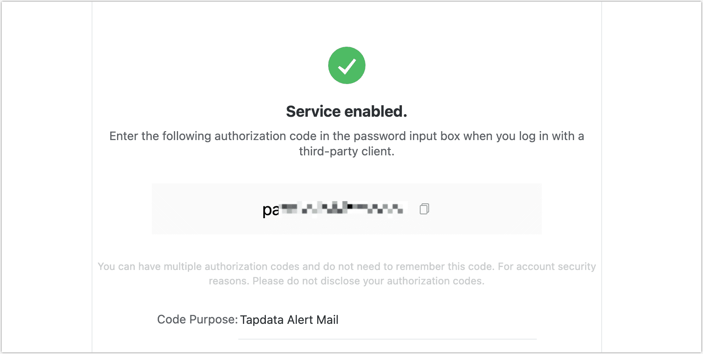
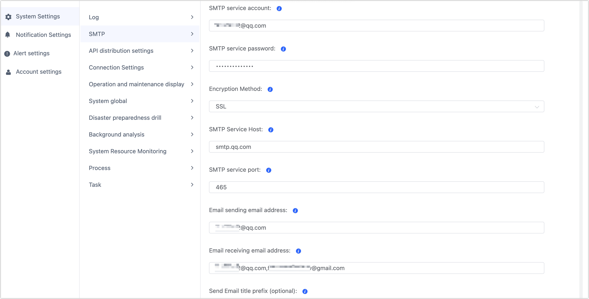

# Sending Alert Emails via QQ Mail
import Content from '../reuse-content/_enterprise-features.md';

<Content />

Tapdata supports sending alert emails through SMTP protocol, enabling users to receive timely notifications in their commonly used email accounts, thus helping you promptly perceive operational anomalies and ensure the stability and reliability of task operations.

## Scenario Introduction

QQ Mail, as a widely used communication tool, facilitates the receipt and review of alert messages, providing users with a convenient way to handle exceptions. In this example, we will demonstrate how to integrate QQ Mail in Tapdata to send alert messages, helping to improve the efficiency of operations personnel in quickly locating and resolving issues.

You can also integrate other email services (such as 163 Mail) in Tapdata platform, with a similar configuration process as described in this document.

## Step One: Obtain Email Authorization Code

The email authorization code is a special password used by QQ Mail to log into third-party clients/services and is applicable for logging into the following SMTP services. Before setting up alert email configurations in Tapdata platform, you need to obtain this authorization code.

1. Log in to [QQ Mail](https://mail.qq.com/).

2. At the top of the page, click **Settings**.

3. In the **Mail Settings** page, click the **Account** tab.

4. Scroll down to **POP3/IMAP/SMTP/Exchange/CardDAV/CalDAV Services** and click **Enable Service**.

   

   :::tip

   If you have already enabled this service, click **Manage Service**, then in the redirected page click **Generate Authorization Code**.

   :::

5. In the pop-up **Security Verification** dialog, click **Go to Verify**.

6. Follow the prompts on the page to complete the verification through WeChat scanning or SMS verification.

7. Once verified, the page will display the email authorization code. Please keep it safe for later use in the Tapdata configuration.

   

   :::tip

   Changing your QQ account password will expire the authorization code. You will need to obtain a new code and update it in the Tapdata platform.

   :::

## Step Two: Configure SMTP Service

1. [Log in to Tapdata platform](../user-guide/log-in.md).

2. In the top right corner of the page, click the  icon, then select **System Settings**.

3. On the left side of the page, click the **SMTP** tab.

4. Follow the instructions below to set up the SMTP service.

   

   * **SMTP Service Account**: Enter your QQ email address.
   * **SMTP Service Password**: Enter the authorization code you obtained in [Step One](#mail-code).
   * **Encryption Method**: Select **SSL** to ensure security.
   * **SMTP Service Host**: Enter **smtp.qq.com**, the SMTP server for sending emails from QQ Mail.
   * **SMTP Service Port**: Enter **465** or **587**.
   * **Email Sending Address**: Enter your QQ email address.
   * **Email Receiving Addresses**: Enter the email addresses that will receive the alert messages, separated by commas (,).
   * **Prefix for Email Subject**: Optional, set a prefix for the email subject to quickly identify the source of the email.

5. After setting up, click **Test Connection** at the bottom of the page. Once you confirm the receipt of the test email in QQ Mail, click **Save**.

   Example of a test email:

   

6. (Optional) In the left navigation bar, select **Notification Settings**, specify which events should trigger alert emails and their intervals, then click **Confirm**.

   

## Result Verification

After the above setup, we deleted a test task on the Tapdata platform and subsequently received an email.