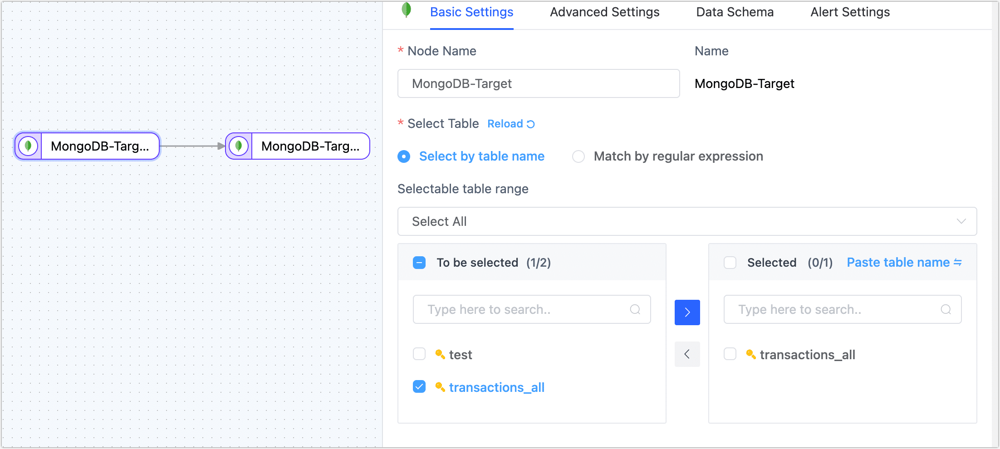
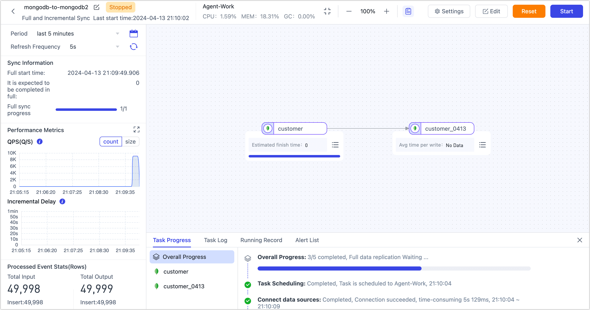

# Ensure Data Migration with Breakpoint Continuation

In scenarios involving massive data migration, you can utilize Tapdata's full resumption from breakpoint feature to segment and migrate data, enhancing the reliability of data migration and ensuring successful execution of migration tasks.

## Scenario Description

As businesses grow and data volumes continuously increase, data storage and management have become core issues for enterprise development. Data migration, as a common data management approach, is widely used across various domains such as cloud computing, big data analytics, backup, and recovery. However, due to large data volumes, long duration, unstable network environments, and equipment failures, data transmission tasks may interrupt, leading to task failures.

To address this issue, Tapdata introduces the full resumption from breakpoint functionality, which segments massive data from the source database and records the amount and progress of transmitted data. In subsequent data migration processes, each data segment is temporarily stored in Tapdata’s local cache. Then, it merges with the related incremental data changes before being sent to the target database, achieving resumption from breakpoints and ensuring data accuracy. This effectively avoids data loss and task failures due to data transmission interruptions, enhancing the reliability and efficiency of data migration.

## Prerequisites

The full resumption from breakpoint is currently only supported for MongoDB data sources, i.e., the source database must be MongoDB.

## Preparation

Before creating a data transformation task, ensure you have configured the relevant data sources, see [Configuring MongoDB Connection](../prerequisites/on-prem-databases/mongodb.md) for details.

## Procedure

In this case, we will demonstrate the specific configuration process for data migration between MongoDB instances.

1. [Log in to the Tapdata platform](../user-guide/log-in.md).

2. In the left navigation bar, select **Data Pipeline** > **Data Replication**.

3. Click **Create** on the right side of the page.

4. Drag the MongoDB data sources acting as the source and target databases to the right-side canvas, then connect them.

5. Click on the node corresponding to the source database and complete the right-side panel configuration as instructed below.

   

    * **Basic Settings**
        * **Node Name**: Default is the connection name; you can also set a business-meaningful name.
        * **Select Tables**: Choose based on business needs.
            * **By Table Name**: Select tables in the area to be copied, then click the right arrow to complete the setting.
            * **By Regular Expression**: Enter the table name's regular expression; additionally, when a new table in the source database satisfies the expression, it will also be automatically synchronized to the target database.
        * **Visible Table Range**: Default shows all tables; you can also filter to show only tables with **Primary Keys** or **No Primary Keys**. Since tables without primary keys use a full primary key method for data updates, which may cause index length overflow errors and possibly limited performance, it is recommended to set up a separate data replication task for tables without primary keys to avoid errors and improve data update performance.
    * **Advanced Settings**
        * **DDL Event Collection**: Enabling this switch allows Tapdata to automatically collect selected source DDL events (such as adding fields), and if the target end supports DDL writing, it can synchronize DDL statements.
        * **Batch Read Amount**: The number of records read per batch during full synchronization, default is **100**.
        * **Full Resumption from Breakpoint**: This feature is suitable for migration scenarios with data sizes reaching billions. When enabled, after stopping the task, you can continue migration from the breakpoint next time.
            * **Partitioning Method**: Choose based on business needs:
                * **Based on count partitioning**: Based on the number of records, you need to specify the size of the partition.
                * **Based on min/max partitioning**: Based on maximum/minimum values, you need to specify the number of partitions.
            * **Concurrent Thread Count for Partitioning**: Choose the concurrency based on the source database and Tapdata server load, default is 8.
            * **Batch Read Limit Per Partition**: Choose the upper limit of batch read data per partition based on source database load, default is 3000.
            * **Merge Batch and Incremental Data Locally Before Sending**: If this task needs to perform both full and incremental migration, keep it enabled. If only full migration is performed and the source database will not change data during migration, you can disable this feature.
        * **Data Source Exclusive Configuration**
          Choose whether to **Disable Cursor Timeout** (default off) and **Supplement Update Data with Complete Fields** (default on).
    * **Data Model**
      Display the source table structure information, including field names and field types.
    * **Alert Settings**
      By default, if the node's average

processing time continuously exceeds 5 seconds for 1 minute, system notifications and email alerts will be sent. You can adjust the rules or turn off alerts based on business needs.

6. Click on the target endpoint node and complete the parameter configuration on the right-side panel as instructed below.

   

    * **Basic Settings**
        * **Node Name**: Default is the connection name; you can also set a business-meaningful name.
        * **Target Table Structure**: Displays the table structure information that Tapdata will write to the target endpoint, deduced based on the settings of the source endpoint node. It automatically sets the update condition to the table's primary key. If there is no primary key, you must manually specify the fields for the update condition.

          :::tip

          Additionally, you can directly click on the target's automatic field type in the pop-up dialog to adjust the field type and precision.

          :::

        * **Duplicate Handling Strategy**: Choose based on business needs, default is **Preserve Original Structure and Data of Target Endpoint**.
        * **Multi-Thread Writing for Full Data**: The number of concurrent threads for full data writing, default is **8**, which can be adjusted based on the target endpoint's writing performance.
        * **Multi-Thread Writing for Incremental Data**: The number of concurrent threads for incremental data writing, not enabled by default. Enable and adjust based on the target endpoint's writing performance.
        * **Batch Size per Write**: Number of entries per batch during full synchronization.
        * **Maximum Wait Time per Batch Write**: Set the maximum wait time based on the target database's performance and network delay, in milliseconds.
    * **Advanced Settings**
        * **Data Writing Mode**: Choose based on business needs.
            * **By Event Type**: After selecting this option, you also need to select the data writing strategies for insert, update, and delete events.
            * **Statistics Append Writing**: Only processes insert events, discards update and delete events.
        * **Data Source Exclusive Configuration**: Choose whether to **Save Deleted Data**.
    * **Data Model**
      Displays the table structure information for the target table, including field names and field types.
    * **Alert Settings**
      By default, if the node's average processing time continuously exceeds 5 seconds for 1 minute, system notifications and email alerts will be sent. You can adjust the rules or turn off alerts based on business needs.

7. (Optional) Click the **Settings** button in the upper right corner of the page to configure the task properties.

    * **Task Name**: Enter a business-meaningful name.
    * **Synchronization Type**: You can choose **Full + Incremental**, or select **Full** or **Incremental** separately.
      Full means copying the existing data from the source endpoint to the target endpoint, and Incremental means copying new data or data changes from the source endpoint to the target endpoint in real-time, both combined can be used in real-time data synchronization scenarios.
    * **Task Description**: Enter a description for the task.
    * **Advanced Settings**: Set the start time of the task, shared mining, incremental data processing mode, processor thread count, Agent, etc.

8. Click **Save** or **Start** to complete the creation. To ensure the normal operation of the task, Tapdata will perform a pre-check based on node configurations and data source characteristics, while also logging information.

   :::tip

   If the pre-check fails, adjust according to the log prompts on the current page. For more information, see [Task Pre-Check Explanation](../user-guide/data-pipeline/pre-check.md).

   :::

9. After successful startup, you will automatically be redirected to the task monitoring page, where you can view the task's QPS, delay, task events, and more.

## Full Resumption from Breakpoint Verification

During the operation of the task, click the **Stop** button in the upper right corner of the task monitoring page to pause the task; the progress of the full migration still exists.

At a low business peak, you can restart the task to continue the previous full migration. You can also edit the task by clicking the settings at the top of the page to set the scheduled start time of the task.