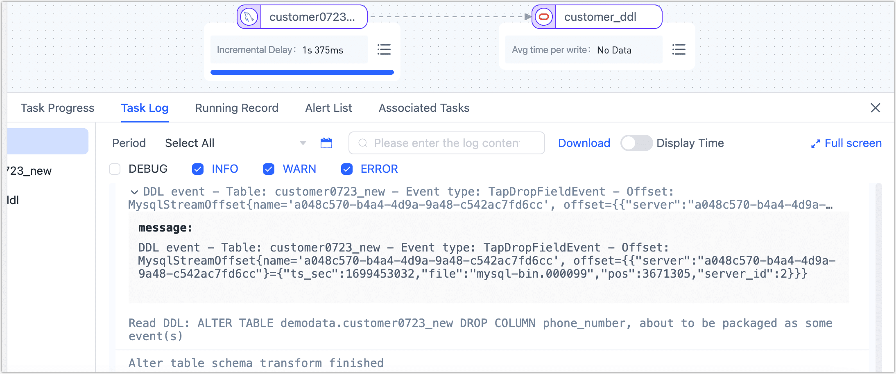

# Handle DDL Changes During Data Sync

During data migration and synchronization with Tapdata Cloud, recognizing the impact of table structure modifications, such as DDL (Data Definition Language) operations, is crucial for continuous business operations. The platform seamlessly manages most DDL changes, ensuring a smooth synchronization process.

## Enable DDL Changes Sync

To ensure the high availability and fault tolerance of data replication/transformation tasks, by default, Tapdata Cloud does not synchronize the DDL statements from the source database to the target database. If you need to enable this feature, please follow these steps:

1. When creating or editing a [data replication](../user-guide/data-pipeline/copy-data/create-task.md) or [data transformation](../user-guide/data-pipeline/data-development/create-task.md) task, go to the configuration page of the source database node.

2. Find the **Advanced Settings** tab and check if the **Sync DDL Events** option is available.

3. Depending on your specific data source type, enable this feature and select the DDL events to be collected.

   This page will display the DDL events that the data source supports collecting, usually including **adding fields**, **modifying field names**, **modifying field properties**, **deleting fields**.

   

   :::tip

   Besides enabling this switch, the target database must also support **DDL** **application**. You can check the support status of various data sources for DDL event collection and DDL apply through the [supported data sources](../introduction/supported-databases.md) document, or in the **Advanced Settings** of the target node, see the hint for **DDL Event Apply**.

   :::

## DDL Collection and Apply Overview

| DDL Collection          | DDL Apply                                                    |
| ----------------------- | ------------------------------------------------------------ |
| Add Fields              | Tapdata Cloud will automatically adapt the field type when adding fields to the target database, for example, converting from MySQL's **INT** to Oracle's **NUMBER(38,0)**. If there are [unsupported column types](../user-guide/no-supported-data-type.md), this may lead to the failure of adding fields. |
| Modify Field Names      | Tapdata Cloud will automatically complete this operation in the target database, be aware of the target database's field naming restrictions. |
| Modify Field Attributes | When synchronizing between different types of databases (for example, from MySQL to Oracle), ensure that the target database supports the changed data types and attributes. Otherwise, this may lead to errors or interruptions in the synchronization task. |
| Delete Fields           | Deleting columns from the source table can have a severe impact on the data pipeline, especially when the column is a key part of the data processing logic, such as a primary key or as a field for update conditions in the synchronization link. Before making such changes, ensure that other components in the data pipeline no longer depend on this column. |

:::tip

For data sources with weak Schema constraints, the Schema information of historical data will not be changed. For example, when Kafka as a target database, Kafka will save the details of the DDL change in its messages, and subsequent consumption can be aware of the occurred DDL details.

:::

If a DDL synchronization error causes a data synchronization task to interrupt, you can either undo the relevant DDL operation in the source database or choose to [reload the source database's Schema](../user-guide/manage-connection.md), then reset and restart the task to repair it.

Additionally, consulting the [task log](../user-guide/data-pipeline/copy-data/monitor-task.md) and [error codes](../user-guide/error-code-solution.md) can aid in identifying and rectifying the root causes of the task failure. A normal DDL collection and application log example is as follows:

## Best Practices for DDL Changes

To safely manage DDL changes and reduce the potential risk to data synchronization tasks, it is recommended to follow these best practices:

1. **Pre-change Verification**: Verify the full extent of DDL changes in a test environment before applying them in a production environment to identify potential issues that may interrupt synchronization.
2. **Planning and Notification**: Schedule DDL changes during off-peak business hours and notify related teams in advance.
3. **Pipeline Configuration Updates**: Regularly review and update your data pipeline configurations to match the latest table structures.
4. **Monitoring and Alerts**: Set up [monitoring](../user-guide/data-pipeline/copy-data/monitor-task.md) and alerts for your data pipelines to respond quickly to unsupported DDL operations.
