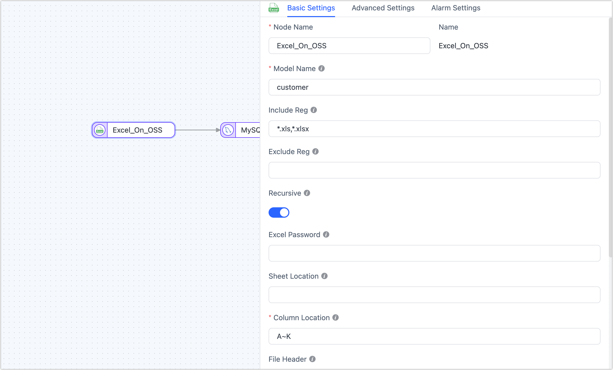
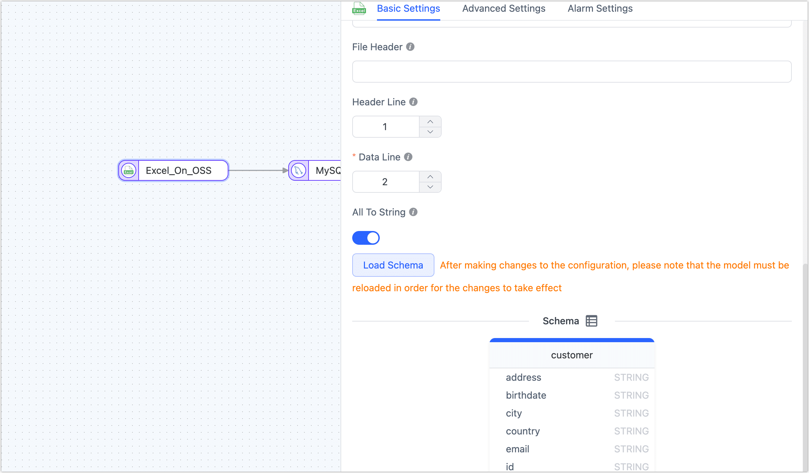
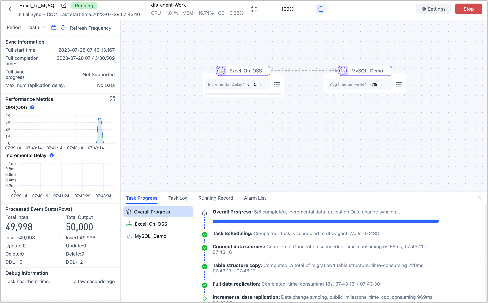

# Excel to MySQL Real-Time Sync

import Content from '../../reuse-content/_all-features.md';

<Content />

Excel is a wide range of data statistics and data analysis software. TapData enables reading local, FTP, SFTP, SMB, OSS, or S3FS on Excel files to meet diverse data flow needs.

This article describes how to synchronize Excel file data to MySQL through TapData, so that Excel data can be quickly stored and used for deeper data analysis.

## Scenario Introduction

The business provides real-time data updates and improved data analysis capabilities. In this business scenario, we have an Excel file called customer that contains basic customer information. Our goal is to synchronize this Excel file's data with MySQL, meet different business needs or data sharing needs, and open up data silos. This is the demo data generated by software at random


## Prerequisites

Before you create a replication task, make sure you have configured the relevant data source:

1. [Configure Excel Connection](../../connectors/files/excel.md)
2. [Configure MySQL Connection](../../connectors/on-prem-databases/mysql.md)

## Procedure

1. [Log in to TapData Platform](../../user-guide/log-in.md).

2. Based on the product type, select the operation entry:

    * **TapData Cloud**: In the left navigation panel, click **Data Transformation**.
    * **TapData Enterprise**: In the left navigation panel, choose **Data Pipelines** > **Transforms**.

3. On the right side of the page, click **Create**.

4. On the left side of the page, drag the Excel and MySQL data sources into the right canvas and connect them.

5. Click the Excel data source to complete the parameter configuration of the right panel according to the following instructions.

   1. Set up the basic settings for the node.

      
      * **Node Name**: Defaults to connection name, you can also set a name that has business significance.
      * **Model Name**: It is suggested that the model name be the same as the Excel file that will be imported.
      * **Include Reg**: The default is `* .xls, * .xlsx`, which means that all files in XLS/XLSX format will be searched. Currently, only `*` fuzzy matches are supported, and regular expressions are not supported.
      * **Exclude Regs**: Default is empty, i.e. no Excel files are filtered.
      * **Recursive**: Default is turned on, which means searching for Excel files in subdirectories.
      * **Excel Password**: If Excel sets password protection, you need to enter the password to decrypt it.
      * **Sheet Location**: All Sheet pages are automatically loaded by default, you can also specify sheets, for example, enter `1,3~5,8` for sheets 1, 3, 4, 5, and 8.
      * **Column Location**: Enter a list of the columns that need to be imported, for example, input `A ~ BA`, indicating column A to column BA.
      * **File Header**: To customize a row, you have the option to designate it as a table header or add personalization by using a comma (,) to separate the elements.
      * **Header Line**: Please specify the row in the file that contains the table header, which is where the column names are located. If there is no table header row in the file, please input the value **0**. If the table header row is empty, it will automatically label the columns as **Column1**, **Column2**, and so on.N
      * **Body Start Line**: This refers to the line that initiates the body section, typically located in the next row of the table header.
      * **All To String**: The default is turned on. If each column of data is well-organized, especially with numeric and time formats, and does not contain any mixed strings, you can turn off this feature.
      * **Schema**: Click to **Load Schema**, and the structure and column names of the source table will be displayed at the bottom of the page. Currently, supported data types include **STRING**, **TEXT**, **DOUBLE**, **BOOLEAN**, and **DATE**.
        

   2. Click the Advanced Settings to complete the setup of the node.

      

      * **DDL Event Collection**: After enabling the switch, TapData will automatically capture the selected source DDL events, such as the addition of new fields. If the target database supports DDL writing, TapData can synchronize the DDL statements to ensure consistency between the source and target databases.
      * **Filter Settings**: When you turn on the switch, you should set data filtering conditions.
      * **Batch Read Number**: The number of records read in each batch during full data synchronization, the default is **100**.
      
   3. Set up the alarms for the node.
   
      If the average processing time of nodes exceeds 5 seconds continuously for 1 minute, TapData will send out notifications and email alerts by default. You can further customize these rules or choose to turn off alerts based on your specific business needs.
   
6. Click the MySQL data source on the right to complete the settings for each tab according to the following instructions.

   

   - **Basic Settings**
      - **Node Name**: Defaults to connection name, you can also set a name that has business significance.
      - **Table**: Select a destination table to write, or you can also manually fill in a table that will be automatically created if it does not exist.
      - **Update Condition Field**: Select the field on which the update condition is determined.
      - **Duplicate Processing Strategy**: Choose how duplicate data should be handled.
      - **Number of Writes Per Batch**: The number of entries written in each batch during full data synchronization.
      - **Write the Maximum Waiting Time for Each Batch**: Set the maximum wait time in milliseconds, based on the performance of the target database and the network delay evaluation.
      - **Full Multi-threaded Write**: The number of concurrent threads for writing full data is set to the default value of **8**. You can adjust this value based on the write performance of the target database.
      - **Incremental Multi-threaded Write**: The number of concurrent threads with incremental data written, which is disabled by default, can be appropriately adjusted based on the write performance of the target database.
      - **Model**: Displays the table structure information of the target table, including the field name and field type.
   - **Advanced Settings**
      - **Data write mode**: Keep the default, or select according to business needs.
         * **Process by Event Type**: After selecting this item, you also need to select the data write policy for inserts, updates, and deletes events.
         * **Statistics Additional Write**: Handles only insert events, discards updates, and deletes events.
      - **Data Source**: Select whether to synchronize the index.
   - **Alert Settings**
      If the average processing time of nodes exceeds 5 seconds continuously for 1 minute, TapData will send out notifications and email alerts by default. You can further customize these rules or choose to turn off alerts based on your specific business needs.

7. (Optional) Click **Settings** in the top-right corner of the page to configure the task properties.

   - **Task name**: Fill in a name that has business significance.
   - **Sync Type**: You have the option to select **Full + incremental synchronization**, or you can choose to perform **Initial Sync** and **CDC** (Change Data Capture) separately. In real-time data synchronization scenarios, using the combination of full and incremental data copying allows you to copy existing data from the source database to the target database.
   - **Task Description**: Provide a description for the task by filling in the relevant information.
   - **Advanced Settings**: Set the start time of the task, select the incremental data processing mode, specify the number of processor threads, and choose the appropriate agent.

8. After confirming the configuration is correct, click **Start**.

   After the operation is completed, you will be able to view the task's performance on the current page, including metrics such as RPS (Records Per Second), delay, and task event statistics:

   :::tip

   During the incremental synchronization process, TapData checks for changes in Excel files every 1 minute. If any changes are detected, the corresponding files are added as full incremental data with update conditions to complete the modification. However, it currently does not support the synchronization of deleted files or data.

   :::

   

## Result Verification

According to the task settings, TapData will automatically complete the migration of Excel data. Let's log into the target database to view the synchronized data.

```sql
-- Check the number of data entries
SELECT COUNT(*) FROM customer_from_excel;
-- Result
count(*)|
--------+
   49998|

-- View one record from the table
SELECT id,name,country FROM customer_from_excel LIMIT 1;
-- Result
id                              |name       |country|
--------------------------------+-----------+-------+
000329567a744f6497a843993fcc7a30|Christopher|Israel |
```

Later, we uploaded a new table with the same structure in the data source, which included 5 new data entries. We monitored the progress of the incremental synchronization on TapData Cloud's task monitoring page. At the same time, you can also query the number of data entries in the target MySQL database:

```sql
-- Check the number of data entries
SELECT COUNT(*) FROM customer_from_excel;
-- Result
count(*)|
--------+
   50003|
```

