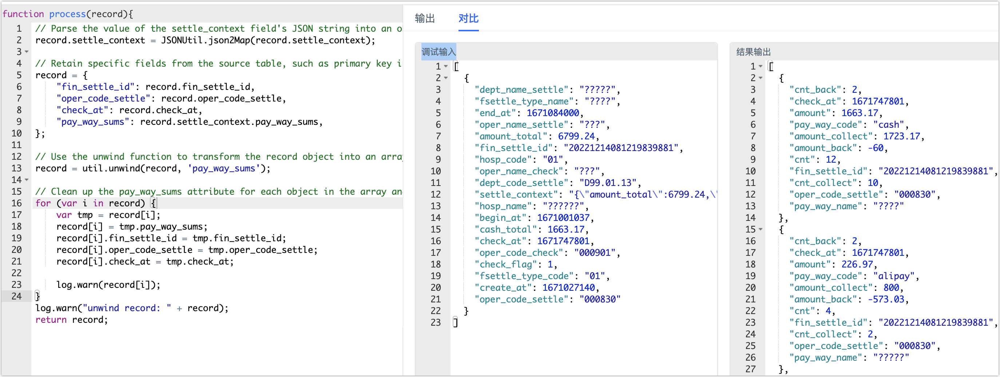
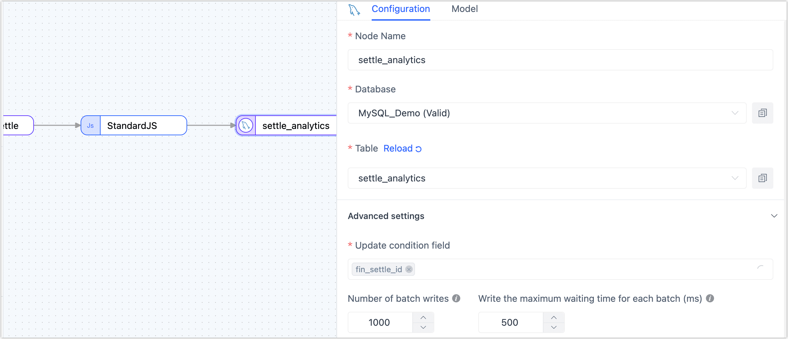

# Building an Array Extraction Link to Simplify Data Analysis


In modern payment systems, the analysis of payment data is crucial for understanding user behavior, optimizing business processes, and making decisions. For database tables storing payment data, payment data is sometimes written as a JSON string in a field, complicating its structure and making subsequent analysis complex.

This article will discuss how to use the JS node of TapData in this scenario to directly extract data from the nested JSON array in the table and use it as a top-level field, thereby helping companies more conveniently interface with BI reports for data analysis.

## Scenario Description

Suppose we have a payment system in our business scenario (served by the MySQL database). The settlement summary table in this system has a `settle_context` field, which stores various payment-related information in the form of a JSON string, including payment methods, amounts, etc. A sample data of the `settle_context` field is as follows:

```json
{
	"amount_total": 6799.24,
	"cash_total": 1663.17,
	"invoice_count": 0,
	"invoice_normal_count": 0,
	"invoice_cancel_count": 0,
	"invoice_park_count": 0,
	"pay_way_sums": [{
		"pay_way_code": "cash",
		"pay_way_name": "Cash Payment",
		"cnt": 12,
		"cnt_collect": 10,
		"cnt_back": 2,
		"amount": 1663.17,
		"amount_collect": 1723.17,
		"amount_back": -60
	}, {
		"pay_way_code": "alipay",
		"pay_way_name": "Alipay Platform",
		"cnt": 4,
		"cnt_collect": 2,
		"cnt_back": 2,
		"amount": 226.97,
		"amount_collect": 800,
		"amount_back": -573.03
	}
	......
	]
}
```

Because data in the JSON string format has some limitations for statistical analysis, this article will discuss how to decompose this field and synchronize the results to a specified data table in real-time, thereby obtaining the latest data. This helps companies better understand information such as payment method distribution, optimize payment processes, improve user experience, and develop more effective business strategies, suitable for the following analysis scenarios:

* **Payment Method Analysis**: Based on the extracted payment method statistics, perform in-depth data analysis, such as calculating the proportion of each payment method, analyzing changes in payment method trends, and comparing differences in amounts between different payment methods. These analysis results will provide insights for companies to optimize payment strategies and decision-making.
* **Visualization and Reporting**: Present the results of payment method analysis in the form of visual charts or reports to understand data more intuitively. With data visualization tools (such as Tableau), you can create bar charts, pie charts, or trend charts to better display the distribution and changes in payment methods.

Next, we will introduce how to use the built-in **Standard JS** node in TapData to decompose the `settle_context` field in the settlement summary table, and then synchronize the extracted payment method information to a specified database, thereby helping companies to interface more conveniently with BI reports and gain deeper insights and analysis based on payment data.

## Prerequisites

Before creating a data conversion task, you need to add the data source to which the settlement table belongs to TapData. Also, you need to add a data source (such as a MySQL database) as the target database. For specific operations, see [Configure MySQL Connection](../../connectors/on-prem-databases/mysql.md).

## Procedure

1. Log in to TapData platform.
2. Based on the product type, select the operation entry:

   * **TapData Cloud**: In the left navigation panel, click **Data Transformation**.
   * **TapData Enterprise**: In the left navigation panel, choose **Data Pipelines** > **Transforms**.
3. Click **Create** on the right side of the page.
4. Select and connect nodes.

   1. In the **Connection** area on the left side of the page, drag the data connections serving as the source and target to the canvas on the right.
   2. In the **Processing Node** area at the bottom left of the page, drag the **Standard JS** node to the canvas on the right.
   3. Connect the aforementioned three nodes in the order of the source database, Standard JS, and target database, as shown in the figure.

      

5. Click on the leftmost source node, and in the panel on the right, select the settlement summary table to be operated on (**fin_oper_settle**). Other configurations can be kept as default.

   

   For more configuration introductions, see [Create Data Transform Task](../../user-guide/data-development/create-task.md).

6. Click the middle Standard JS node and enter the following code in the script text box on the right.

   ```js
   // Use the json2Map function to parse the settle_context field into an object and extract the pay_way_sums array value
   record.settle_context = JSONUtil.json2Map(record.settle_context);
   
   // Retain specific fields from the source table, such as primary key information
     record = {
       "fin_settle_id": record.fin_settle_id,
       "oper_code_settle": record.oper_code_settle,
       "check_at": record.check_at,
       "pay_way_sums": record.settle_context.pay_way_sums,
     };
   
   // Use the unwind function to transform the record object into an array
     record = util.unwind(record, 'pay_way_sums');
   
   // Clean up the pay_way_sums attribute for each object in the array and extract its properties to the upper layer
     for (var i in record) {
       var tmp = record[i];
       record[i] = tmp.pay_way_sums;
       record[i].fin_settle_id = tmp.fin_settle_id;
       record[i].oper_code_settle = tmp.oper_code_settle;
       record[i].check_at = tmp.check_at;
   
       log.warn(record[i]);
     }
     log.warn("unwind record: " + record);
   	return record;
   ```

   :::tip

   For introductions to the functions used in the above code, such as json2Map and unwind, see [Standard JS Built-in Functions](../../appendix/standard-js.md).

   :::

7. After setting up, click **Try Run** at the bottom right. Click the comparison on the right to view the input and output data examples. If there are no issues, click **Exit Full Screen** in the upper right corner.

   

8. Click on the node belonging to the target database, and in the panel on the right, select or enter the target table name. Other configurations can be kept as default.

   

   For more configuration introductions, see [Create Data Transform Task](../../user-guide/data-development/create-task.md).

9. After the configuration is complete, click **Save** in the lower right corner. Name the task and select the relevant directory to save. Click **Start**.

10. After the task is saved and submitted successfully, the system will return to the task list. Here, you can view the task details, run the task manually, or set a schedule for automatic execution.

## Conclusion

This article introduced how to use the built-in **Standard JS** node in TapData to extract data from the JSON array in the database and interface more conveniently with BI reports. Through the detailed operating steps, we aim to help companies analyze payment data more effectively and make better business decisions.