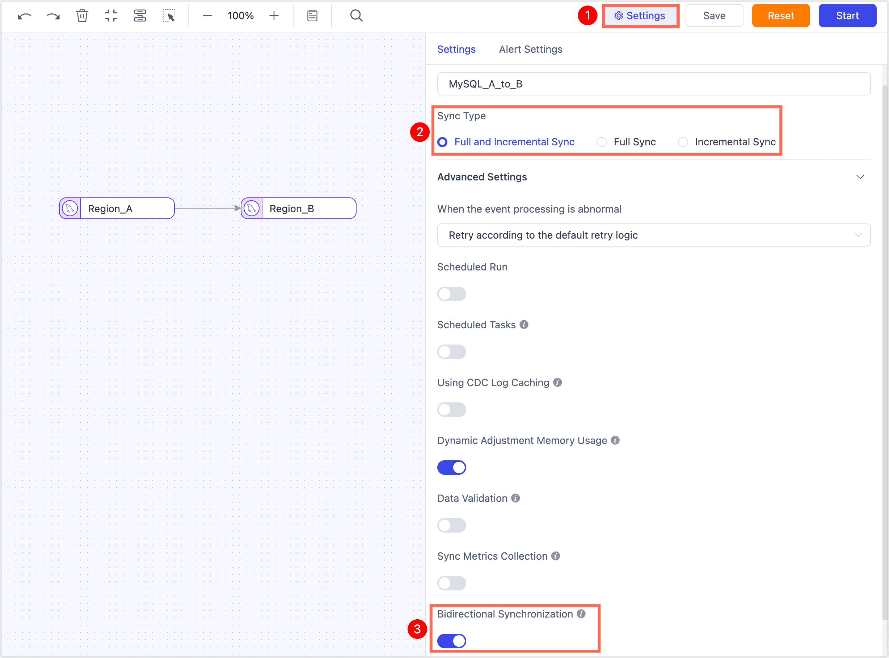
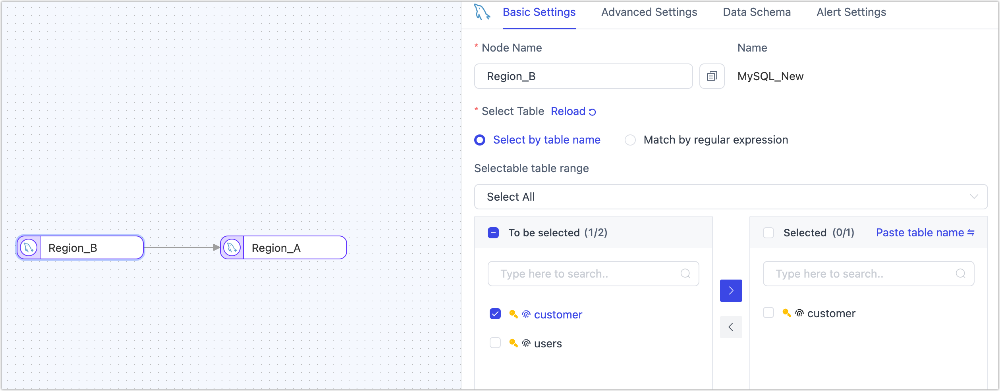
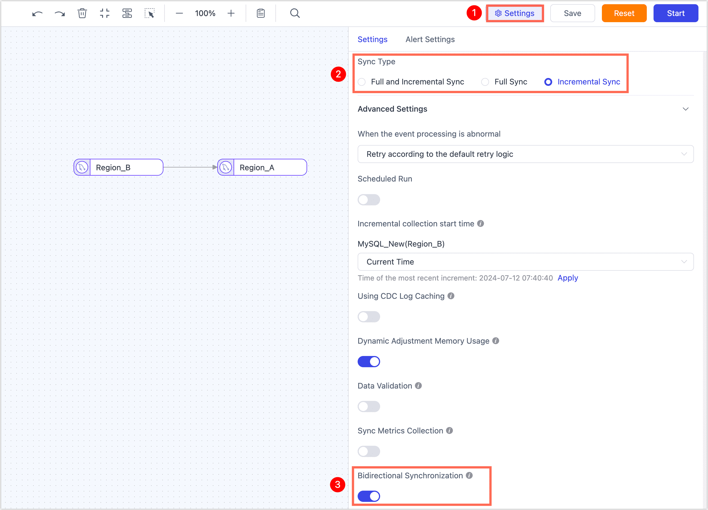

# Implement Multi-Active with MySQL Bi-directional Sync

With the rapid development of enterprise business, ensuring data consistency and high availability has become a core requirement. Data synchronization across different regions not only allows for local access and reduced response latency but also helps build a multi-active architecture, enhancing system stability and reliability against single points of failure.

This document introduces how to use Tapdata to implement bi-directional synchronization between MySQL databases in two regions, thus achieving a multi-active architecture to ensure business continuity.

## Scenario Introduction

With the rapid growth of business and user numbers, deploying business in a single region may face the following issues:

- **High Access Latency**: Users are geographically distributed, leading to high access latency for users located far from the deployment region, affecting user experience.
- **Limited Scalability**: The capacity of infrastructure in a single region limits business expansion, such as power supply capacity and network bandwidth.

To solve these problems, you can use TapData to achieve real-time data synchronization between business units in the same city or across regions, ensuring global data consistency. If any unit fails, the traffic can automatically switch to other available units, effectively ensuring service high availability.

TapData helps enterprises achieve the following goals through cross-regional data synchronization:

- **Reduced Access Latency**: By synchronizing data to the business unit closest to the user, significantly reducing access latency and improving user experience.
- **Improved Scalability**: Overcoming the limitations of single-region infrastructure, leveraging resources from multiple regions for business expansion.
- **Enhanced High Availability**: Quickly switching traffic to other available units when any unit fails, ensuring business continuity.

:::tip

Tapdata supports bi-directional data synchronization for MySQL ↔ MySQL, PostgreSQL ↔ PostgreSQL, MongoDB ↔ MongoDB, PostgreSQL ↔ MySQL, and SQL Server ↔ SQL Server. Next, we will introduce the specific operation process using MySQL bi-directional synchronization as an example.

:::

## Considerations

- Bidirectional synchronization does not currently support active-active conflict resolution. Avoid modifying the same data on both sides simultaneously.
- To ensure that bi-directional DML operations execute correctly, the tables to be synchronized must have primary keys.
- During bi-directional synchronization, do not perform DDL changes (such as adding columns) on the synchronized tables, as this will cause task failure.
- A bi-directional synchronization task consists of two data synchronization tasks: one task synchronizes both full and incremental data, and the other only needs to synchronize incremental data to avoid data duplication.
- To ensure the normal operation of the bi-directional synchronization task, Tapdata will automatically add a table named `_tap_double_active` in the database to record task heartbeat information.

## Preparation

[Connect MySQL databases in two regions separately](../../connectors/on-prem-databases/mysql.md).

:::tip

Follow the instructions in the document to complete the Binlog configuration and create the account for data synchronization.

:::

## Operation Steps

1. Log in to the TapData platform.

2. Based on the product type, select the operation entry:

   * **TapData Cloud**: In the left navigation panel, click **Data Replications**.
   * **TapData Enterprise or TapData Community**: In the left navigation panel, choose **Data Pipelines** > **Replications**.

3. Create the forward data synchronization task.

   1. Click **Create** on the right side of the page.

   2. On the left side of the page, drag the MySQL data sources created in the preparation work (named Region A and Region B) to the right canvas, and then connect them.

   3. Click the Region A node, select the table to be synchronized, which is `customer` in this case. For more parameter details (such as advanced settings), see [Creating Data Replication Task](../../data-replication/create-task.md).

      

      :::tip

      To ensure the task runs normally, do not turn on the **Sync DDL Events** switch in the advanced settings.

      :::

   4. Click the Region B node and complete the node configuration as described below.

      

      * **Target Table Structure**: Shows the table structure information that TapData will write to the target end, based on the source node settings. You can also click the edit button next to the target field to adjust the field type and precision in the pop-up dialog box.
      * **Duplicate Handling Strategy**: Choose according to business needs, the default is **Keep the original table structure and data at the target end**.
      * **Full Multi-Threaded Write**: The number of concurrent threads for full data write, default is **8**, which can be adjusted based on the target end's write performance.
      * **Incremental Multi-Threaded Write**: The number of concurrent threads for incremental data write, not enabled by default. If enabled, it can be adjusted based on the target end's write performance.
      * **Number of Writes Per Batch**: The number of entries per batch during full synchronization, default is 100 entries.
      * **Write the Maximum Waiting Time for Each Batch**: Set the maximum wait time based on the target database's performance and network latency, default is 500 milliseconds.

   5. Click **Settings** in the upper right corner of the page, set the synchronization type to **Full and Incremental Sync**, and then turn on the **Bidirectional Synchronization** switch.

      

   6. Click **Start** and wait for the task to start running.

4. Return to the data replication task list page, find the task just configured, and wait for it to enter the **Incremental Data Replication** state.

   

5. Configure the reverse incremental synchronization task.

   1. Click **Create** on the right side of the page.

   2. On the left side of the page, drag the MySQL data sources created in the preparation work (named Region A and Region B) to the right canvas, and then connect them.

   3. Click the Region B node, select the table to be synchronized in reverse, keeping the same table as the forward synchronization task, which is the `customer` table in this case.

      

   4. Click the Region A node, confirm the table structure preview is correct, and keep other settings as default.

   5. Click **Settings** in the upper right corner of the page, set the synchronization type to **Incremental Sync**, and then turn on the **Bidirectional Synchronization** switch.

      

   6. Confirm the settings are correct and click **Start**.

      After completion, you can observe the task execution details on the current page, such as RPS (records processed per second), latency, task time statistics, and more.

6. After a while, you can see that the two tasks just created have both entered the incremental synchronization state in the task list.

   

   At this point, we have completed the configuration of the bi-directional synchronization task. Next, you can verify the effect of the bi-directional synchronization, such as changing a piece of data in Region A and then checking its change in Region B.

   :::tip

   For Tapdata Enterprise, you can use the [data verification](../../operational-data-hub/fdm-layer/validate-data-quality.md) to continuously verify the data of the two bi-directional sync tasks, better meeting your business needs.

   :::

## Task Management

In the task list page, you can start/stop, monitor, edit, copy, reset, and delete tasks.

For detailed operations, see [Manage Tasks](../../design-incremental-views/manage-task.md).