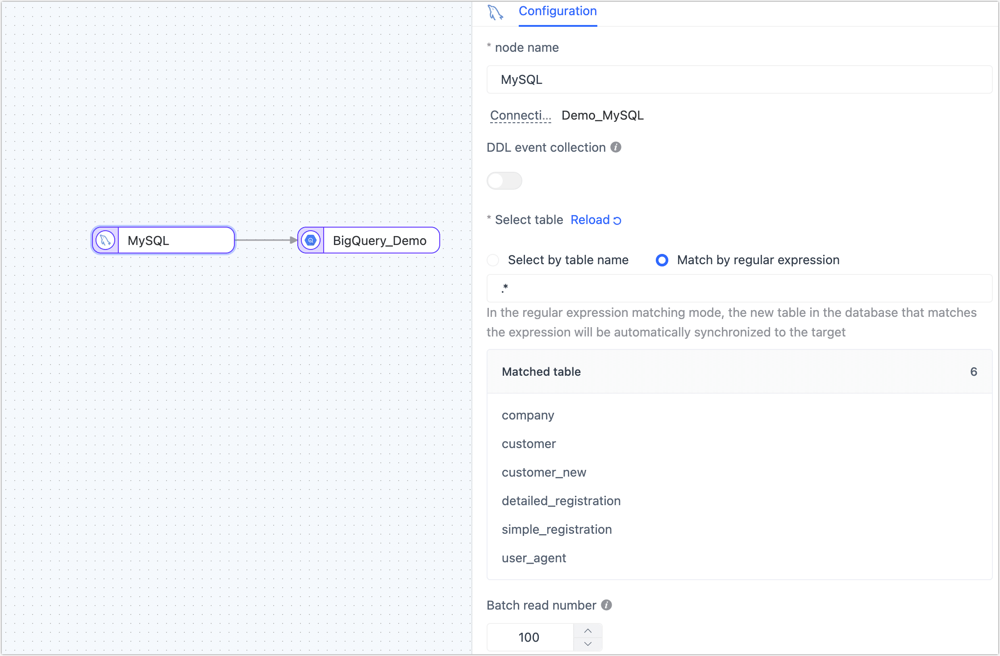
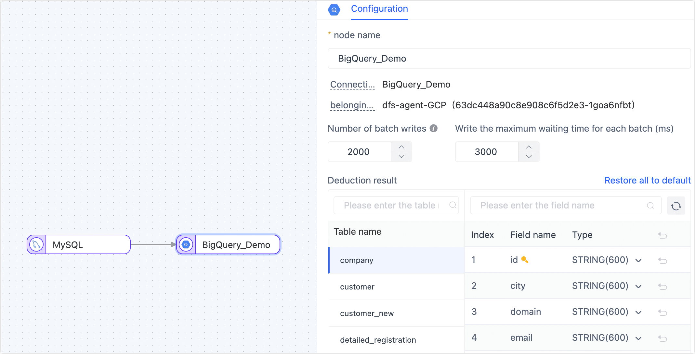
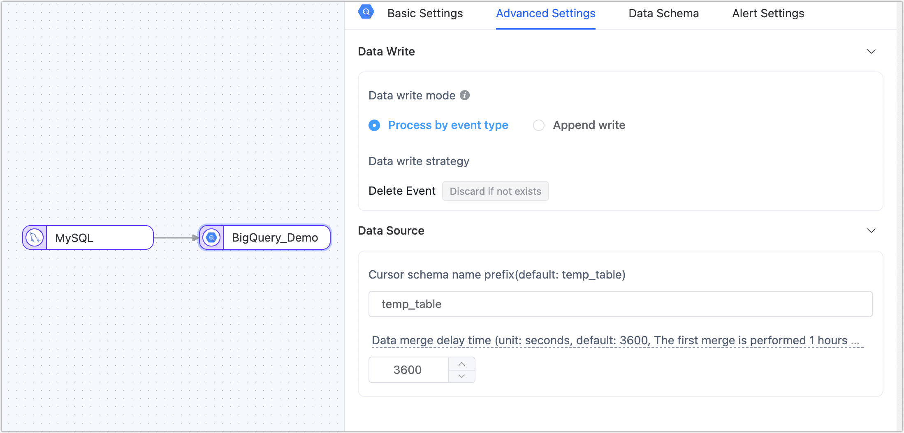
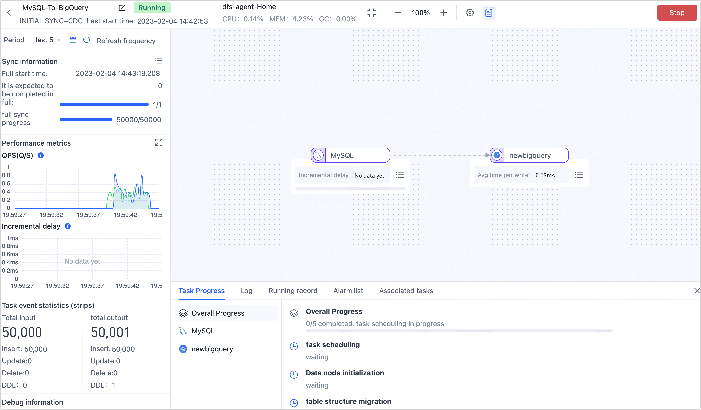

# MySQL to BigQuery Real-Time Sync

[BigQuery](https://cloud.google.com/bigquery/docs?hl=zh-cn) is a fully serverless and cost-effective enterprise data warehouse that operates seamlessly across different cloud platforms and effortlessly scales with your data. It incorporates business intelligence, machine learning, and AI functionalities. TapData, on the other hand, enables real-time synchronization of multiple data sources with BigQuery, facilitating smooth data flow and effectively accommodating changes in data architecture or big data analysis requirements.

To illustrate this synchronization process, let's consider MySQL as the source data. The following article demonstrates how to synchronize MySQL data with BigQuery, while similar configuration can be applied to other data sources.

## Preparations

Before you create a replication task, make sure you have configured the relevant data source:

1. [Configure MySQL Connection](../../connectors/on-prem-databases/mysql.md)
2. [Configure BigQuery Connection](../../connectors/warehouses-and-lake/big-query.md)

Also note the reference [data type support](../../user-guide/no-supported-data-type.md).

## Configure Task

1. [Log in to TapData Platform](../../user-guide/log-in.md).

2. Based on the product type, select the operation entry:

   * **TapData Cloud**: In the left navigation panel, click **Data Replications**.
   * **TapData Enterprise**: In the left navigation panel, choose **Data Pipelines** > **Replications**.

3. On the right side of the page, click **Create** to configure the task.

4. Drag the MySQL and BigQuery data sources into right canvas from the left side of the page and connect them on the right canvas.

5. Click on the MySQL data source in the right panel to proceed with the parameter configuration as per the provided instructions.

   

   - **Node Name**: Defaults to connection name, you can also set a name that has business significance.
   - **DDL Event Collection**: BigQuery does not support DDL writing, so you do not need to configure this parameter.
   - **Select Table**: Select the source table to operate. The table structure, including column names and types, will be displayed below.      
     * **Select by table name**: Select the table on the left, and then click the right arrow to complete the setup.
     * **Match regular expressions**: Enter the regular expression for the table name. Additionally, when a table is added to the source database and it matches the specified expression, TapData will automatically synchronize the table to the target database.
     * **Selectable table range**: By default, all tables are displayed, but you can choose to filter only tables with primary keys or only tables without primary keys. Since tables without primary keys use the full primary key method to implement data updates, they might encounter errors due to exceeding the index length limit, and their performance might be limited. Therefore, it is recommended that you create separate data replication tasks for tables without primary keys to avoid task errors and enhance the performance of data updates.
   - **Batch read number**: The number of records read in each batch during full data synchronization, the default is **100**.

6. Click the BigQuery data source to preview the data structure and set advanced options.

   1. In the **Derivation Result** area, preview of the post-synchronization data structure. 

      :::tip

      To adjust the field type, click the  icon in the target field type, and in the dialog that pops up, complete the setup.

      :::

   2. Click the **Advanced Settings** tab, and complete the advanced setup.

      

      - **Data Write**: Choose the data writing mode:

           - **Process by Event Type**: When this option is selected, you'll also need to specify the write strategy for insert, update, and delete events.
           - **Append Write**: This mode only processes insert events, disregarding update and delete events.

      - **Data Source**: 

            - **Cursor Schema Name Prefix**: When an INSERT operation is performed on the source table, it will be directly synchronized to the target table. On the other hand, when an UPDATE or DELETE operation is performed on the source table, it will be synchronized to a temporary table within the target dataset. The temporary table will have a specified name prefix to distinguish it from the target table.
                :::tip
                For more information about temporary tables, see [FAQ](#faq).

                :::

            - **Data Merge Delay Time**: TapData will merge the data from the temporary table into the target table at regular time intervals. The specified time interval determines how frequently these merges occur. With shorter merge times, the target table will have more up-to-date data. It's important to note that the first merge occurs **1 hour** after the full data synchronization is completed.

   3. (Optional) Click on **Data Schema** tab to view the table structure, or click on **Alert Settings** tab to set the alert policies for the node.

7. After confirming the configuration is correct, click **Start**.

   After the operation is completed, you can observe the performance of the task on the current page, such as RPS (Records Per Second), delay, task time statistics, etc.

   

## Task Management

On the Task List page, you can also start, stop, monitor, edit, copy, reset, and delete tasks.

For more information, See [Management Tasks](../../design-incremental-views/manage-task.md).

##  FAQ

* Q: Why does Agent's machine require access to Google Cloud Services?

   A: The Agent obtains data from the source, processes and transmits it to the target, so it needs to access Google Cloud's BigQuery service to ensure that data can be written to BigQuery.

* Q: How does the temporary table work?

   A: In order to improve the performance of data write and reduce data latency, TapData uses the Stream API and Merge API in combination based on BigQuery data characteristics. The process is as follows:

   1. During the full data synchronization stage, use the Stream API for data import.

   2. During the incremental data synchronization stage, incremental events are initially written to a temporary table in BigQuery. These events are stored in the temporary table until a periodic merge process is triggered. At the specified intervals, the data from the temporary table is merged into the target table, ensuring that the target table stays up to date with the latest incremental changes.

      :::tip

      The first merge occurs 1 hour after the completion of full synchronization data to ensure updates written by the Stream API are not missed.

      :::

* Q: What are the fields in the temporary table?

   A: The figure illustrates the structure and data of a data item within the temporary table. It includes the **merge_data_before** and **merge_data_after** fields, which store the data before and after the record change, respectively. The data type for these fields is [Record](https://cloud.google.com/bigquery/docs/nested-repeated). 

   In the case of the current record, identified by the **merge_type** as **D** (indicating a deletion), the merge_data_after field is empty, signifying that the data has been deleted.

   

* Q: Why is the data queried in BigQuery not up to date?

   A: You can view the incremental delay in the management interface of the task. Please note that apart from the network delay, the temporary table might not be immediately merged into the target BigQuery table. In such cases, it is recommended to wait for the automatic merge to take place before querying the target table.

