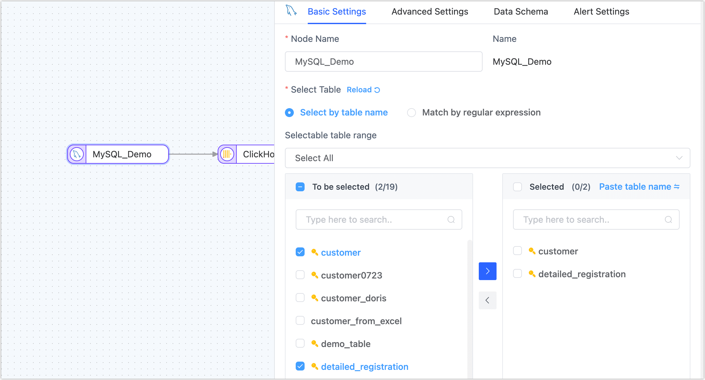

# How to Build a Real-time Data Warehouse by Syncing MySQL to ClickHouse

ClickHouse® is an open-source column-oriented database management system that allows generating analytical data reports in real-time. Its official ClickHouse Cloud offers scalable, real-time analytical processing without the need to manage infrastructure. With storage and computation decoupled, ClickHouse Cloud can auto-scale to accommodate modern workloads, ensuring high-speed query processing.

This artical demonstrates real-time syncing from MySQL to ClickHouse using Tapdata Cloud.

## Background

Data drives business growth in our digital age, the challenge is to gain insights from massive data sets in real-time. Enter ClickHouse, the go-to solution for many businesses seeking timely, accurate, low-overhead analytics:

- **High-performance data processing**: Handles millions of rows per second.
- **Real-time analysis**: Meets demands for real-time data processing and analysis.
- **Columnar storage**: Enables rapid data querying and summarization.
- **Scalability**: Built for horizontal scalability and high availability.
- **Data compression**: Reduces storage needs with inbuilt compression algorithms.
- **User-friendly ecosystem**: Supports SQL queries, easing integration with other tools and systems.

Recognizing the demand for data migration, Tapdata Cloud introduced ClickHouse as a syncing target, facilitating data transitions and real-time data warehousing.

## Prerequisites

Before setting up a data sync pipeline on Tapdata Cloud, connect your data sources:

1. [Connect to MySQL](../prerequisites/on-prem-databases/mysql.md)
2. [Connect to ClickHouse](../prerequisites/warehouses-and-lake/clickhouse.md)

## Configure Task

1. Log in to [Tapdata Cloud](https://cloud.tapdata.io/).

2. In the left navigation panel, click **Data Replications**.

3. On the right side of the page, click **Create** to configure the task.

4. Drag and drop previously configured MySQL and ClickHouse sources to the canvas and connect them.

5. Click on the MySQL data source, select the tables for syncing.
   Adjust settings, view table structures, set batch sizes, and configure email alerts if needed.
   

6. Click on the ClickHouse data source, preview data structure and adjust advanced settings.
   

   * **Node name**: Defaults to connection name, you can also set a name that has business significance.
   * **Deduction Results**: This is derived from the source node settings. The update condition is automatically set to the table's primary key. If there's no primary key, a unique index field is used. In the absence of both a primary key and a unique index, you'll need to manually specify the update condition's field.
     :::tip
     Additionally, you can click on the field type, in the pop-up dialog, you can adjust the field type and precision. You can also modify the field's length based on a coefficient. For instance, if the original field is `STRING(200)` and the coefficient is set to **2**, then the field becomes `STRING(400)`. This feature is helpful to address data insertion failures due to varying storage length requirements caused by character encoding differences.
     :::
   * **Duplicate Processing Strategy**, **Data write mode**: Select the preferred method for handling duplicated data.
   * **Full Multi-threaded Write**: The default setting for the number of concurrent threads with full data written is **8**. However, it can be adjusted as needed, taking into consideration the write performance of the target database.
   * **Incremental Multi-threaded Write**: The number of concurrent threads with incremental data written is disabled by default. However, it can be adjusted as needed, considering the write performance of the target database.
   * **Number of Writes Per Batch**: This is the number of entries written per batch during full synchronization.
   * **Maximum Wait Time for Each Batch Write**: Evaluate based on the performance of the destination database and network latency. Set the maximum wait time, measured in milliseconds.

7. Click on the **Save** or **Start** to finalize the creation. To ensure the task runs smoothly, Tapdata Cloud conducts a pre-check based on the node configuration and characteristics of the data source, simultaneously logging relevant information.

   Upon successful start, you'll be automatically redirected to the **Task Monitoring** page. Here, you can view details like the task's QPS (Queries Per Second), latency, and various task-related events.

   

## See also

For more advanced features like table merging or building wide tables, you can [create data transformation task](../user-guide/data-development/create-task.md) on Tapdata Cloud. Additionally, you can explore the [Real-Time Data Hub](../user-guide/real-time-data-hub/enable-real-time-data-hub.md), simply drag the source table to generate a data pipeline, which will then automatically start the task. This greatly simplifies the task configuration process.