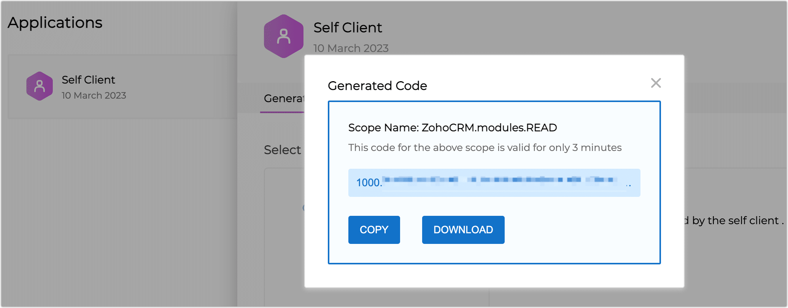
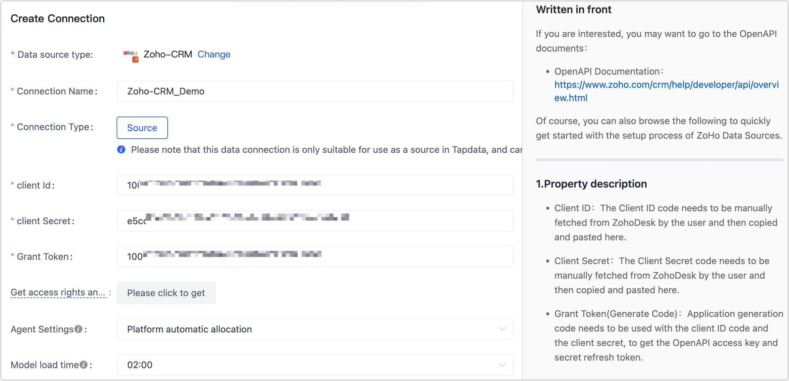

# Zoho-CRM

Zoho CRM is a SaaS cloud CRM customer management system. Tapdata Cloud supports Zoho CRM as the source database to build a data pipeline, this article describes how to add Zoho CRM data source in Tapdata Cloud.

## Preparations

1. Log in to the [Zoho API console](https://api-console.zoho.com/) and click **GET STARTED**.

2. Locate the **Self Client** card, click **CREATE NOW**.

3. Click **CREATE**, and in the pop-up dialog, click **OK**.

4. After the creation is complete, you will get the **Client ID** and **Client Secret**, which will be used when connecting the data source.

   

5. Click the **Generate Code** tab, fill in the **Scope** and description information you want to authorize, and then click **Create**.

   

   :::tip

   For Scope setup references, see [official document](https://www.zoho.com/crm/developer/docs/api/v3/scopes.html).

   :::

6. In the pop-up menu, select Portal and Production, and then click **CREATE**.

7. In the pop-up dialog, copy or download the Code information (ie, token information), save the information properly, and then use it when connecting the data source.

   

   :::tip

   The default token is valid for 3 minutes. Please complete adding the data source as soon as possible. If it expires, please repeat steps 5 ~ 7 to get the new token information.

   :::

## Connect to Zoho-CRM

## Procedure

1. Log in to [Tapdata Cloud](https://cloud.tapdata.io/).

2. In the left navigation panel, click **Connections**.

3. On the right side of the page, click **Create**.

4. In the pop-up **dialog**, select **Zoho-CRM**.

5. Fill in the connection information for Zoho-CRM on the redirected page, following the instructions provided below.

   
   * **Connection name**: Fill in a unique name that has business significance.
   * **Connection type**: Currently only supported as a **Source**.
   * **Client ID**,**Client secret**, and **Grant token**: Fill in the required authentication information, and see the [preparations](#preparations) for more detailed.
     :::tip
     Once you have finished configuring, click the button below to verify the authentication information, after verified successful, the page will display a message saying **OK**. However, if you receive an error message stating **invalid_client**, it could mean that the token has expired. In that case, please refer to the necessary preparations to generate a new token.
   * **Agent settings**: Defaults to **Platform automatic allocation**, you can also manually specify an agent.
   * **Model load time**: If there are less than 10,000 models in the data source, their information will be updated every hour. But if the number of models exceeds 10,000, the refresh will take place daily at the time you have specified.

6. Click **Test Connection**, and when passed, click **Save**.

   :::tip

   If the connection test fails, follow the prompts on the page to fix it.

   :::