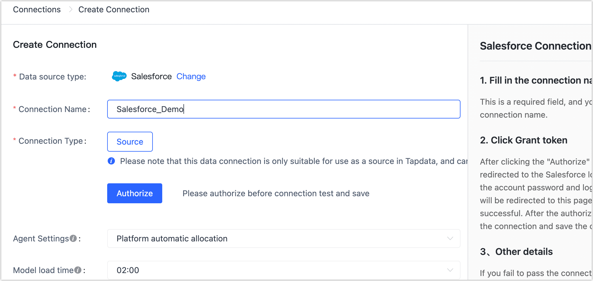

# Salesforce

Salesforce is a massive infrastructure of customer relationship management software products that help marketing, sales, commerce, service, and IT teams connect with their customers. Tapdata Cloud supports building data pipelines with Salesforce as a source database, and this article describes how to add Salesforce data sources to Tapdata Cloud.

## Connect to Salesforce

1. Log in to [Tapdata Cloud](https://cloud.tapdata.io/).

2. In the left navigation panel, click **Connections**.

3. On the right side of the page, click **Create**.

4. In the pop-up **dialog**, select **Salesforce**.

5. Fill in the connection information for Salesforce on the redirected page, following the instructions provided below.

   

   * **Connection name**: Fill in a unique name that has business significance.
   * **Connection type**: Salesforce is only supported as a Source.
   * **Authorization**: Click Authorize, and on the page that you are redirected to, log in to your Salesforce account to complete the authorization (recommended as an administrator).
     :::tip
      After completing the operation, the page will return to the data source configuration page and display **Authorization successful**.
   * **Agent settings**: Defaults to **Platform automatic allocation**, you can also manually specify an agent.
   * **Model load time**: If there are less than 10,000 models in the data source, their information will be updated every hour. But if the number of models exceeds 10,000, the refresh will take place daily at the time you have specified.

6. Click **Test Connection**, and when passed, click **Save**.

   :::tip

   If the connection test fails, follow the prompts on the page to fix it.

   :::

