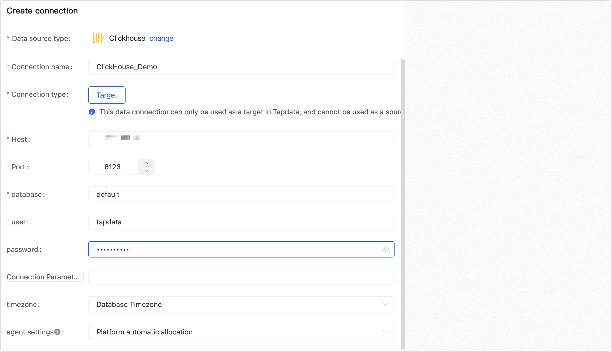

# ClickHouse

ClickHouse® is a high-performance, column-oriented SQL database management system (DBMS) for online analytical processing (OLAP). 

Tapdata Cloud supports the creation of data pipelines with ClickHouse as the target database. The following article provides a comprehensive guide on how to add ClickHouse to Tapdata Cloud.

## Supported Versions

ClickHouse v21.x

## Precautions

If binary-related fields are included, you need to remove them via field mapping for data synchronization/development.

## Preparations

1. Adjust the configuration file **user.xml**, enable access control and restart the service. For more information, see [Enable Access Control](https://clickhouse.com/docs/zh/operations/access-rights#enabling-access-control).

   :::tip

   You can also use this file to modify the [account configuration](https://clickhouse.com/docs/zh/operations/settings/settings-users/), this article demonstrates how to create and authorize an account after the permission control is turned on.

   :::

2. Log in to the ClickHouse database and execute the following commands to create an account for data synchronization/development tasks.

   ```sql
   CREATE USER username HOST 'host' IDENTIFIED WITH protection BY 'password';
   ```

   * **username**: Enter user name.
   * **host**: Which host can be accessed by the account, **any** means to allow all host.
   * **protection**: Password protection.
   * **password**: Enter password.

   Example: Create an account named **tapdata** , using the sha256_password protection mechanism, allowing it to log in from any host.

   ```sql
   CREATE USER tapdata HOST ANY IDENTIFIED WITH sha256_password BY 'Tap@123456';
   ```

3. To grant permissions to the account you have just created, it is advisable to implement more granular permission controls based on your business needs. For detailed instructions on authorization syntax and further information, see [authorization syntax](https://clickhouse.com/docs/en/sql-reference/statements/grant).

   ```sql
   GRANT SELECT, INSERT, CREATE TABLE, ALTER TABLE, ALTER UPDATE, DROP TABLE, TRUNCATE ON database_name.* TO username
   ```

   * **database_name**: Enter database name.
   * **username**: Enter user name.
   
   

## Connect to ClickHouse

1. Log in to [Tapdata Cloud](https://cloud.tapdata.io/).

2. In the left navigation panel, click **Connections**.

3. On the right side of the page, click **Create connection**.

4. In the pop-up dialog, select **ClickHouse**.

5. Complete the data source configuration according to the following instructions.

   

   * **Basic Connection Settings**
      * **Connection name**: Fill in a unique name that has business significance.
      * **Connection type**: ClickHouse databases can only be targets.
      * **Host**: The database connection address.
      * **Port**: The HTTP API service port of the database, the default is **8123**. If SSL encryption is enabled, the default port is **8443**. For more information, see [network ports](https://clickhouse.com/docs/en/guides/sre/network-ports/).
      * **Database**: Database name, a connection corresponding to a database, if there are multiple databases, you need to create multiple connections.
      * **user**, **password**: The database username and password.
      * **Connection parameter string**: additional connection parameters, default empty.
   * **Advanced Settings**
      * **Timezone**: Defaults to the time zone used by the database, which you can also manually specify according to your business needs.
      * **Agent settings**: Defaults to **Platform automatic allocation**, you can also manually specify an agent.
      * **Model load time**: If there are less than 10,000 models in the data source, their information will be updated every hour. But if the number of models exceeds 10,000, the refresh will take place daily at the time you have specified.

6. Click **Connection Test**, and when passed, click **Save**.

   :::tip

   If the connection test fails, follow the prompts on the page to fix it.

   :::
