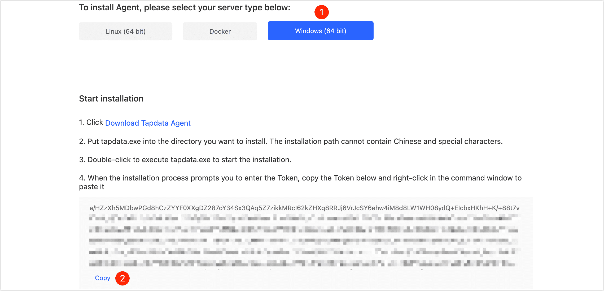

# Install on Windows

Tapdata Agent (abbreviated as Agent) retrieves data from the source, processes it, and transmits it to the target. It also supports installation on multiple platforms. This article provides instructions on installing Agent on the Windows platform.

## Requirements

- CPU: x86 Architecture Processor
- Operating System: 64-bit
- Network: Ability to connect to the public network and communicate with the source/target database
- Software: Java 1.8

:::tip

You can view the Java version by executing the `java-version` command from the command line on your Windows device. For more information, see [install Java](https://www.java.com/en/download/manual.jsp).

:::

## Install Agent

1. Log in to [Tapdata Cloud](https://cloud.tapdata.io/).

2. [Create an Agent](../../billing/purchase.md) according to business requirements.

3. After completing subscription, on the **deployment** page that you are redirected to, select **Windows (64 bit)** as the target operating system, and then copy the installation command.

   

4. For easier management of the Tapdata Agent, we recommend moving the downloaded Agent installer to the installation directory of your choice. 

   For example, you can move it to **C:\tapdata** on a Windows system. By doing so, you can conveniently access and manage the Tapdata Agent from the designated installation directory.

5. Double-click the **tapdata.exe** file.

6. Follow the prompts provided in the command window that appears. Right-click inside the window and select **Paste** to input the token information copied during step 3. Press the Enter key to proceed. If the launch is successful, the command window will automatically close.

7. (Optional) Double-click the **status.bat** in the Agent installation directory to check the status of the Agent. The following is an example of a normal startup.

   

## Next step

[Connect Data Sources](../connect-database.md)

## See also

* [Manage Agent](../../user-guide/manage-agent.md)
* [FAQ about Agent](../../faq/agent-installation.md)
