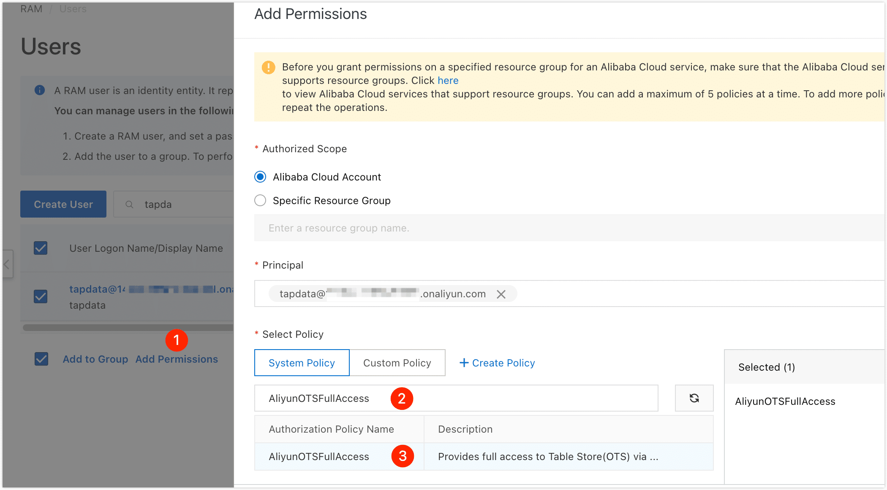

# Connect to Tablestore

[Alibaba Cloud Tablestore](https://www.alibabacloud.com/help/en/tablestore) is a serverless table storage service for large amounts of structured data, while providing a one-stop IoT store solution for the depth optimization of IoT scenarios. Tapdata Cloud supports data synchronization tasks with Tablestore as the target database, and this article describes how to add Tablestore data sources to Tapdata Cloud.

## Preparations

1. [Create an Alibaba Cloud Tablestore instance](https://help.aliyun.com/document_detail/342853.html), then get the public network connection address and instance name of the instance.

   

2. Create a RAM user on the Alibaba Cloud and get AccessKey (AK), which will be used when connecting.

   1. To [create a RAM user](https://help.aliyun.com/document_detail/93720.htm#task-187540), select **OpenAPI access**.
   2. On the page that you are redirected to, click **Download CSV file** that contains the AccessKey information.

3. Grant **AliyunOTSFullAccess** for this RAM user, that is grant manage permissions for Tablestore service.

   1. Select the newly created RAM user and click **Add permissions**.

   2. Type **AliyunOTSFullAccess** in the text box of the dialog, and then click Select the permissions policy name in the search results.

      

   3. Click **OK**, and then click **Complete**.

## Procedure

1. Log in to [Tapdata Cloud](https://cloud.tapdata.io/).

2. In the left navigation panel, click **Connections**.

3. On the right side of the page, click **Create connection**.

4. In the pop-up dialog, click **Beta data source**, and select **Tablestore**.

5. On the page that you are redirected to, follow the instructions below to fill in the connection information for Tablestore.

   

   * **Connection name**: Fill in a unique name that has business significance.
   * **Connection type**: Currently only supported as a**Target**.
   * **Endpoint**, **Instance**: Fill in theTablestore public network connection address and instance name obtained in the [preparatory work](#prerequisite).
   * **AccessKey ID**, **AccessKey Secret**: Fill in the AccessKey information of the RAM user obtained in the [preparation](#prerequisite).
   * **AccessKey Token**: Default empty.
   * **Client type**: fixed as **Wide table**.
   * **Agent settings**: Defaults to **Platform automatic allocation**, you can also manually specify an agent.

6. Click **Connection Test**, and when passed, click **Save**.

   :::tip

   If the connection test fails, follow the prompts on the page to fix it.

   :::

## Related Topics

[Oracle to Tablestore Real-Time Sync](../../../best-practice/oracle-to-tablestore.md)
