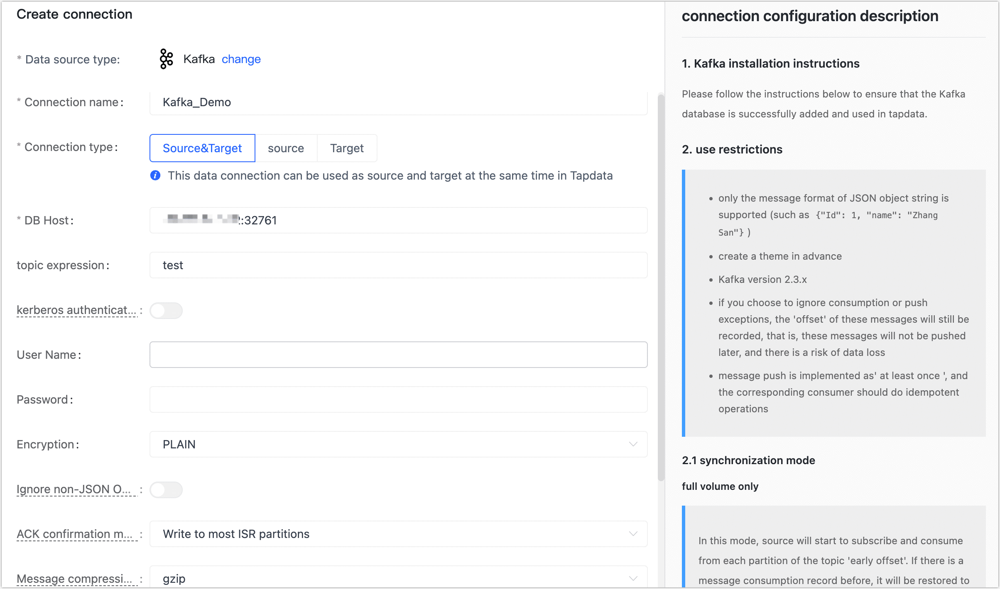

# Connect to Kafka

Apache Kafka is a distributed event store and stream-processing platform. Tapdata Cloud supports building data pipelines with Kafka as the source and target database, and this article describes how to add Kafka to Tapdata Cloud.

## Preparations

[Preparations for Kafka](../../../prerequisites/config-database/certified/kafka.md)

## Procedure

1. Log in to [Tapdata Cloud](https://cloud.tapdata.io/).

2. In the left navigation panel, click **Connections**.

3. On the right side of the page, click **Create connection**.

4. In the pop-up dialog, click **GA data source**, and select **Kafka**.

5. Complete the data source configuration according to the following instructions.

   

   * Connection Information Settings
      * **Connection name**: Fill in a unique name that has business significance.
      * **Connection type**: Supports Kafka as a source or target database.
      * **DB host**: Kafka connection address, including address and port number, separated by English colon (:), such as `113.222.22.***:9092`.
      * **Topic expression**: Topics in Kafka, supports regular expressions and is not longer than 256 characters. For more information, see [Kafka Quick Start](https://kafka.apache.org/23/documentation.html#quickstart).
      * **Kerberos authentication**: If Kafka turns on the authentication, you need to turn on the switch, and then upload and set the key, configuration and other information.
      * **User name**,**Password**,**Encryption**: If Kafka has password authentication turned on, you need to fill in the account and password, and choose encryption.
   * Advanced settings
      * **Ignore non-JSON Object format messages**: If the message isn't ignored and a message of this format is encountered in the future, the pull will cease.
      * **ACK confirmation mechanism**: Choose according to business requirements: Do not confirm, write to master partitions, write to most ISR partitions (default), or write to all ISR partitions.
      * **Message compression type**: Support gzip, snappy, lz4, zstd, when the message volume is large, compression can be enabled to improve transmission efficiency.
      * **Ignore push message exception**: After turning on the switch, the system will still record the offset of the relevant message, but will not push afterward, there may be a risk of data loss.
      * **Agent settings**: Defaults to **Platform automatic allocation**, you can also manually specify an agent.
      * **Model loading frequency**: When the number of models in the data source is greater than 10,000, Tapdata Cloud will periodically refresh the model according to the set time.

Click **Connection Test**, and when passed, click **Save**.

:::tip

If the connection test fails, follow the prompts on the page to fix it.

:::

## Description of the Consumption of Kafka

* **Full data synchronization only**: Subscribe from the earliest offset of each partition in the Topic, and if there is a previous message consumption record, revert to the previous offset to start consumption.
* **Incremental data synchronization only**: Subscribe from the latest offset of each partition in the topic, if there is a previous message consumption record, restore to the previous offset to start consumption.
* **Full + incremental data synchronization**: Skip the full sync phase, starting from the incremental phase.
   * If there is no full synchronization, the subscription will start from the earliest offset of each partition in the Topic, otherwise the subscription will start from the latest offset of each partition in the Topic.
   * If there is a previous message consumption record, it will be restored to the previous offset to start consumption.