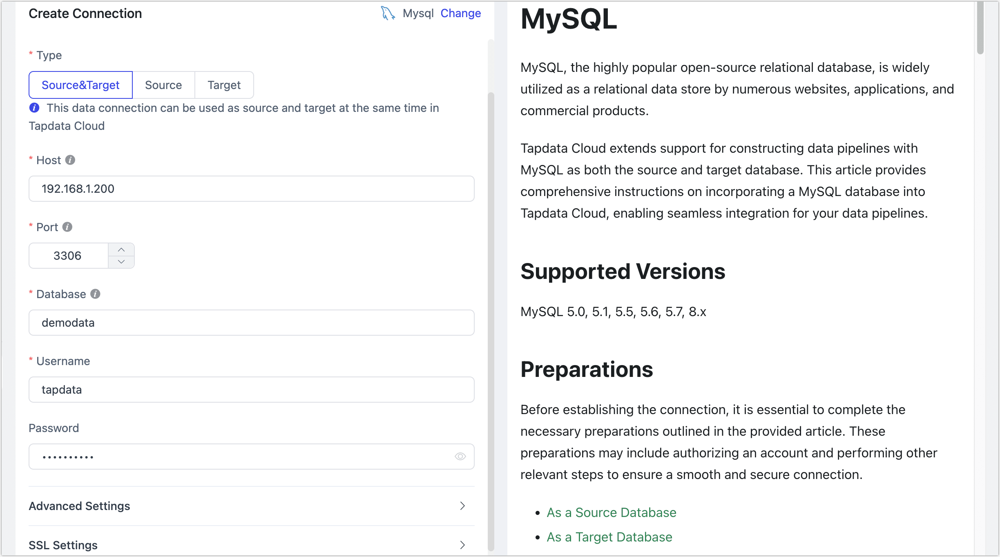

# Connect to MySQL

MySQL, the highly popular open-source relational database, is widely utilized as a relational data store by numerous websites, applications, and commercial products. 

Tapdata Cloud extends support for constructing data pipelines with MySQL as both the source and target database. This article provides comprehensive instructions on incorporating a MySQL database into Tapdata Cloud, enabling seamless integration for your data pipelines.

## Preparations

[Preparations for MySQL](../../../prerequisites/config-database/certified/mysql.md)

## Procedure

1. Log in to [Tapdata Cloud](https://cloud.tapdata.io/).

2. In the left navigation panel, click **Connections**.

3. On the right side of the page, click **Create connection**.

4. In the pop-up dialog, select **MySQL**.

5. On the page that you are redirected to, follow the instructions below to fill in the connection information for MySQL.

   

   * Connection Information Settings

      * **Connection name**: Fill in a unique name that has business significance.
      * **Connection type**: Supports MySQL as a source or target database.
      * **Host**: The database connection address.
      * **Port**: The service port of database.
      * **Database**: Database name, a connection corresponding to a database, if there are multiple databases, you need to create multiple connections.
      * **username**: The database username.
      * **Password**: The database password.
      * **Connection parameter string**: Additional connection parameters, default empty.
      
   * Advanced settings

      * **Timezone**: By default, Tapdata Cloud utilizes the time zone used by the database. However, you also have the flexibility to manually specify the time zone based on your business requirements.
      
        For instance, let's consider a scenario where the source database operates in the default database time zone (+8:00), while the target database has a specified time zone of +0:00. In this case, if the source database stores a timestamp as **2020-01-01 16:00:00**, the same timestamp will be interpreted as **2020-01-01 08:00:00** in the target database due to the time zone conversion.
      
      * **Contain table**: The default option is **All**, which includes all tables. Alternatively, you can select **Custom** and manually specify the desired tables by separating their names with commas (,).
      
      * **Exclude tables**: Once the switch is enabled, you have the option to specify tables to be excluded. You can do this by listing the table names separated by commas (,) in case there are multiple tables to be excluded.
      
      * **Agent settings**: Defaults to **Platform automatic allocation**, you can also manually specify an agent.
      
      * **Model loading frequency**: When the number of models in the data source is greater than 10,000, Tapdata Cloud will periodically refresh the model according to the set time.

6. Click **Connection Test**, and when passed, click **Save**.

   :::tip

   If the connection test fails, follow the prompts on the page to fix it.

   :::

## Related Topics

[MySQL to BigQuery Real-Time Sync](../../../best-practice/mysql-to-bigquery.md)