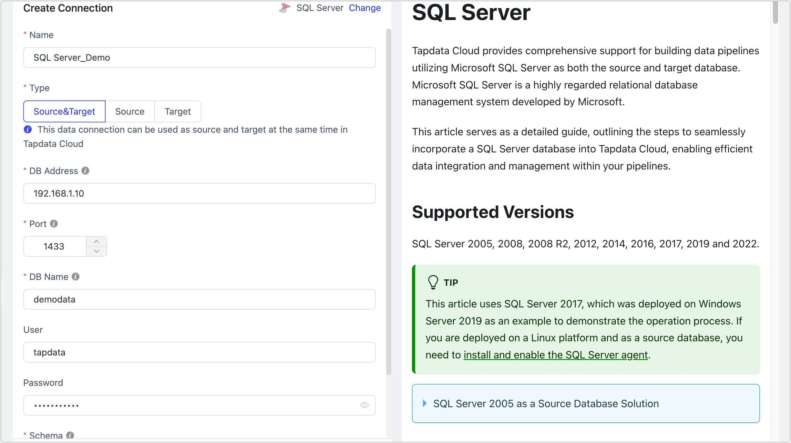

# Connect SQL Server Database

Microsoft SQL Server is a relational database management system developed by Microsoft. Tapdata Cloud supports building data pipelines with SQL Server as the source and target database, and this article describes how to add SQL Server database to Tapdata Cloud.

## Preparations

[Preparations for SQL Server](../../../prerequisites/config-database/certified/sqlserver.md)

## Procedure

1. Log in to [Tapdata Cloud](https://cloud.tapdata.io/).

2. In the left navigation panel, click **Connections**.

3. On the right side of the page, click **Create connection**.

4. In the pop-up dialog, click **GA data source**, and select **SQL Server**.

5. On the page that you are redirected to, follow the instructions below to fill in the connection information for SQL Server.

   

   * Connection Information Settings

      * **Connection name**: Fill in a unique name that has business significance.
      * **Connection type**: Supports SQL Server as a source or target database.
      * **DB address**: The database connection address.
      * **Port**: The service port of database.
      * **DB name**: Database name, a connection corresponding to a database, if there are multiple databases, you need to create multiple connections.
      * **User**: The database account.
      * **Password**: The database password.
      * **Schema**: Schema name.
      * **Connection parameter string**: additional connection parameters, default empty.
   * Advanced settings

      * **Timezone**: Defaults to the time zone used by the database, which you can also manually specify according to your business needs.
      * **Contain table**: Defaults to **all**, you can also choose to custom and fill in the included tables, separated by commas (,) between multiple tables.
      * **Exclude tables**: After turning on the switch, you can set the tables to be excluded, separated by commas (,) between multiple tables.
      * **Agent settings**: Defaults to **Platform automatic allocation**, you can also manually specify an agent.
      * **Model loading frequency**: When the number of models in the data source is greater than 10,000, Tapdata Cloud will periodically refresh the model according to the set time.

6. Click **Connection Test**, and when passed, click **Save**.

   :::tip

   If the connection test fails, follow the prompts on the page to fix it.

   :::