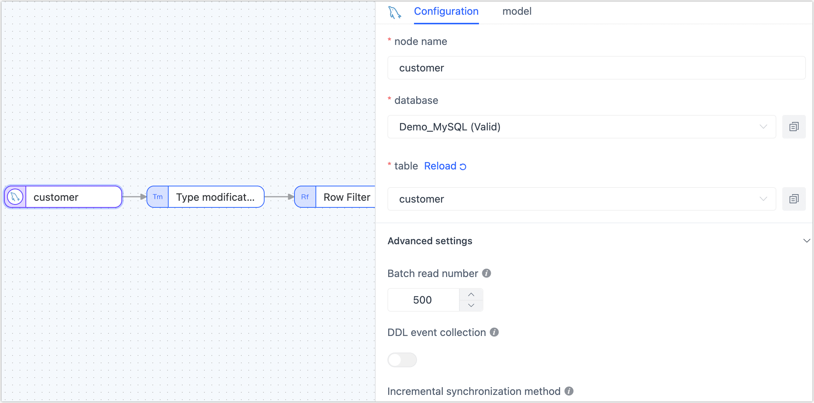
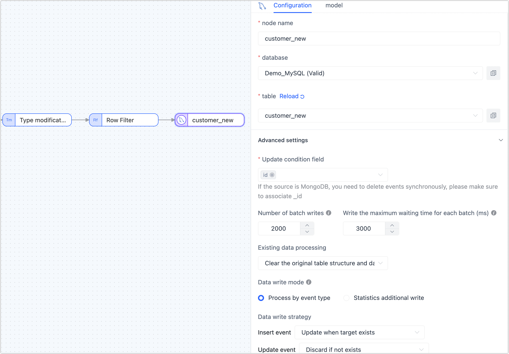

# Create a Data Dev Task

The data development tasks in Tapdata Cloud allow you to add processing nodes between source and target data nodes, which can help you quickly accomplish data processing tasks like merging multiple tables, splitting data, and adding and removing fields. This article describes the process of creating data development tasks.

## Procedure

As an example, we will show how to change the type of **birthdate** field in the table structure from **STRING** to **DATE** without modifying the source table (**customer** table) through data development tasks, and at the same time filter out users born after **1991-01-01**. Then the table structure and filtered data are applied to the new table (**customer_new**).

1. Log in to [Tapdata Cloud](https://cloud.tapdata.io/).

2. In the left navigation bar, click **Data Pipelines**.

3. Click **Create** on the right side of the page to go to the task configuration page.

4. In the **Connections** area on the left side of the page, drag and drop the source and destination data into the right canvas.

5. In the**Processing node** area on the left side of the page, drag and drop the **Type modification** node and the **Row Filter** node.

   :::tip

   For more information on processing nodes and application scenarios, see [processing nodes](process-node.md).

   :::

6. The above four nodes are connected in the order of data flow, as shown in the figure below.

   

7. To configure each node, follow the instructions below.

   1. On the canvas, click the source node on the left, and configure the parameters on the right panel.

      

      * **Node name**: Defaults to connection name, you can also set a name that has business significance.
      * **Table**: Select the source table you want to work with.
      * **DDL event collection**: After turning on the switch, Tapdata Cloud automatically collects the selected source DDL events (such as new fields), if the target database supports DDL writing, it can achieve DDL statement synchronization.
      * **Filter settings**: Default off, after turning on you need to specify data filtering conditions.

   2. Click **Type modification** node, and in the right panel, modify the **birthdate** field to the type **Date**.

      

   3. Click the Row Filter node to complete the parameter configuration of the right panel according to the following instructions.

      

      * **Execute action**: Select **Keep matching data**.
      * **Conditional expression**: Fill in the data matching expression, the case is filled in `record.birthdate > = '1990-01-01'`, the supported symbols are as follows:
         * Comparison: greater than (`>`), less than (`<`), greater than or equal to (`>=`), less than or equal to (`<=`), equal to (`==`)
         * Logical judgment: with (`&&`), or (`||`), non- (`!`)
         * Regular expression: e.g.`/^.*$/.test( )`
         * Conditional grouping: To add multiple groups of conditions, first include each group of conditions in brackets, and then add logical judgment symbols between each group of conditions, such as filtering out men over 50 years old or people under 30 years old with incomes of 10,000 years old, that is: `( record.gender == 0&& record.age > 50) || ( record.age >= 30&& record.salary <= 10000)`.

   4. Click the last target data node to complete the parameter configuration of the right panel according to the following instructions.

      

      - **Node name**: Defaults to connection name, you can also set a name that has business significance.
      - **Table**: Select the table where you want to write the processed data.
      - **Existing data processing**,**Data write mode**: Choose how data should be handled. For example, if the target table does not have data and the structure and source table are inconsistent, you can select **Clear the original table structure and data on the target side**.
      - **Full multi-threaded write**: The number of concurrent threads with full data written, the default is **8**, which can be appropriately adjusted based on the write performance of the target database.
      - **Incremental multi-threaded write**: The number of concurrent threads with incremental data written, which is disabled by default, can be appropriately adjusted based on the write performance of the target database.

8. (Optional) Click the  icon above to configure the task properties.

   * **Task name**: Fill in a name that has business significance.
   * **Sync type**: **Full + incrementtal synchronization** can be selected, or **Initial sync**and **CDC** can be selected separately.In real-time data synchronization scenarios, the combination of full and incremental data copying can be used to copy existing data from the source database to the target database.
   * **Task description**: Fill in the description information for the task.
   * **Advanced settings**: Set the start time of the task, incremental data processing mode, number of processor threads, agent, etc.

9. Click **Save** or **Start**, the following figure shows that after the task starts successfully, you can view its QPS, delay, task event, and other information.

   

   :::tip

   In order to ensure the normal operation of the task, after clicking **Save** or **Start**, Tapdata Cloud will pre-check the configuration of each node. If it does not pass, please adjust it according to the log prompt of the current page.

   :::


## Data Validation

Log in to the target database, check the structure of the **customer_new** table, the type of the **birthdate** column is **DateTime**, and then check the number of users with birth dates earlier than **1990-01-01**, the number is zero, and the total number of records in the table is **31276**, proving that this part of the data has been filtered.

```sql
mysql> DESC customer_new;
+---------------+--------------+------+-----+---------+-------+
| Field         | Type         | Null | Key | Default | Extra |
+---------------+--------------+------+-----+---------+-------+
| id            | varchar(200) | NO   | PRI | NULL    |       |
| name          | varchar(200) | NO   |     | NULL    |       |
| lastname      | varchar(200) | NO   |     | NULL    |       |
| address       | varchar(200) | NO   |     | NULL    |       |
| country       | varchar(200) | NO   |     | NULL    |       |
| city          | varchar(200) | NO   |     | NULL    |       |
| registry_date | varchar(200) | NO   |     | NULL    |       |
| birthdate     | datetime(3)  | NO   |     | NULL    |       |
| email         | varchar(200) | NO   |     | NULL    |       |
| phone_number  | varchar(200) | NO   |     | NULL    |       |
| locale        | varchar(200) | NO   |     | NULL    |       |
+---------------+--------------+------+-----+---------+-------+
11 rows in set (0.00 sec)

mysql> SELECT COUNT(*) FROM customer_new WHERE birthdate < 1990-01-01;
+----------+
| count(*) |
+----------+
|        0 |
+----------+
1 row in set, 1 warning (0.01 sec)

mysql> SELECT COUNT(*) FROM customer_new
+----------+
| count(*) |
+----------+
|    31276 |
+----------+
1 row in set, 1 warning (0.01 sec)
```


## See also

By combining multiple processing nodes and multiple data sources, you can achieve a more complex and personalized data flow. For more information, see [processing nodes](process-node.md).

