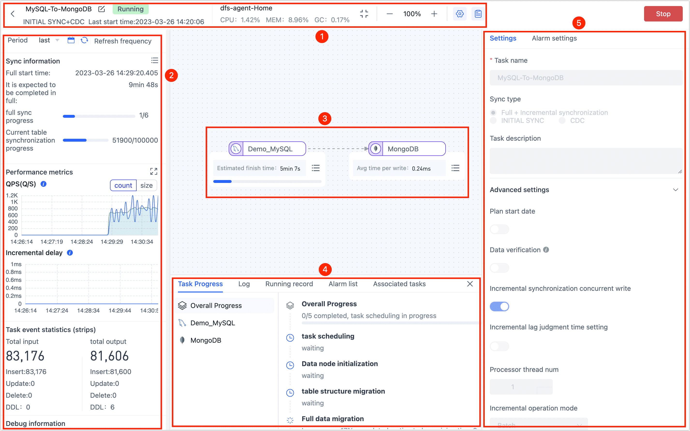

# Monitor Data Pipeline Task

After the data pipeline task is started, the page will automatically jump to the task monitoring page, through which you can observe the task operation details, including Agent status, data synchronization status, task progress, alarm settings and other information.

:::tip

By clicking the **monitor** button on the task list page, you can access the monitoring page as well.

:::

## ① Top control bar

You can rename a task name, view the task start time, and see the Agent status, which includes the following information:

* CPU usage: the proportion of CPU used by the engine process to the total CPU of the system
* Memory usage: Used / Memory Max
* GC Throughput: (Engine Cumulative Run Time - GC Time)/Engine Cumulative Run Time * 100%

## ② Task indicators display bar

Display basic information and key monitoring indicators of the task, including synchronization information, task verification information, performance indicators and task time statistics, including:

* Task checksumming: will be displayed only if the task has checksumming enabled. Click to view checksumming details if any anomalies are found.
* QPS: The average number of input events and output events processed per second by the task.
* Incremental delay: The delay from the time the event is generated from the source database to the time it is completed by the task processing to write the target. When there are multiple targets, only the maximum incremental delay time is counted, in milliseconds.
* Task event statistics: Statistics of all cumulative events after the operation of the task, the statistical precautions are as follows:
   * Update: The insertion event becomes the update event if the target database already exists when the target database is inserted, and the write policy sets the update to occur when the target already exists.
   * DDL
      * Tapdata builds a table directly on the target based on deduction results, so DDL events of the table cannot be counted at the source.
      * If the target is a database type that does not require table building (such as MongoDB), the target's table building events are not counted.
      - DDL events are counted for drop table and create table if the target duplicate processing policy selects clear target structure and data.

## ③ Node information display area

Hover your mouse pointer over a node to display key metrics for that node, and click the  icon in the bottom right corner of the node to see more details.

- Full sync progress: The progress report on the full data synchronization.
- incremental data synchronization: The time point at which incremental logs are collected. By moving the mouse in the floating window, it is expressed as the relative time of (the engine time - the incremental time point of the node).
- Writing time: The time it takes for data to be written to the target.
- QPS: The QPS of the node.
- Cumulative input events: The number of events entered into the node from the previous node or source database.
- Cumulative output events: The number of events output from the node to the next node or target database.
- Processing time: The time it takes for the node to process data.

## ④ Task log display area

Click the  icon at the top of the page, then you can view the progress, logs, alarm list, and associated task information for a task run. You can filter the logs using keywords, periods, and levels, or download them for local analysis on the **Log** tab.

## ⑤ Task/alarm setting area

Click the  icon at the top of the page, which displays the task settings (not modifiable) and alarm settings, you can set the alarm rules:

* Task running error alarm
* Notice of full completion of tasks
* Task increment start notification
* Task stop alarm
* Task increment delay alarm

