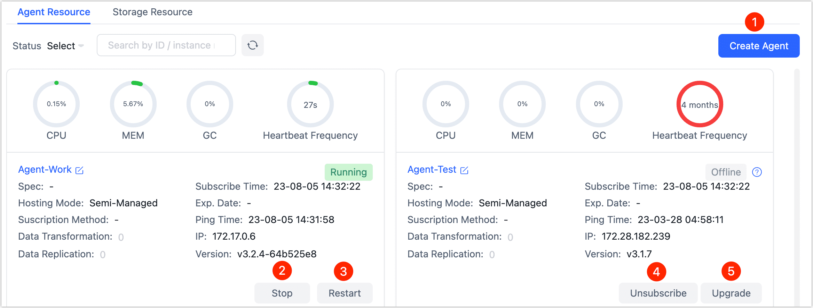

# Manage Agent

Tapdata Cloud provides visual management and maintenance capabilities for Agents. You can manage installed Agents through the dedicated page or by executing commands.


## Manage Agent by Page

1. Log in to [Tapdata Cloud](https://cloud.tapdata.io/).

2. Click **Resource Management** in the left navigation panel, and then choose which operation to perform.

   


import Tabs from '@theme/Tabs';
import TabItem from '@theme/TabItem';

<Tabs className="unique-tabs">
    <TabItem value="create-agent" label="① Create Agent" default>
    <p>Agent support multi-platform installation, see <a href="../quick-start/install-agent">Install Agent</a>.</p>
   </TabItem>
   <TabItem value="stop-agent" label="② Stop Agent">
   <p>Click <b>Stop</b> to pause the Agent, which can be used for temporary maintenance scenarios, to restart the Agent later, you should run it from the command line.</p>
   </TabItem>
   <TabItem value="restart-agent" label="③ Restart Agent">
   <p>Click <b>Restart</b> to restart the Agent.</p>
   </TabItem>
   <TabItem value="delete-agent" label="④ Unsubscribe Agent">
   <p>If the Agent is no longer needed, it can be unsubscribed after stopping it. Please note that once deleted, the Agent cannot be recovered.</p>
   </TabItem>
   <TabItem value="upgrade-agent" label="⑤ Upgrade Agent">
   <p>When a new version becomes available, an upgrade icon will appear on the right side of the version information. To initiate the upgrade process, follow these steps:</p>
   <p></p>
   <ul>
   <li><b>Automatic Upgrade</b>
   <ol>
   <li>Choose this method if the Agent status is running.</li>
   <li>Click the upgrade icon, and the upgrade process will begin.</li>
   <li>After the upgrade is completed, the upgrade icon will disappear automatically.</li>
   <li>In case the automatic upgrade fails, you can proceed with a manual upgrade.</li>
   </ol></li>
   <li><b>Manual Upgrade</b>
   <ol> <li>To ensure that the upgrade operation does not impact any ongoing tasks, it is advisable to stop any task associated with the Agent before proceeding with the upgrade.</li>
   <li>Execute the upgrade command on the device where the Agent is installed.</li></ol></li>
  </ul> 
  <p>By following these instructions, you can easily upgrade to the latest version of the Agent software. If you encounter any issues during the upgrade process, please refer to the documentation or contact our support team for assistance.</p>
   </TabItem>
  </Tabs>


## Manage Agent by Command

According to the platform selection of the Agent installation, view the relevant command description:


<Tabs className="unique-tabs">
    <TabItem value="linux" label="Linux" default>
    <p>Navigate to the installation directory of the Agent and proceed by executing the following command: </p>
    <ul>
    <li>View command help: <code>./tapdata help</code>
 </li>
    <li>Check the status of the Agent: <code>./tapdata status</code> </li>
    <li>Start Agent: <code>./tapdata start</code> </li>
    <li>Stop Agent: <code>./tapdata stop</code> </li>
    </ul>
   </TabItem>
   <TabItem value="windows" label="Windows">
    <p>Enter the installation directory of the Agent and proceed with the chosen operation:</p>
    <ul>
    <li>Check the status of the Agent: Double-click the <b>sstatus.bat</b> </li>
    <li>Start Agent: Double-click the <b>start.bat</b> or <b>tapdata.exe</b> </li>
    <li>Stop Agent: Double-click the <b>stop.bat</b> </li>
    </ul>
   </TabItem>
   <TabItem value="dockerandmac" label="Docker/Mac(M1 Chip)">
    <ol>
    <li>Execute <code>docker ps</code> to get the container ID. </li>
    <p></p>
    <li>To access the container command line, execute the following command format:
    <pre>
    docker exec -it container ID/bin/bash</pre>
    <p>Replace the container ID in the command, such as <code>docker exec -it 1dbee41b4adc/bin/bash</code>. </p>
    </li>
    <li> Within the container command line, navigate to the installation directory of the Agent and proceed by executing the following command:
    <ul>
    <li>View command help: <code>./tapdata help</code>
 </li>
    <li>Check the status of the Agent: <code>./tapdata status</code>
 </li>
    <li>Start Agent: <code>./tapdata start</code>
 </li>
    <li>Stop Agent: <code>./tapdata stop</code>
 </li>
    </ul>
    </li>
    </ol>
   </TabItem>
  </Tabs>

### Agent Directory Description
During the installation and execution of the task, the Agent will automatically generate some files in the installation directory for storing task information, logs, configuration files, data source certificates and other information, as detailed below:

tap_table_ehcache: Cache the table's structure of the data source associated with the task runtime.

```bash
├── cert/						 			# Certificate files for the middleware database
├── application.yml							# Agent configuration file
├── CacheObserveLogs/						# Cached monitoring logs
├── components/								# Jar files for engine execution
├── connectors/								# Files related to data source plugins
├── etc/									# Initialization scripts for the middleware database
├── fileObserveLogAppenderV2/				# Observability logs, subdirectories named as task IDs
├── logs/									# Logs generated by the engine during runtime
├── tapdata/								# Agent program
├── tapdataDir/								# Recording the working directory of the engine
└── tap_table_ehcache/						# Cached table models of data sources

```


:::tip
To ensure the smooth operation of the Agent and enable efficient fault detection, please refrain from deleting the mentioned directory or file.
:::


### Adjust Agent Runtime Memory

To adjust the memory configuration in the Agent installation directory, locate the **application.yml** configuration file and edit it accordingly. Set the tapdataJavaOpts: `-Xms4G -Xmx8G` to allocate 4GB as the initial memory and allow a maximum of 8GB.

```yaml
tapdata:
    conf:
        tapdataPort: '3030'
        backendUrl: 'https://cloud.tapdata.io/api/'
        apiServerPort: ""
        tapdataJavaOpts: "-Xms4G -Xmx8G"
        reportInterval: 20000
        uuid: a5f266a1-a495-412f-a433-29d345713c176
		……
```

After saving the changes, restart the Agent to take effect:

```bash
# Stop Agent
./tapdata stop -f
# Start Agent
./tapdata start
```
