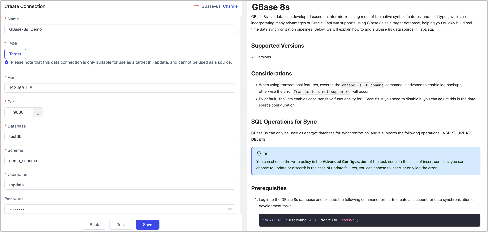

# GBase 8s


GBase 8s is a database developed based on Informix, retaining most of the native syntax, features, and field types, while also incorporating many advantages of Oracle. TapData supports using GBase 8s as a target database, helping you quickly build real-time data synchronization pipelines. In this article, we will explain how to add a GBase 8s in TapData.

## Supported Versions

All versions

## Considerations

- When using transactional features, execute the `ontape -s -U dbname` command in advance to enable log backups, otherwise the error `Transactions not supported` will occur.
- By default, TapData enables case-sensitive functionality for GBase 8s. If you need to disable it, you can adjust this in the data source configuration.

## SQL Operations for Sync

GBase 8s can only be used as a target database for data synchronization, and it supports the following operations: **INSERT**, **UPDATE**, **DELETE**.

:::tip

You can choose the write policy in the **Advanced Configuration** of the task node. In the case of insert conflicts, you can choose to update or discard; in the case of update failures, you can choose to insert or only log the error.

:::

## Prerequisites

1. Log in to the GBase 8s database and execute the following command to create a user for data replication/transformation tasks:

   ```sql
   CREATE USER username WITH PASSWORD "passwd";
   ```

   - **username**: Username.
   - **passwd**: Password.

   Example: Create an account named `tapdata`.

   ```sql
   CREATE USER tapdata WITH PASSWORD "Your@passwd123";
   ```

2. Execute `GRANT DBA TO 'username'` to grant DBA permissions to the newly created account. You can also set more granular permission control based on business requirements (e.g., table-level permissions).

## Connect to GBase 8s

1. [Log in to TapData platform](../../user-guide/log-in.md).

2. In the left navigation bar, click on **Connections**.

3. Click **Create** on the right side of the page.

4. In the pop-up dialog, search for and select **GBase 8s**.

5. On the page that appears, fill in the connection information for GBase 8s as described below.

   

   - **Connection Information Settings**
     - **Name**: Enter a unique name that is meaningful for your business.
     - **Type**: GBase 8s is only supported as a target database.
     - **Host**: Database connection address.
     - **Port**: Database service port.
     - **Database**: Database name (one connection corresponds to one database; if there are multiple databases, multiple connections need to be created).
     - **Schema**: Schema name.
     - **Username**: The database account.
     - **Password**: The password for the database account.
     - **Additional Connection Parameters**: The default is `:delimident=y`, which enables case sensitivity.
     - **Time Zone**: The default time zone is set to UTC (0 timezone).
   - **Advanced Settings**
     - **Agent Settings**: By default, the platform automatically assigns an agent, but you can manually specify an agent.
     - **Model Load Time**: If there are less than 10,000 models in the data source, their schema will be updated every hour. But if the number of models exceeds 10,000, the refresh will take place daily at the time you have specified.

6. Click **Test**. If the test is successful, click **Save**.

   :::tip

   If the connection test fails, please follow the page prompts to resolve the issue.

   :::