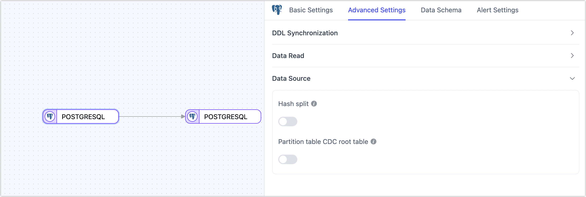

# PostgreSQL

[PostgreSQL](https://www.postgresql.org/) is a powerful open-source object-relational database management system (ORDBMS). TapData supports using PostgreSQL as both a source and target database, helping you quickly build real-time data pipelines. This document will introduce how to connect PostgreSQL as a data source in the TapData platform.

```mdx-code-block
import Tabs from '@theme/Tabs';
import TabItem from '@theme/TabItem';
```

## Supported Versions and Architectures

* **Versions**: PostgreSQL 9.4 to 17
* **Architectures**: Stand-alone or Replication architectures
  :::tip
  In a primary-standby architecture, you can capture incremental data from a standby by selecting the **PHYSICAL** replication slot and enabling **Prefer Standby for CDC**. Existing Walminer deployments can continue to use Walminer.
  :::

## Supported Data Types

| Category       | Data Types                                                   |
| -------------- | ------------------------------------------------------------ |
| Strings & Text | character, character varying, text                           |
| Numeric        | integer, bigint, smallint, numeric, real, double precision   |
| Binary         | bytea                                                        |
| Bit            | bit, bit varying                                             |
| Boolean        | boolean                                                      |
| Date & Time    | timestamp without time zone, timestamp with time zone, date, time without time zone, <br />time with time zone, interval |
| Spatial Data   | geometry, point, polygon, circle, path, box, line, lseg      |
| Network Types  | inet, cidr, macaddr                                          |
| Identifier     | uuid, oid, regproc, regprocedure, regoper, regoperator, regclass, regtype, regconfig, regdictionary |
| Text Search    | tsvector, tsquery                                            |
| Others         | xml, json, jsonb, array                                      |

:::tip

When using PostgreSQL as the target database or obtaining incremental data via the Wal2json plugin, the following data types are not supported: `tsvector`, `tsquery`, `regproc`, `regprocedure`, `regoper`, `regoperator`, `regclass`, `regtype`, `regconfig`, and `regdictionary`. If the Walminer plugin is used, these types are also not supported, along with `array` and `oid` types.

:::

## Supported Operations

**DML operations**: **INSERT**, **UPDATE**, **DELETE**

**DDL operations**: Add columns, rename columns, change column attributes, and drop columns. Logical replication requires the DDL trigger. PHYSICAL captures system catalog changes from WAL and should be validated before use.

:::tip

- When used as a **target**, you can configure advanced write strategies in the task node settings. Options include update or discard on insert conflict, insert or log on update failure, and enable file-based writes. Additionally, you can apply and execute source-side ADD COLUMN, CHANGE COLUMN, DROP COLUMN, and RENAME COLUMN operations.
- For data synchronization between PostgreSQL databases, extra support is provided for synchronizing **column default values**, **auto-increment columns**, and **foreign key constraints**.

:::

## Limitations

- Incremental sync can start from a specified time only when the required continuous WAL is still available. Changing the start time cannot recover WAL that has already been recycled.
- With `wal_level=replica`, PHYSICAL relies on full-page images (FPIs) and its page cache to recover the before images of UPDATE and DELETE events. Complete before images are not guaranteed in every scenario. Cold pages, cache eviction, or insufficient warm-up after failover can cause before images to be missing.
- PostgreSQL does not support storing `\0` in string types; TapData will automatically filter it to avoid exceptions.
- To capture incremental events for partitioned parent tables, PostgreSQL version 13 or above must be used, and the pgoutput plugin must be selected.
- The Walminer plugin currently only supports connecting and merging shared mining.

## Considerations

- To start pgoutput, wal2json, or decoderbufs from a specified time, set **WAL Retention Hours** in the source node advanced features to a value greater than 0. Also confirm that the replication slot, task checkpoint, and required WAL are still valid. The retention window does not make arbitrary historical points replayable.
- To capture column DDL with a logical replication plugin, enable **Enable DDL Trigger** and grant the sync account permission to create the audit table, functions, and event triggers. PHYSICAL captures column DDL by parsing system catalog changes in WAL and does not use this setting. Incomplete catalog reads or before-image recovery can still affect DDL capture.
- If complete before images are required for UPDATE and DELETE events, use `wal_level=logical` and set `REPLICA IDENTITY FULL` on the captured tables. In `replica` mode, PHYSICAL remains subject to FPI, page cache, and page-compression limitations and must be validated with representative data.
- Both physical and logical replication slots retain the WAL they still require. Long-idle tasks and abandoned slots can fill `pg_wal`. Use [`pg_replication_slots`](https://www.postgresql.org/docs/17/view-pg-replication-slots.html) to check `restart_lsn`. On PostgreSQL 13 and later, also check `wal_status` and use `max_slot_wal_keep_size` to limit retention. On versions 9.4 through 12, control usage through disk monitoring and manual cleanup. Remove a slot only after confirming that it is no longer needed for recovery.
- When using a slot-based plugin such as **wal2json**, too many shared mining processes can cause WAL accumulation and increase disk usage. Configure mining processes according to actual capture needs and monitor WAL usage. Remove a replication slot only after confirming that the associated task will not be recovered.
- PostgreSQL logical replication relies on the creation of a replication slot. If there are ongoing tasks in the database (such as refreshing materialized views), they may block the creation of replication slots. If the connection test becomes unresponsive for an extended period, it is recommended to check for such tasks.
- Plugins based on WAL logs (e.g., **walminer**) will frequently read and write to the `walminer_contents` table during shared mining, generating some load. However, since only single-task mining is currently supported, the impact is relatively small.
- PHYSICAL can spill buffers for large transactions to the Agent disk. Reserve sufficient space and write permission for the spill directory. The WAL archive directory is for historical log recovery and is separate from the temporary spill directory.
- The current PHYSICAL decoder might not recover complete values from WAL records that contain external TOAST pointers or unsupported compressed page images. Validate large fields and UPDATE and DELETE scenarios with representative data before running the task.

## Preparation

### As a Source Database

<span id="prerequisites"></span>

If you only need a full snapshot, complete the account authorization steps. For incremental sync, select a capture method and complete its prerequisites.

#### Grant account permissions

1. Log in to PostgreSQL as an administrator.

2. Create a user and grant permissions.

   1. Execute the following command format to create an account for data synchronization/development tasks.

      ```sql
      CREATE USER username WITH PASSWORD 'password';
      ```

      * **username**: Username.
      * **password**: Password.

   2. Execute the following command format to grant account permissions.

      ```mdx-code-block
      <Tabs className="unique-tabs">
      <TabItem value="Read Full Data Only">
      ```

      ```sql
      -- Switch to the database to be authorized
      \c database_name
      
      -- Grant table read permission for the target schema
      GRANT SELECT ON ALL TABLES IN SCHEMA schema_name TO username;
      
      -- Grant USAGE permission to schema
      GRANT USAGE ON SCHEMA schema_name TO username;
      ```
      </TabItem>
      
      <TabItem value="Read Full and Incremental Data">
      
      ```sql
      -- Switch to the database to be authorized
      \c database_name
      
      -- Grant table read permission for the target schema
      GRANT SELECT ON ALL TABLES IN SCHEMA schema_name TO username;
      
      -- Grant USAGE permission to schema
      GRANT USAGE ON SCHEMA schema_name TO username;
      
      -- Grant replication permission
      ALTER USER username REPLICATION;
      ```
      </TabItem>
      </Tabs>
      
      * **database_name**: Database name.
      * **schema_name**: Schema name.
      * **username**: Username.

Walminer does not require the `REPLICATION` privilege, but Walminer and Pgto Server deployments usually require superuser privileges. Follow the preparation steps on the Walminer tab below.

#### Select an incremental capture method

For most incremental sync tasks, use a **logical replication slot**. Select **PHYSICAL** when you need to read raw WAL from a standby first. Existing Walminer deployments can continue to use Walminer. After granting account permissions, complete the steps for your selected method.

```mdx-code-block
<Tabs className="unique-tabs" groupId="postgres-cdc" queryString="cdc" defaultValue="logical">
<TabItem value="logical" label="Logical replication slot">
```

#### Logical replication slot

1. If a captured table does not have a primary key, or if you need complete before images for UPDATE and DELETE events, run the following command as the table owner or another account with the required privilege. This sets the replica identity to FULL so that the entire row identifies a changed record.

   :::tip

   You can skip this step for tables that have a primary key and can use the default replica identity. If you only need a full snapshot, skip this and all subsequent steps.

   :::

   ```sql
   ALTER TABLE schema_name.table_name REPLICA IDENTITY FULL;
   ```

   * **schema_name**: Schema name.
   * **table_name**: Table name.

2. Log in to the PostgreSQL server and select a decoder plugin based on your requirements and database version:

   - [Wal2json](https://github.com/eulerto/wal2json/blob/master/README.md): Supports PostgreSQL 9.4 and later and converts WAL records to JSON. For captured tables without primary keys, check the `REPLICA IDENTITY FULL` setting and validate UPDATE and DELETE events.
   - [Pgoutput](https://www.postgresql.org/docs/17/logicaldecoding-output-plugin.html) (default): Built into PostgreSQL 10 and later, with no separate installation required. Pgoutput uses a publication to define its published scope. For details, see [Customize the replication slot and publication](postgresql.md?cdc=logical#customize-the-replication-slot-and-publication). With `REPLICA IDENTITY DEFAULT`, the before image for an UPDATE on a table with a primary key might be incomplete. Use FULL when complete before images are required.
   - [Decoderbufs](https://github.com/debezium/postgres-decoderbufs): Supports PostgreSQL 9.6 and later and uses Google Protocol Buffers to parse WAL, but requires more complex configuration.

   The connector might also display RDS or Streaming variants of WAL2JSON. Install these options according to the plugin and version provided by the corresponding environment. The CentOS example below does not apply to those variants.

   :::tip

   To capture DDL events from a PostgreSQL source, select pgoutput, wal2json, or decoderbufs and use a sync account with superuser privileges to create event triggers. TapData writes DDL events to the `public._tapdata_ddl_audit` audit table through an event trigger, then captures changes from the audit table through a logical replication slot. If the account does not have sufficient privileges or DDL capture is not required, turn off **Enable DDL Trigger** in the source node advanced features.

   :::

   The following installation steps apply only to **Wal2json**. **Pgoutput** is built into PostgreSQL 10 and later and does not require installation. Install **Decoderbufs** according to its project documentation.

   The following example shows how to install **Wal2json**.

   :::tip

   In this example, PostgreSQL version 12 is installed on CentOS 7. If your environment differs, you will need to adjust the installation steps for development package versions, environment variable paths, etc.

   :::

   1. Add the repository package.

      ```bash
      yum install https://download.postgresql.org/pub/repos/yum/reporpms/EL-7-x86_64/pgdg-redhat-repo-latest.noarch.rpm
      ```

   2. Install the PostgreSQL 12 development package.

      ```bash
      yum install -y postgresql12-devel
      ```

   3. Set environment variables and activate them.

      ```bash
      export PATH=$PATH:/usr/pgsql-12/bin
      source /etc/profile
      ```

   4. Install environment dependencies, including llvm, clang, gcc, etc.

      ```bash
      yum install -y devtoolset-7-llvm centos-release-scl devtoolset-7-gcc* llvm5.0
      ```

   5. Execute the following commands in sequence to complete the installation of the plugin.

      ```bash
      # Clone and enter the directory
      git clone https://github.com/eulerto/wal2json.git && cd wal2json
      
      # Enter the scl's devtoolset environment
      scl enable devtoolset-7 bash
      
      # Compile and install
      make && make install
      ```

3. Configure logical replication logging for pgoutput, wal2json, or decoderbufs. In `postgresql.conf`, set `wal_level` to `logical`.

      :::tip

   Size `max_replication_slots` and `max_wal_senders` for physical replication, CDC consumers, and temporary slots used by connection tests. Make sure spare capacity is available.

      :::

4. Add a rule to `pg_hba.conf` that allows TapData to connect to the database.

   ```bash
   # Replace this example address with the TapData Agent's actual egress IP.
   # The database name applies to both regular SQL and logical replication connections.
   host    database_name    username    192.0.2.10/32    md5
   ```

5. Restart PostgreSQL during an off-peak period to apply the logging settings. The following command is an example for PostgreSQL 12. Adjust it for your deployment.

   ```bash
   service postgresql-12.service restart
   ```

   After the restart, run `SHOW wal_level;` and confirm that it returns `logical`. From the Agent network, connect to the target database with the sync account to verify network access and authentication.

6. (Optional) Test Wal2json. The following SQL applies only when Wal2json is installed. For pgoutput or decoderbufs, validate incremental capture with a TapData test task.

   1. Connect to the postgres database, switch to the database to be synchronized, and create a test table.

      ```sql
      -- Suppose the database to be synchronized is demodata, and the schema is public
      \c demodata
      CREATE TABLE public.test_decode
      (
        uid    integer not null
            constraint users_pk
                primary key,
        name   varchar(50),
        age    integer,
        score  decimal
      );
      ```
   
   2. Create a Slot connection, using the wal2json plugin as an example.
   
      ```sql
      SELECT * FROM pg_create_logical_replication_slot('slot_test', 'wal2json');
      ```
   
   3. Insert a record into the test table.
   
      ```sql
      INSERT INTO public.test_decode (uid, name, age, score)
      VALUES (1, 'Jack', 18, 89);
      ```
   
   4. Listen to the log and check if there is information about the insert operation.
   
      ```sql
      SELECT * FROM pg_logical_slot_peek_changes('slot_test', null, null);
      ```
   
      Example return (displayed vertically):
   
      ```sql
      lsn  | 0/3E38E60
      xid  | 610
      data | {"change":[{"kind":"insert","schema":"public","table":"test_decode","columnnames":["uid","name","age","score"],"columntypes":["integer","character varying(50)","integer","numeric"],"columnvalues":[1,"Jack",18,89]}]}
      ```
   
   5. If there are no issues, delete the Slot connection and the test table.
   
      ```sql
      SELECT * FROM pg_drop_replication_slot('slot_test');
      DROP TABLE public.test_decode;
      ```

##### Customize the replication slot and publication

By default, TapData manages the replication slots used by tasks. If your DBA centrally manages slots and publication scopes, create them in advance and specify their names in the source node.

1. To use a specific replication slot, create one in the captured database with the plugin used by the connection. For example, to create a pgoutput slot:

   ```sql
   SELECT * FROM pg_create_logical_replication_slot('tapdata_slot', 'pgoutput');
   ```

   Enter `tapdata_slot` in **Specified Logical Replication Slot Name** on the source node. A slot can have only one active consumer, so use a separate slot for each independent capture task. When an existing task resumes, it uses its saved slot information first. Changing this field alone does not move the task to a new slot.

2. For pgoutput, configure the publication based on whether **Partial Publication** is enabled.

   | Configuration | Name and scope | Permissions and maintenance |
   | --- | --- | --- |
   | Partial Publication disabled | Set **Custom Full Publication Name** in the connection. The default is `dbz_publication`. When partition-root capture is enabled, TapData appends `_root`. | If the publication does not exist, TapData attempts to create a publication for all tables. `FOR ALL TABLES` requires superuser privileges, so a DBA can create it in advance. |
   | Partial Publication enabled, no custom name | Uses the task slot name to create a publication containing the tables captured by that task. | Automatic creation requires `CREATE` on the database and ownership of the relevant tables. |
   | Partial Publication enabled, custom name | Enter the existing publication name in **Custom Publication Name** on the source node. | The publication must include all captured tables. TapData still attempts to add missing tables, which requires the corresponding privilege, unless a DBA adds them first. |

   Partial Publication narrows the publication scope so that uncaptured tables do not have to be included. It does not remove replica identity requirements for UPDATE and DELETE events on captured tables. The UI term “publication name” refers to a PostgreSQL publication; you do not need to create a PostgreSQL subscription for TapData.

   Create one of the following publications for all tables:

   ```sql
   -- Partition-root capture disabled
   CREATE PUBLICATION dbz_publication FOR ALL TABLES;

   -- PostgreSQL 13 or later with partition-root capture enabled
   CREATE PUBLICATION dbz_publication_root
     FOR ALL TABLES WITH (publish_via_partition_root = true);
   ```

   To create a partial publication:

   ```sql
   CREATE PUBLICATION tapdata_publication FOR TABLE schema_name.table_name;
   ```

   For logical DDL capture, also include the DDL audit table, `public._tapdata_ddl_audit` by default, in the publication. Initialize the audit objects first if the table does not exist. Publishing only business tables does not capture DDL records from the audit table.

3. Use the sync account to inspect the slot and publication:

   ```sql
   SELECT slot_name, slot_type, plugin, database, active,
          restart_lsn, confirmed_flush_lsn
   FROM pg_replication_slots
   WHERE slot_name = 'tapdata_slot';

   -- Replace tapdata_publication with the actual publication name.
   SELECT pubname, schemaname, tablename
   FROM pg_publication_tables
   WHERE pubname = 'tapdata_publication';
   ```

   Confirm that the slot database and plugin match the connection, the slot is not used by another consumer before startup, and the publication covers the capture scope. If you retain a custom slot, also review **Automatically Clean Up Replication Slots**. Specifying a custom name does not guarantee that TapData will never remove the slot.

##### PostgreSQL 17 logical slot failover (optional)

This feature requires PostgreSQL 17 or later, pgoutput, and a connector version that displays **Enable PostgreSQL 17 Logical Slot Failover**. It synchronizes a logical slot to a physical standby and is separate from PHYSICAL timeline recovery.

:::caution

This setting is not available in every connector version. Follow these steps only if **Enable PostgreSQL 17 Logical Slot Failover** appears in the node advanced settings. Do not add the setting manually when it is absent from the UI.

:::

1. Ask a DBA to configure primary-standby replication and slot synchronization. On the standby, set `sync_replication_slots=on` and `hot_standby_feedback=on`, use the physical slot between the primary and standby through `primary_slot_name`, and specify a valid database name in `primary_conninfo`. On the primary, consider setting `synchronized_standby_slots` so that the logical consumer cannot advance beyond the failover candidate. Waiting for the standby can increase capture latency. For details, see [PostgreSQL replication slot synchronization](https://www.postgresql.org/docs/17/logicaldecoding-explanation.html#LOGICALDECODING-REPLICATION-SLOTS-SYNCHRONIZATION).

2. Enable **Enable PostgreSQL 17 Logical Slot Failover** on the source node so that TapData sets `failover=true` when it creates a pgoutput slot. To create a slot in advance, use the following command instead of the standard logical-slot command. Run it as a DBA in the captured database and use an unused name:

   ```sql
   SELECT * FROM pg_create_logical_replication_slot(
     'tapdata_failover_slot', 'pgoutput', false, false, true
   );
   ```

   Enter `tapdata_failover_slot` in **Specified Logical Replication Slot Name**. Enabling failover does not convert an existing standard slot. Do not delete the slot of a running task to enable this feature.

3. Verify the slot on the primary:

   ```sql
   SELECT slot_name, plugin, database, failover,
          restart_lsn, confirmed_flush_lsn
   FROM pg_replication_slots
   WHERE slot_name = 'tapdata_failover_slot';
   ```

   Confirm that the plugin is `pgoutput`, the database is correct, and `failover=true`.

4. Verify the synchronized slot on the standby that might be promoted:

   ```sql
   SELECT slot_name, synced, temporary, invalidation_reason
   FROM pg_replication_slots
   WHERE slot_name = 'tapdata_failover_slot';
   ```

   The slot must exist with `synced=true`, `temporary=false`, and an empty `invalidation_reason`. Slot synchronization is asynchronous, so confirm that the standby has advanced far enough before failover. After failover, TapData must connect to the new primary and resume from a valid slot and saved checkpoint. Creating a new slot with the same name cannot recover historical changes that have already been lost.

</TabItem>

<TabItem value="physical" label="Physical replication slot (PHYSICAL)">

#### Physical replication slot (PHYSICAL)

PHYSICAL supports PostgreSQL 12 and later only. It uses PostgreSQL physical replication slots and the streaming replication protocol to send raw WAL to the Agent, where TapData decodes it into change events. For details, see the PostgreSQL documentation for the [streaming replication protocol](https://www.postgresql.org/docs/17/protocol-replication.html) and [physical replication slots](https://www.postgresql.org/docs/17/warm-standby.html#STREAMING-REPLICATION-SLOTS).

After granting account permissions, ask a DBA to configure the following database prerequisites.

1. Configure logging and replication settings on the primary and on every candidate standby that the connector might read directly. First, inspect the configuration files and current settings:

   ```sql
   SHOW config_file;
   SHOW hba_file;
   SHOW wal_level;
   SHOW full_page_writes;
   SHOW max_replication_slots;
   SHOW max_wal_senders;
   ```

   In `postgresql.conf`, set `wal_level` to at least `replica`. Keep `full_page_writes = on` so that the decoder can use full-page images to recover before images for UPDATE and DELETE events when possible:

   ```ini
   wal_level = replica
   full_page_writes = on
   ```

   :::tip About before images

   With `wal_level = replica`, before-image recovery depends on full-page images and cache state. Cold pages and cache eviction can cause before images to be missing. `REPLICA IDENTITY FULL` does not guarantee complete before images for PHYSICAL. If your workload requires reliable UPDATE and DELETE before images, use a logical replication slot, set `wal_level` to `logical`, and set `REPLICA IDENTITY FULL` on the captured tables.

   :::

   Make sure `max_replication_slots` and `max_wal_senders` can accommodate existing replication, CDC tasks, and connection tests. In a primary-standby deployment, configure access rules on each candidate node. A standby used as a WAL sender must accept replication connections and be caught up. A physical slot belongs to the node that TapData reads. If TapData streams WAL directly from a standby, the slot must be created or managed on that standby.

2. Add the following rules to `pg_hba.conf`. Replace the database, account, Agent egress IP, and authentication method for your environment:

   ```text
   host    database_name    username    192.0.2.10/32    md5
   host    replication      username    192.0.2.10/32    md5
   ```

   Add the rules to each candidate node in a primary-standby architecture. A standby must also allow read-only queries. The first rule is for standard SQL connections; the second is for physical replication. For details, see [PostgreSQL client authentication](https://www.postgresql.org/docs/17/auth-pg-hba-conf.html).

3. Restart the affected database service during an off-peak period if you changed logging or replication settings that require a restart. If you changed only `pg_hba.conf`, ask a DBA to run `SELECT pg_reload_conf();`. Then rerun the `SHOW` statements from step 1 and confirm that the settings are active.

   From the Agent network, connect with the sync account and run the following statements after replacing the schema and table names:

   ```sql
   SELECT * FROM schema_name.table_name LIMIT 1;
   SELECT pg_is_in_recovery();
   ```

   `pg_is_in_recovery()` returns `false` on a primary and `true` on a standby. To start PHYSICAL, the connector uses WAL-related functions or `pg_control_checkpoint()` to determine the timeline and location. Insufficient privileges or an incompatible version can limit page warm-up and timeline recovery. Validate the result with a connection test and test task. Also verify the following permissions when using the corresponding features:

   | Scenario | Access to verify with the DBA |
   | --- | --- |
   | Timeline detection and page warm-up | Execute `pg_control_checkpoint()`. Without this privilege, PHYSICAL timeline detection or page warm-up might be limited. |
   | Historical timeline recovery after failover | Use `pg_read_file()` to read timeline history files, or provide the files through the archive. |
   | Start incremental capture from a specified time | On PostgreSQL 10 and later, verify permission to execute `pg_ls_waldir()` and `pg_read_binary_file()`. On other versions, validate the connector version's fallback path. |
   | Column DDL | Read captured tables and system catalog metadata such as `pg_attribute`. |

   With **Prefer Standby for CDC** enabled and candidate nodes configured, PHYSICAL detects their timelines and re-establishes the stream after failover. Before production use, test an actual failover and verify that capture resumes and that WAL remains continuous through the failover window.

4. (Optional) If the installed connector supports reading archived WAL, configure WAL archiving so that capture can recover when online WAL is unavailable.

   <span id="physical-wal-failover-and-archive-optional"></span>

   Ask a DBA to retain continuous WAL segments and `.history` files as described in [PostgreSQL WAL archiving](https://www.postgresql.org/docs/17/continuous-archiving.html#BACKUP-ARCHIVING-WAL). If the connector provides **WAL Archive Directory**, set it to a directory that the Agent can read, such as `/data/pg-wal-archive`. If the field or archive-reading capability is absent, skip this step. Do not enable it by manually adding a setting.

   If the connector provides **WAL Archive Restore Command** and must retrieve files from other storage, you can configure:

   ```bash
   cp "/mnt/pg-wal-backup/%f" "%p"
   ```

   Replace the backup path for your environment. `%f` is the file name, `%p` is the local destination, and `%t` is the timeline number. The Agent runs the command through `/bin/sh`; it must have the required read and write permissions. The command must return 0 and create the destination file. TapData does not back up WAL automatically, and any missing segments must still be supplied.

After completing the prerequisites, [connect to PostgreSQL](#connect-to-postgresql). TapData manages the physical replication slot, so you do not need to create a logical slot or publication.

To reuse an existing physical slot, run the following command on the node that provides WAL, then enter the slot name in **Specified Logical Replication Slot Name** on the source node:

```sql
SELECT * FROM pg_create_physical_replication_slot('tapdata_physical_slot');
```

Confirm that `slot_type` is `physical`, `database` is `NULL`, and no other consumer uses the slot. Otherwise, leave the setting empty so TapData can create a slot.

To reserve WAL immediately before the connector first connects, set the second argument to `true`: `pg_create_physical_replication_slot('tapdata_physical_slot', true)`.

</TabItem>

<TabItem value="walminer" label="Walminer">

#### Walminer

Use Walminer for an existing Walminer plugin or Pgto Server deployment. For a new task with no existing dependency, prefer a logical replication slot. To capture from a standby first, use PHYSICAL.

1. Confirm that the installed Walminer components match the database version and server environment, and use a sync account with superuser privileges. Walminer does not use logical replication, so it does not require changing `wal_level` to `logical`.
2. Select **Walminer** as the log plugin. If you use Pgto Server, enter its address and port and make sure the Agent can access it.
3. Configure the task to use connection-based shared mining. After the connection test passes, validate INSERT, UPDATE, and DELETE events. In a primary-standby deployment, also verify that capture resumes after failover. Walminer currently supports only connection-based shared mining.

</TabItem>
</Tabs>

### As a Target Database

1. Log in to the PostgreSQL database as an administrator.

2. Execute the following command format to create an account for data synchronization/development tasks.

   ```sql
   CREATE USER username WITH PASSWORD 'password';
   ```

   * **username**: Username.
   * **password**: Password.

3. Execute the following command format to grant database account permissions.

   ```sql
   -- Switch to the database to be authorized
   \c database_name;
   
   -- Grant USAGE and CREATE permissions for the target schema
   GRANT CREATE, USAGE ON SCHEMA schemaname TO username;
   
   -- Grant read and write permissions for tables in the target schema
   GRANT SELECT, INSERT, UPDATE, DELETE, TRUNCATE ON ALL TABLES IN SCHEMA schemaname TO username;
   
	-- If the synchronization involves foreign key relationships or requires disabling triggers on the target table, grant the user permission to ignore foreign key constraints (superusers can skip this step).
   -- To restore foreign key and trigger constraints, change the value from replica to origin.
   ALTER USER username SET session_replication_role = 'replica';
   
	-- Due to PostgreSQL's own limitations, for tables without primary keys, the following command must be executed to use update and delete (TapData will automatically execute it)
	ALTER TABLE schema_name.table_name REPLICA IDENTITY FULL; 
	```
	
	* **database_name**: Database name.
	* **schema_name**: Schema name.
	* **username**: Username.
	

### Enable SSL Connection (Optional)

To further enhance the security of the data pipeline, you can enable SSL (Secure Sockets Layer) encryption for PostgreSQL, providing encrypted network connections at the transport layer. This improves communication data security while ensuring data integrity.

1. Log in to the device hosting the PostgreSQL database and execute the following commands to create a self-signed certificate.

   ```bash
   # Generate root certificate private key (pem file)
   openssl genrsa -out ca.key 2048
   
   # Generate root certificate signing request file (csr file)
   openssl req -new -key ca.key -out ca.csr -subj "/C=CN/ST=myprovince/L=mycity/O=myorganization/OU=mygroup/CN=myCA"
   
   # Create a self-signed root certificate, valid for one year:
   openssl x509 -req -days 365 -extensions v3_ca -signkey ca.key -in ca.csr -out ca.crt
   ```

2. Execute the following commands in sequence to generate server private key and certificate.

   ```bash
   # Generate server private key
   openssl genrsa -out server.key 2048
   
   # Generate server certificate request file
   openssl req -new -key server.key -out server.csr -subj "/C=CN/ST=myprovince/L=mycity/O=myorganization/OU=mygroup/CN=myServer"
   
   # Use self-signed CA certificate to issue server certificate, valid for one year
   openssl x509 -req -days 365 -extensions v3_req -CA ca.crt -CAkey ca.key -CAcreateserial -in server.csr -out server.crt
   ```

3. (Optional) Execute `openssl verify -CAfile ca.crt server.crt` to verify whether the server certificate is correctly signed.

4. Execute the following commands in sequence to generate client private key and certificate.

   ```bash
   # Generate client private key
   openssl genrsa -out client.key 2048
   
   # Generate certificate request file, for user1 (full authentication should focus on users)
   openssl req -new -key client.key -out client.csr -subj "/C=CN/ST=myprovince/L=mycity/O=myorganization/OU=mygroup/CN=user1"
   
   # Use root certificate to issue client certificate
   openssl x509 -req -days 365 -extensions v3_req -CA ca.crt -CAkey ca.key -CAcreateserial -in client.csr -out client.crt
   ```

5. (Optional) Execute `openssl verify -CAfile ca.crt client.crt` to verify whether the client certificate is correctly signed.

6. Modify the following PostgreSQL configuration files to enable SSL and specify the relevant certificate/key files.

   ```mdx-code-block
   <Tabs className="unique-tabs">
   <TabItem value="postgresql.conf">
   ```
   ```sql
   ssl = on
   ssl_ca_file = 'ca.crt'
   ssl_cert_file = 'server.crt'
   ssl_crl_file = ''
   ssl_key_file = 'server.key'
   ssl_ciphers = 'HIGH:MEDIUM:+3DES:!aNULL' # allowed SSL ciphers
   ssl_prefer_server_ciphers = on
   ```
   </TabItem>

   <TabItem value="pg_hba.conf">

   ```sql
   hostssl all all all trust clientcert=verify-ca
   ```
   </TabItem>
   </Tabs>

## Connect to PostgreSQL

1. Log in to TapData platform.

1. In the left navigation bar, click **Connections**.

2. Click **Create** on the right side of the page.

3. In the pop-up dialog box, search for and select **PostgreSQL**.

4. On the redirected page, fill in the connection information for PostgreSQL as described below.

   <!-- TODO: Update the connection screenshot to include deployment mode, PHYSICAL/TDE, and archive fields that appear only in applicable connector versions. -->

   * **Connection Settings**
      * **Name**: Enter a unique name that has business significance.
      * **Type**: Supports using PostgreSQL as a source or target database.
      * **Deployment Mode**: Select a stand-alone or primary-standby deployment. For a primary-standby deployment, enter each node's address and port under **Server Address**.
      * **Host**: For a stand-alone deployment, enter the database address.
      * **Port**: Database service port.
      * **Database**: The name of the database, i.e., one connection corresponds to one database. If there are multiple databases, multiple data connections need to be created.
      * **Schema**: Schema name.
      * **User**: Database username.
      * **Password**: Password corresponding to the database username.
      * **Log Plugin Name**: To capture PostgreSQL changes for incremental sync, select a capture method and complete its [source prerequisites](#as-a-source-database). Select **PHYSICAL** to use a physical replication slot.
      * **Pgto Server Address/Port**: Appears for a source connection that uses Walminer. A non-empty address uses Pgto Server for mining. Enter the actual service address and port and make sure the Agent can access them. The connector defaults are `127.0.0.1` and `9876`; keep them when using the default local service. Clear the address when using in-database Walminer without Pgto Server. Otherwise, the connector attempts the Pgto path.
      * **Partial Publication**: Available only for pgoutput and disabled by default. When enabled, TapData manages a publication for the tables captured by each task, so uncaptured tables do not have to be included in a database-wide publication. Captured tables must still meet replica identity requirements.
      * **Custom Full Publication Name**: Used by pgoutput when Partial Publication is disabled. The default is `dbz_publication`. TapData appends `_root` when partition-root capture is enabled. For creation examples, see [Customize the replication slot and publication](postgresql.md?cdc=logical#customize-the-replication-slot-and-publication).
      * **Prefer Standby for CDC**: Available only for a primary-standby deployment that uses PHYSICAL and disabled by default. When enabled, TapData prefers an available standby. It might use the primary when no suitable standby is available or during failover recovery.
      * **EDB TDE Key File**: Used only when PHYSICAL reads WAL encrypted with EDB TDE. Upload the corresponding key file, usually `PGDATA/pg_encryption/key.bin`.
      * **EDB TDE Key Password**: Unwraps a wrapped key. Leave it empty when uploading an unwrapped raw key.
      * **TDE Key Wrapping Algorithm**: The default is Auto, which tries AES-256-CBC and then AES-128-CBC. You can select an algorithm that matches the EDB wrapping configuration. This setting controls key unwrapping and does not imply support for every database encryption implementation.
      * **WAL Archive Directory**: Available only when the installed connector exposes this field, and used only by PHYSICAL. Enter an archive directory that the Agent can read. Complete the [PHYSICAL archive prerequisites](postgresql.md?cdc=physical#physical-replication-slot-physical) first. Files can be stored directly in the directory or in a subdirectory named with an eight-character hexadecimal timeline number.
      * **WAL Archive Restore Command**: Available only when the installed connector exposes this field, and used only by PHYSICAL. After a local lookup fails, the Agent executes this command through `/bin/sh`. `%f` is the file name, `%p` is the local destination, and `%t` is the timeline number. Make sure required tools are installed and the destination is writable. The command must return 0 and create the file. For an example, see step 4 of the [PHYSICAL prerequisites](postgresql.md?cdc=physical#physical-replication-slot-physical).
   * **Advanced Settings**
      * **ExtParams**: Additional connection parameters, default is empty.
      * **Timezone**: Defaults to timezone 0. You can also specify it manually according to business needs. Configuring a different timezone will affect timezone-related fields, such as DATE, TIMESTAMP, TIMESTAMP WITH TIME ZONE, etc.
      * **CDC Log Caching**: [Mining the source database's](../../operational-data-hub/advanced/share-mining.md) incremental logs. This allows multiple tasks to share the same source database’s incremental log mining process, reducing duplicate reads and minimizing the impact of incremental synchronization on the source database. After enabling this feature, you will need to select an external storage to store the incremental log information.
      * **Contain Table**: The default option is **All**, which includes all tables. Alternatively, you can select **Custom** and manually specify the desired tables by separating their names with commas (,).
      * **Exclude Tables**: Once the switch is enabled, you have the option to specify tables to be excluded. You can do this by listing the table names separated by commas (,) in case there are multiple tables to be excluded.
      * **Agent Settings**: Defaults to **Platform automatic allocation**, you can also manually specify an agent.
      * **Model Load Time**: If there are less than 10,000 models in the data source, their schema will be updated every hour. But if the number of models exceeds 10,000, the refresh will take place daily at the time you have specified.
      * **Enable Heartbeat Table**: When the connection type is set to **Source and Target** or **Source**, you can enable this option. Once the task references and starts using this data source, TapData will create a heartbeat table named **_tapdata_heartbeat_table** in the source database and update its data every 10 seconds (the database account must have relevant permissions), to monitor the health of the data source connection and task.
      * **Allow Replication Session Settings**: Enabled by default. If you disable it without setting the replication role separately, writes to tables with foreign keys might be affected.
      * **Preset Total WAL Size (MB)**: The default is `102400`. This threshold applies only when data source monitoring is enabled and is used by WAL usage alerts and cleanup policies. Actual cleanup also depends on idle slots and the monitoring policy.
   * **SSL Settings**: Choose whether to [enable SSL](#enable-ssl-connection-optional) to connect to the data source, which can further enhance data security. After enabling this function, you need to upload CA files, client certificates, and fill in the client password.

5. Click **Test**, and after passing the test, click **Save**.

   :::tip

   If the connection test fails, follow the instructions on the page. After a PHYSICAL connection test passes, use a test task to validate inserts, updates, deletes, large fields, and required DDL events before production use. If you use primary-standby failover or archive recovery, also verify that capture resumes correctly.

   :::

## Node Advanced Features

When configuring a data replication or transformation task, you can set the following advanced features based on how the PostgreSQL node is used.



<!-- TODO: Update the source node advanced settings screenshot and confirm which new fields appear in customer connector versions. -->

:::note

The available source settings depend on the installed connector version. Some settings appear dynamically based on the node type and other configuration. If a setting does not appear in the UI, do not add it manually to the task configuration as a supported option.

:::

* As a Source Node
  * **Hash Sharding**: When enabled, all table data will be split into multiple shards based on hash values during the full synchronization phase, allowing concurrent data reading. This significantly improves reading performance but also increases the database load. The maximum number of shards can be manually set after enabling this option.
  * **Partition Table CDC Root Table**: Supported only in PostgreSQL 13 and above, and when selecting the pgoutput log plugin. When enabled, only CDC events for root tables will be detected; when disabled, only CDC events for child tables will be detected.
  * **Max Queue Size**: Specifies the queue size for reading incremental data in PostgreSQL. The default value is **8000**. If the downstream synchronization is slow or individual table records are too large, consider lowering this value.
  * **Enable DDL Trigger**: Enabled by default in the UI and used only by logical replication plugins. TapData creates the `public._tapdata_ddl_audit` audit table, a DDL event trigger, and a trigger function in the source database. It writes source DDL events to the audit table and captures them through a logical replication slot. Supported events include adding, renaming, modifying, and dropping columns. Creating an event trigger requires superuser privileges. Disable this setting if the sync account lacks the privilege or DDL capture is not required.
  * **Specified Logical Replication Slot Name**: The existing UI label also applies to PHYSICAL. Enter an existing slot that matches the database and log plugin: a logical slot for a logical plugin or a physical slot for PHYSICAL. Leave it empty to let TapData manage the slot. An existing task resumes with its saved slot information first. For logical plugins, see [Customize the replication slot and publication](postgresql.md?cdc=logical#customize-the-replication-slot-and-publication). For PHYSICAL, see [Physical replication slot](postgresql.md?cdc=physical#physical-replication-slot-physical).
  * **Custom Publication Name**: Used only by pgoutput when Partial Publication is enabled. Enter an existing publication name, or leave it empty so TapData can create a publication for the task's captured tables. If tables are missing, TapData might still attempt to add them and require the corresponding privilege. A specified publication is not automatically removed with the task.
  * **WAL Retention Hours**: The default is **0** hours. This setting applies only to logical CDC acknowledgements and historical retention. A value of 0 acknowledges normal consumption progress. A value greater than 0 delays acknowledgement of newer positions to retain historical WAL and can increase disk usage on the source. It does not set `restart_lsn` directly or immediately remove all WAL. Time-based recovery still requires a valid slot, checkpoint, and WAL. This setting does not control PHYSICAL archives.
  * **Automatically Clean Up Replication Slots**: Appears only when **Specified Logical Replication Slot Name** is set and **WAL Retention Hours** is greater than 0. It is enabled by default. When a task is reset or deleted and capture resources are destroyed, TapData attempts to remove the corresponding inactive slot, including a custom slot. Disable this setting and manage WAL usage yourself when a slot must be retained long-term. Pausing a task does not delete its slot.
  * **Page Cache Capacity**: Used by PHYSICAL in `replica` mode to cache page state and help recover before images. The default, **0**, does not set an entry limit. A small value can increase before-image recovery failures, but no limit still does not guarantee recovery for every cold page.
  * **Spill Threshold**: Used only by PHYSICAL. When a single transaction buffer reaches this number of rows, TapData spills it to disk. The default is **500000**. This value is neither a byte limit nor the total memory limit for the task.
  * **Spill Directory**: Stores temporary PHYSICAL transaction files. Configure it on the task source node. The Agent account must have write permission and sufficient disk space. When empty, TapData uses the runtime configuration or Java temporary directory.
  * **Lookback Segment Count**: The number of WAL segments that PHYSICAL scans backward when warming a cold cache. The default is **10**. Increasing it can extend startup time. It is not a WAL retention period.
  * **WAL Debug Logging**: Disabled by default and intended only for PHYSICAL troubleshooting. It logs hexadecimal WAL structures and content. Disable it after troubleshooting.
  * **Split Update Unique Key**: Enabled by default. When updating unique key fields, this splits UPDATE into DELETE + INSERT events to improve target compatibility. Disable this if you need to preserve original UPDATE events (e.g., for auditing or change tracking).
* As a Target Node
  * **Ignore NotNull**: Default is off, meaning NOT NULL constraints will be ignored when creating tables in the target database.
  * **Specify Table Owner**: When synchronizing to PostgreSQL, you can specify the owner of automatically created tables. Ensure that the account used for data synchronization has the necessary permissions. If not, log in to the database as an administrator and execute `ALTER USER <tapdataUser> INHERIT;` and `GRANT <tableOwner> TO <tapdataUser>;`.
  * **Synchronize Auto-Increment Columns**: When using PostgreSQL 10 or later, enabling this option allows the synchronization of auto-increment column properties from the source database to the target table, using `GENERATED BY DEFAULT AS IDENTITY` to generate unique sequential values.
  * **Auto-Increment Key Jump Value**: When **Synchronize Auto-Increment Columns** is enabled, there may be gaps in auto-incremented IDs (e.g., 1, 2, 4, 5, missing 3), typically caused by database caching or restarts. The default value is `1000000`, which pre-allocates numbers to enhance performance. While transactions rollback or restarts may result in skipped values, uniqueness remains unaffected.
  * **Apply Default Values**: Disabled by default. When enabled, field default values will be synchronized, applicable to standard strings and numbers. For heterogeneous data source synchronization, expression and function support is limited, currently supporting `CURRENT_TIMESTAMP`, `CURRENT_USER` and `gen_random_uuid()`.
  * **Enable File Input**: Disabled by default. When enabled, TapData uses the **[COPY](https://www.postgresql.org/docs/current/sql-copy.html)** method to efficiently batch write data in file format, avoiding performance degradation caused by constraint conflicts. This significantly improves synchronization efficiency for large datasets. Note that binary data types (bytea) are not supported in this mode.

## FAQs

* Q: Why does resetting a task that uses PostgreSQL as the data source fail?

  A: When a task is reset or deleted, TapData cleans up its capture resources. If **Automatically Clean Up Replication Slots** is enabled, TapData also attempts to remove the corresponding inactive slot. Cleanup can fail if the database is unavailable or the account lacks the required privilege.

* Q: After running a TapData task, there are many SLOTs in PostgreSQL. Can these be cleaned up?

  A: A temporarily stopped task that uses a slot-based plugin leaves its slot in PostgreSQL. Removing the slot can cause the task to lose its resume position and result in incomplete data. If the task is no longer needed, review **Automatically Clean Up Replication Slots**, then reset or delete the task. Manage slots manually when automatic cleanup is disabled. Slots created by other replication tools might also require manual cleanup.

* Q: What if SLOT connections cannot be deleted from the PostgreSQL master node after CDC unexpectedly disconnects?

  A: First confirm that the slot is not needed to resume a task and is not used by another consumer. If the task still requires checkpoint recovery, keep the slot and troubleshoot the connection. Remove only an inactive slot that is no longer needed:

  ```sql
  -- Check each slot's type and active state.
  SELECT slot_name, slot_type, active, restart_lsn
  FROM pg_replication_slots;
  
  -- Replace tapdata_slot with the name of an inactive slot that is no longer needed.
  SELECT pg_drop_replication_slot('tapdata_slot');
  ```

* Q: How can I capture incremental data if I cannot change the WAL configuration or configure a logical replication slot?

  A: Use **Field Polling** to capture inserts and updates from a last-modified timestamp without reading WAL or creating a replication slot. Field polling generally cannot capture physical deletes. If the table already has a timestamp that is updated on every insert and update, use it directly. Otherwise, ask the table owner to add a column and trigger. Replace the schema and table names and avoid naming conflicts:

  ```sql
  ALTER TABLE schema_name.mytable ADD COLUMN last_update timestamp DEFAULT now();

  CREATE OR REPLACE FUNCTION schema_name.update_lastmodified_column()
    RETURNS TRIGGER LANGUAGE plpgsql AS $$
    BEGIN
        NEW.last_update = now();
        RETURN NEW;
    END;
  $$;

  CREATE TRIGGER trg_uptime BEFORE UPDATE ON schema_name.mytable
    FOR EACH ROW EXECUTE PROCEDURE schema_name.update_lastmodified_column();
  ```

  On the [task source node](../../data-replication/create-task.md), select **Field Polling** and set `last_update`, the polling interval, and the number of rows read per poll. `now()` returns the [transaction start time](https://www.postgresql.org/docs/17/functions-datetime.html#FUNCTIONS-DATETIME-CURRENT), so verify that long-running transactions do not cause missed changes.
