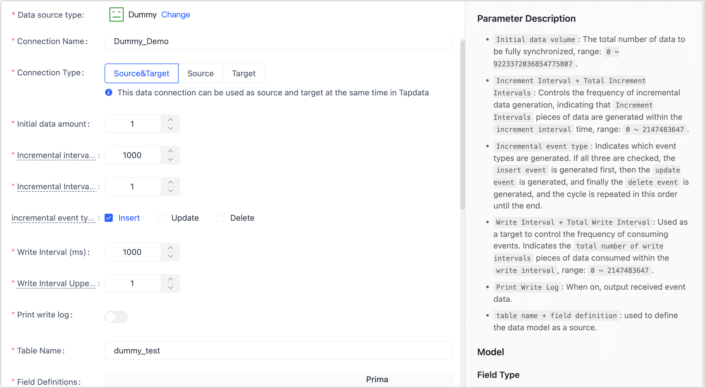

# Dummy

Dummy is a data source that generates test data. This article describes how to add Dummy data sources to TapData Cloud.

Supported Generated Field Types

| Type                      | Description            | Parameters                                                    |
| ------------------------- | ---------------------- | ------------------------------------------------------------ |
| array                     | Array                  | None                                                          |
| binary                    | Binary                 | None                                                          |
| boolean                   | Boolean                | None                                                          |
| date                      | Date                   | None                                                          |
| datetime                  | Date + Time            | None                                                          |
| map                       | Key-Value Pair         | None                                                          |
| now                       | Current Time           | None                                                          |
| number[(precision,scale)] | Number                 | ● precision: Length (range 1-40, default 4) ● scale: Precision (range 0-10, default 1) |
| rdatetime[(fraction)]     | Date with Specific Precision | fraction: Time precision (default: 0, range 0-9 integers)     |
| rlongbinary[(byte)]       | Random Binary with Specified Length | byte: Byte length (default: 1000)                             |
| rlongstring[(byte)]       | Random Long String with Specified Length | byte: Byte length (default: 1000)                             |
| rnumber[(precision)]      | Random Number          | precision: Length (default: 4)                                |
| rstring[(byte)]           | Random String with Specified Length | byte: Byte length (default: 64)                               |
| serial[(begin,step)]      | Serial Sequence        | ● begin: Starting position (default: 1)  ● step: Step size (default: 1) |
| string(byte)              | String                 | ● byte: Byte length (default: 64)  ● fixed: Add this flag for fixed-length strings (default: variable length) |
| time                      | Time                   | None                                                          |
| uuid                      | UUID                   | None                                                          |

## Connect to Dummy

1. Log in to TapData platform.
2. In the left navigation panel, click **Connections**.
3. On the right side of the page, click **Create**.
4. In the pop-up dialog, select **Dummy**.
5. Fill in the connection information for Dummy on the redirected page, following the instructions provided below.
      * **Connection Information Settings**
        * **Connection name**: Fill in a unique name that has business significance.
        * **Connection type**: Supports Dummy as a source or target database.
        * **Initialization data amount**: The total number of data that can be migrated in full data synchronization, ranging from 0 to 9223372036854775807.
        * **Incremental interval**, **Incremental interval upper limits**: The frequency of generating new data by specifying the total number of incremental interval data to be generated during a specified time interval. The Initial data amount number can range from 0 to 2147483647.
        * **Incremental event types**: Select which event types of data are generated, if select all, the sequential loop for Insert > Update > Delete.
        * **Write interval**: When serving as the target data source, control the frequency of consumption events in milliseconds.
        * **Write interval upper limit**: The total number of write interval data consumed during the write interval, ranging from 0 to 2147483647.
      * **Advanced settings**
        * **Print write log**: After turning on the switch, TapData will output the received event data.
        * **Table name**, **Field definitions**: define the structure of the table as the source, support batch new fields.
        * **Contain table**: The default option is **All**, which includes all tables. Alternatively, you can select **Custom** and manually specify the desired tables by separating their names with commas (,).
        * **Exclude tables**: Once the switch is enabled, you have the option to specify tables to be excluded. You can do this by listing the table names separated by commas (,) in case there are multiple tables to be excluded.
        * **Agent settings**: Defaults to **Platform automatic allocation**, you can also manually specify an Agent.
        * **Model load time**: If there are less than 10,000 models in the data source, their information will be updated every hour. But if the number of models exceeds 10,000, the refresh will take place daily at the time you have specified.
      
6. Click **Test Connection**, and when passed, click **Save**.

   :::tip

   If the connection test fails, follow the prompts on the page to fix it.

   :::

