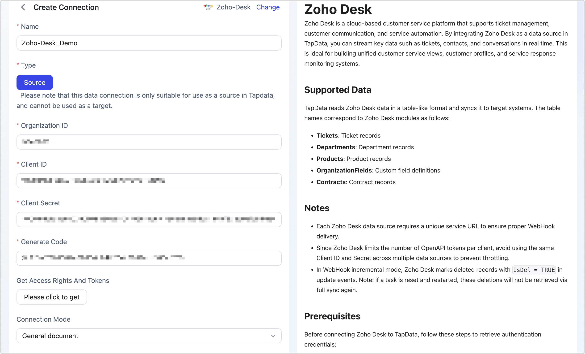
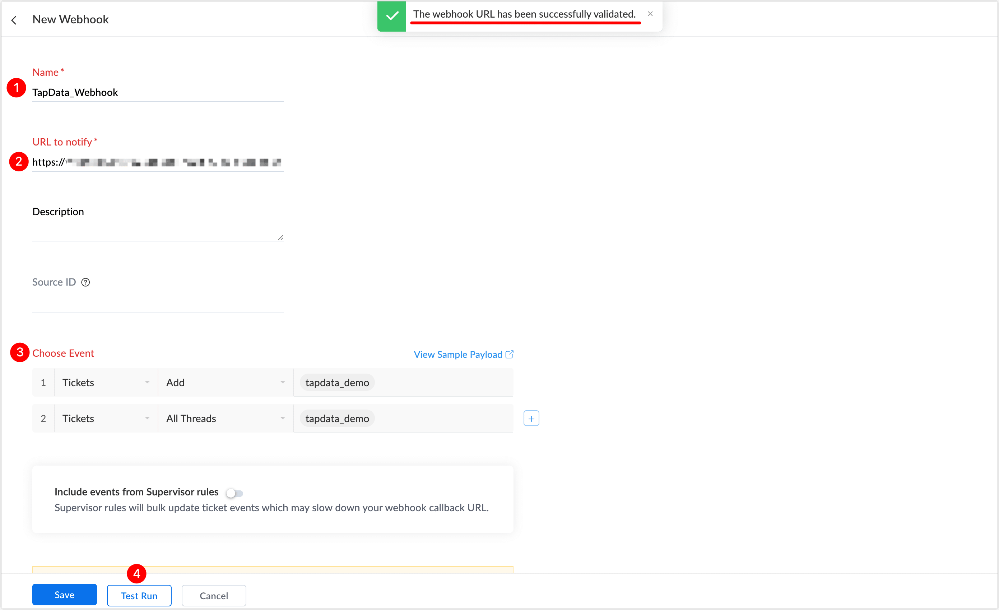

# Zoho Desk


Zoho Desk is a cloud-based customer service platform that supports ticket management, customer communication, and service automation. By integrating Zoho Desk as a data source in TapData, you can stream key data such as tickets, contacts, and conversations in real time. This is ideal for building unified customer service views, customer profiles, and service response monitoring systems.

## Supported Data

TapData reads Zoho Desk data in a table-like format and syncs it to target systems. The table names correspond to Zoho Desk modules as follows:

- **Tickets**: Ticket records
- **Departments**: Department records
- **Products**: Product records
- **OrganizationFields**: Custom field definitions
- **Contracts**: Contract records

## Notes

- Each Zoho Desk data source requires a unique service URL to ensure proper WebHook delivery.
- Since Zoho Desk limits the number of OpenAPI tokens per client, avoid using the same Client ID and Secret across multiple data sources to prevent throttling.
- In WebHook incremental mode, Zoho Desk marks deleted records with `IsDel = TRUE` in update events. Note: if a task is reset and restarted, these deletions will not be retrieved via full sync again.

## Prerequisites

Before connecting Zoho Desk to TapData, follow these steps to retrieve authentication credentials:

1. Obtain Organization ID.

   1. Log in to [Zoho Desk](https://www.zoho.com/).

   2. Click the  icon in the top-right, search for **APIs**, and open the API authentication page to view the Organization ID.

      

2. Obtain Client ID and Secret.

   1. Go to the [Zoho API Console](https://api-console.zoho.com/) and click **GET STARTED**.

   2. Under **Self Client**, click **CREATE NOW**.

   3. Click **CREATE**, then confirm with **OK**.

   4. You will now receive the **Client ID** and **Client Secret**, which will be used in TapData.

      

3. Generate Authorization Code.

   1. Navigate to the **Generate Code** tab, enter the following **Scope**, authorization duration, and description, then click **CREATE**:

      ```bash
      Desk.tickets.ALL,Desk.search.READ,Desk.contacts.READ,Desk.contacts.WRITE,Desk.contacts.UPDATE,Desk.contacts.CREATE,Desk.tasks.ALL,Desk.basic.READ,Desk.basic.CREATE,Desk.settings.ALL,Desk.events.ALL,Desk.articles.READ,Desk.articles.CREATE,Desk.articles.UPDATE,Desk.articles.DELETE
      ```

   2. In the **Select Portal** section, choose the desired portal and environment (e.g., Production), then click **CREATE**.

   3. Copy or download the generated code and store it securely. You’ll need this to complete the data source connection.

      

## Connect to Zoho Desk

1. [Log in to TapData](../../user-guide/log-in.md).

2. From the left navigation panel, click **Connections**.

3. Click **Create** on the right side of the screen.

4. In the pop-up dialog, search for and select **Zoho-Desk**.

5. Configure the data source according to the following instructions:

   

   - **Basic Settings**

     - **Name**: A meaningful name for the connection.

     - **Type**: Source only.

     - **Organization ID**: Retrieved from Zoho Desk.

     - **Client ID**, **Client Secret**, and **Generate Code**: Enter the credentials obtained earlier. See [Prerequisites](#prerequisites).
        Click the authorization button to retrieve access tokens. If authentication fails with "invalid_client", the code may have expired—please regenerate it.

     - **Connection Mode**: Set to "**General document**".

     - **Incremental Mode**: Currently only WebHook-based incremental updates are supported.
        To enable real-time data sync from Zoho Desk, click **Generate URL to Notify**, then configure WebHooks in Zoho Desk:

       :::tip
       
       If TapData is deployed locally, ensure that the generated URL is accessible through your firewall to guarantee successful receipt of incremental data pushed from Zoho Desk.
       
       :::
       
       
       
       <details>
              <summary>Create Webhook (Click to expand) </summary>
       
       1. In [Zoho Desk](https://www.zoho.com/), click the  icon in the top-right.
       
       2. Search for **Webhooks** and go to the configuration page. Click **New Webhook**.
       
       3. Complete the following fields and click **Test Run**, then **Save**:
       
          
       
          - **Name**: A descriptive label for this WebHook.
          - **URL to notify**: Paste the generated URL from TapData.
          - **Choose Event**: Select the events to be tracked. For supported events and examples, see [Events Supported](https://desk.zoho.com/support/WebhookDocument.do#EventsSupported).   
       
          :::tip
       
          Alternatively, you can also [configure the WebHook via workflow rules](https://integratetax.zohodesk.com/portal/en/kb/articles/webhooks).
       
          :::
       
       </details>

   - **Advanced Settings**

     - **Agent Settings**: Defaults to Platform automatic allocation, you can also manually specify an agent.
     - **Model Load Time**: If there are less than 10,000 models in the data source, their schema will be updated every hour. But if the number of models exceeds 10,000, the refresh will take place daily at the time you have specified.

6. Click **Test** at the bottom. Once the test passes, click **Save**.

## Further Reading

- [Zoho Desk OpenAPI](https://desk.zoho.com/DeskAPIDocument#Introduction)
- [Zoho Desk WebHook](https://desk.zoho.com/DeskAPIDocument#Webhook)
- [Workflow Configuration Guide](https://help.zoho.com/portal/en/kb/desk/automation/workflows/articles/workflow-automations)


​         