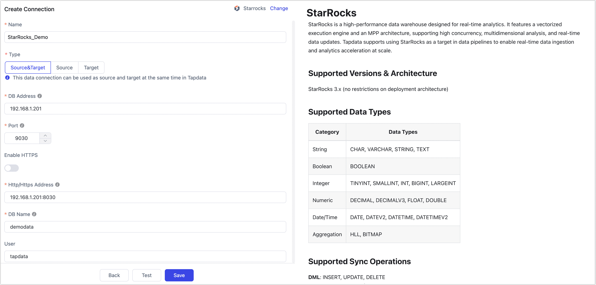

# StarRocks

import Content1 from '../../reuse-content/_all-features.md';

<Content1 />

StarRocks is a high-performance data warehouse designed for real-time analytics. It features a vectorized execution engine and an MPP architecture, supporting high concurrency, multidimensional analysis, and real-time data updates. TapData supports using StarRocks as a source or target database in data pipelines to enable large-scale data ingestion and analytics acceleration.

```mdx-code-block
import Tabs from '@theme/Tabs';
import TabItem from '@theme/TabItem';
```

## Supported Versions & Architecture

StarRocks 3.x (no restrictions on deployment architecture)

## Supported Data Types

| Category    | Data Types                               |
| ----------- | ---------------------------------------- |
| String      | CHAR, VARCHAR, STRING, TEXT              |
| Boolean     | BOOLEAN                                  |
| Integer     | TINYINT, SMALLINT, INT, BIGINT, LARGEINT |
| Numeric     | DECIMAL, DECIMALV3, FLOAT, DOUBLE        |
| Date/Time   | DATE, DATEV2, DATETIME, DATETIMEV2       |
| Aggregation | HLL, BITMAP                              |

## Supported Sync Operations

* **DML (as a target only)**: INSERT, UPDATE, DELETE
* **DDL apply (as a target only)**: Add columns, change column attributes, and drop columns.

:::tip

When used as a source, StarRocks supports only full synchronization. It does not support incremental CDC or DDL event collection.

:::

## Notes

- TapData writes to StarRocks using **Stream Load**. Since supported operations vary by table type (e.g., detail tables support inserts only, but not updates or deletes), see [Table Types Overview](https://docs.mirrorship.cn/docs/table_design/table_types/) for more information.

  :::tip
  Partitioned tables are not created automatically. You must manually define partition keys, buckets, and sort keys before syncing if needed.

  :::

- Avoid frequent transactional operations (e.g., frequent updates/deletes) when using StarRocks as the target, as they may degrade performance.

- For better performance in batch inserts, it’s recommended to configure the batch size between **10,000 and 100,000** records depending on individual record size. Avoid overly large batches to prevent OOM issues.

- Large-scale data loading is best performed during **off-peak hours** to minimize I/O contention and avoid affecting query performance.

## Prerequisites

1. Log in to the StarRocks database and run the following command to create a user account for data sync/development tasks:

   ```sql
   CREATE USER 'username'@'host' IDENTIFIED BY 'password';
   ```

   - **username**: User name
   - **password**: Password (For other authentication methods like LDAP, see [CREATE USER](https://docs.mirrorship.cn/zh/docs/sql-reference/sql-statements/account-management/CREATE_USER))
   - **host**: The allowed login host for the user; use `%` to allow all hosts

   Example:

   ```sql
   CREATE USER 'tapdata'@'%' IDENTIFIED BY 'Tap@123456';
   ```

2. Grant permissions to the created user account based on the connection type.

    ```mdx-code-block
    <Tabs className="unique-tabs">
    <TabItem value="As a source">
    ```

    ```sql
    -- Replace with your actual database name and username
    GRANT SELECT ON ALL TABLES IN DATABASE your_db_name TO USER your_username;
    GRANT SELECT ON ALL VIEWS IN DATABASE your_db_name TO USER your_username;
    ```

    </TabItem>

    <TabItem value="As a target">

    ```sql
    -- Replace with your actual database name and username
    GRANT CREATE TABLE ON DATABASE your_db_name TO USER your_username;
    GRANT SELECT, INSERT, UPDATE, DELETE, ALTER, DROP ON ALL TABLES IN DATABASE your_db_name TO USER your_username;
    ```

    </TabItem>
    </Tabs>

   :::tip

   - As a source, these permissions let TapData read tables, views, and metadata. If you sync only tables, you can skip the `SELECT` privilege on views.
   - As a target, these permissions cover connection testing, automatic table creation, data writes, and supported field-level DDL apply. If tables are created manually and DDL apply is not required, narrow the privileges based on the features you use.
   - If the database is in a non-default catalog, run `SET CATALOG <catalog_name>;` before the grant statements. To view existing catalogs, run [SHOW CATALOGS](https://docs.starrocks.io/docs/sql-reference/sql-statements/Catalog/SHOW_CATALOGS/). For more information, see [Catalog overview](https://docs.mirrorship.cn/docs/data_source/catalog/catalog_overview/).

   :::

3. If a firewall protects the StarRocks cluster, allow inbound traffic to these ports so TapData can connect:
   - FE nodes: 8030 (HTTP/web services), 9030 (MySQL client protocol)
   - BE nodes: 8040 (HTTP/web services)


## Connect to StarRocks

1. Log in to TapData platform.

2. In the left navigation bar, click **Connections**.

3. Click **Create** on the right side of the page.

4. In the dialog box, search for and select **StarRocks**.

5. Fill in the connection details as described below:

   

   - **Basic Settings**
     - **Name**: Enter a meaningful and unique name.
     - **Type**: Supports using StarRocks as a source or target database.
     - **DB Address**: The StarRocks connection address.
     - **Port**: The StarRocks query service port. The default port is **9030**.
     - **Enable HTTPS**: Choose whether to enable the HTTPS connection without certificates.
     - **HTTP/HTTPS Address**: The HTTP/HTTPS protocol access address for the FE service, including address and port information,  e.g., `http://192.168.1.18:8030`.
     - **DB Name**: Each connection corresponds to one database. To connect multiple databases, create separate connections.
     - **User** and **Password**: Enter the database username and password, respectively.
     - **Number of BE Nodes**: TapData will try to auto-detect the number of BE nodes (requires admin privileges). If privileges are insufficient, enter the number manually.
   - **Advanced Settings**
     - **StarRocks Catalog**: StarRocks catalog name (optional if using default). See [Catalog Overview](https://docs.mirrorship.cn/docs/data_source/catalog/catalog_overview/) for details.
     - **Additional Parameters**: Optional JDBC parameters
     - **Timezone for Time Fields**: Defaults to UTC (offset 0). Affects fields like `DATETIME` and `DATETIMEV2` (non-timezone-aware). Fields like `DATE` or `DATEV2` are not affected.
     - **Agent Settings**: Defaults to **Auto Assignment**, but can be specified manually
     - **Model Refresh Frequency**: For fewer than 10,000 models, refreshes every hour. For more than 10,000, refresh occurs daily at a specified time.
     - **Enable Heartbeat Table**: If StarRocks is used as a source or target, this toggle enables TapData to create a `_tapdata_heartbeat_table` that updates every 10 seconds (requires appropriate permissions).
        The heartbeat task starts automatically after replication or development tasks begin. You can [view the heartbeat task](../../case-practices/best-practice/heart-beat-task.md) in the data source settings.

6. Click **Test** at the bottom of the page. Once it passes, click **Save**.

## Node advanced features

When StarRocks is used as a target node, you can use the following advanced settings to control automatic table creation and Stream Load writes. These settings do not apply to StarRocks source nodes.

<!-- TODO: Add a screenshot for StarRocks node advanced features. -->

| Configuration | Description |
| --- | --- |
| **Key type** | Select the key model for automatic table creation: **Primary** (default), **Duplicate**, **Aggregate**, or **Unique**. |
| **Sort fields** | When **Key type** is set to **Duplicate**, append writes are used, and no update condition is set, specify the sort fields. |
| **Partition field** | Used as the bucket key for `DISTRIBUTED BY HASH`. A manually configured value takes precedence. If no value is set, TapData uses the primary key. If no primary key exists, TapData uses all fields. This setting is not the table partition key. |
| **Number of buckets** | The number of buckets to use when TapData creates a table automatically. The default value is **2**. |
| **Table properties** | Specifies StarRocks table properties, such as the number of replicas or compression method, for tables that TapData creates automatically. Existing tables are not rebuilt when you change this setting. |
| **Write buffer size** | The Stream Load write buffer size. The default value is **10240 KB**. |
| **Write format** | Supports **JSON** (default) and **CSV**. |
| **Flush size** | Flushes the local cache for each table after it reaches the specified size. The default value is **100 MB**. |
| **Flush timeout** | Flushes the local cache for a table after the specified wait time. |
| **Write limit per minute** | Limits the amount of data written per minute. Set the value to **0** for no limit. |
