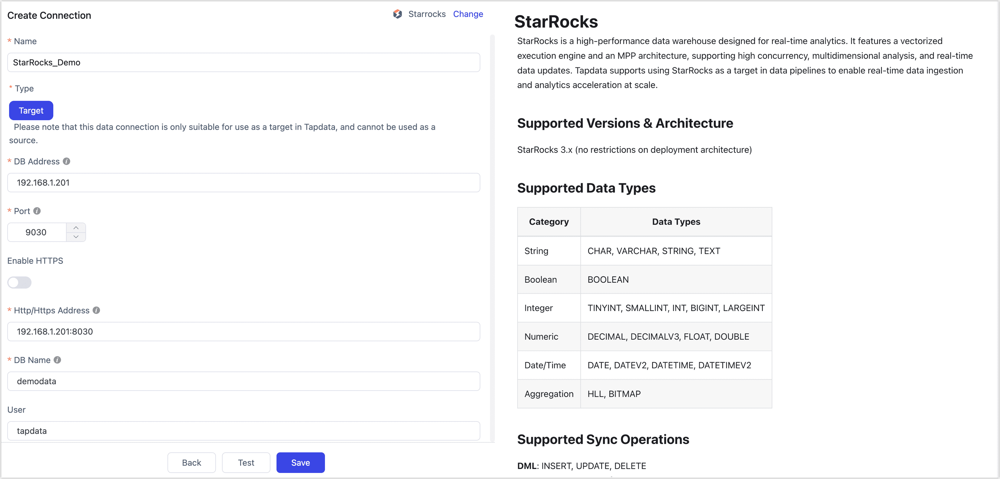

# StarRocks

StarRocks is a high-performance data warehouse designed for real-time analytics. It features a vectorized execution engine and an MPP architecture, supporting high concurrency, multidimensional analysis, and real-time data updates. Tapdata supports using StarRocks as a target in data pipelines to enable real-time data ingestion and analytics acceleration at scale.

```mdx-code-block
import Tabs from '@theme/Tabs';
import TabItem from '@theme/TabItem';
```

## Supported Versions & Architecture

StarRocks 3.x (no restrictions on deployment architecture)

## Supported Data Types

| Category    | Data Types                               |
| ----------- | ---------------------------------------- |
| String      | CHAR, VARCHAR, STRING, TEXT              |
| Boolean     | BOOLEAN                                  |
| Integer     | TINYINT, SMALLINT, INT, BIGINT, LARGEINT |
| Numeric     | DECIMAL, DECIMALV3, FLOAT, DOUBLE        |
| Date/Time   | DATE, DATEV2, DATETIME, DATETIMEV2       |
| Aggregation | HLL, BITMAP                              |

## Supported Sync Operations

**DML**: INSERT, UPDATE, DELETE

## Notes

- Tapdata writes to StarRocks using **Stream Load**. Since supported operations vary by table type (e.g., detail tables support inserts only, but not updates or deletes), see [Table Types Overview](https://docs.mirrorship.cn/docs/table_design/table_types/) for more information.

  :::tip
  Partitioned tables are not created automatically. You must manually define partition keys, buckets, and sort keys before syncing if needed.

  :::

- Avoid frequent transactional operations (e.g., frequent updates/deletes) when using StarRocks as the target, as they may degrade performance.

- For better performance in batch inserts, it’s recommended to configure the batch size between **10,000 and 100,000** records depending on individual record size. Avoid overly large batches to prevent OOM issues.

- Large-scale data loading is best performed during **off-peak hours** to minimize I/O contention and avoid affecting query performance.

## Prerequisites

1. Log in to the StarRocks database and run the following command to create a user account for data sync/development tasks:

   ```sql
   CREATE USER 'username'@'host' IDENTIFIED BY 'password';
   ```

   - **username**: User name
   - **password**: Password (For other authentication methods like LDAP, see [CREATE USER](https://docs.mirrorship.cn/zh/docs/sql-reference/sql-statements/account-management/CREATE_USER))
   - **host**: The allowed login host for the user; use `%` to allow all hosts

   Example:

   ```sql
   CREATE USER 'tapdata'@'%' IDENTIFIED BY 'Tap@123456';
   ```

2. Grant permissions to the created user account. You may also apply fine-grained access control based on your needs.

```mdx-code-block
<Tabs className="unique-tabs">
<TabItem value="Grant access to a specific database">
```

```sql
-- Replace with your actual database name and username
GRANT ALL ON DATABASE your_db_name TO USER your_username;
GRANT ALL ON ALL TABLES IN DATABASE database_name TO USER your_username;
```

</TabItem>

<TabItem value="Grant access to a all databases">

```sql
-- Replace with your actual username
GRANT ALL ON ALL DATABASES TO USER your_username;
GRANT ALL ON ALL TABLES IN ALL DATABASES TO USER your_username;
```

</TabItem>
</Tabs>


## Connect to StarRocks

1. [Log in to Tapdata Platform](../../user-guide/log-in.md).

2. In the left navigation bar, click **Connections**.

3. Click **Create** on the right side of the page.

4. In the dialog box, search for and select **StarRocks**.

5. Fill in the connection details as described below:

   

   - **Basic Settings**
     - **Name**: Enter a meaningful and unique name.
     - **Type**: Only supported as a **target** database.
     - **DB Address**: The StarRocks connection address.
     - **Port**: The StarRocks query service port. The default port is **9030**.
     - **Enable HTTPS**: Choose whether to enable the HTTPS connection without certificates.
     - **HTTP/HTTPS Address**: The HTTP/HTTPS protocol access address for the FE service, including address and port information,  e.g., `http://192.168.1.18:8030`.
     - **DB Name**: Each connection corresponds to one database. To connect multiple databases, create separate connections.
     - **User** and **Password**: Enter the database username and password, respectively.
     - **Number of BE Nodes**: Tapdata will try to auto-detect the number of BE nodes (requires admin privileges). If privileges are insufficient, enter the number manually.
   - **Advanced Settings**
     - **StarRocks Catalog**: StarRocks catalog name (optional if using default). See [Catalog Overview](https://docs.mirrorship.cn/docs/data_source/catalog/catalog_overview/) for details.
     - **Additional Parameters**: Optional JDBC parameters
     - **Timezone for Time Fields**: Defaults to UTC (offset 0). Affects fields like `DATETIME` and `DATETIMEV2` (non-timezone-aware). Fields like `DATE` or `DATEV2` are not affected.
     - **Agent Settings**: Defaults to **Auto Assignment**, but can be specified manually
     - **Model Refresh Frequency**: For fewer than 10,000 models, refreshes every hour. For more than 10,000, refresh occurs daily at a specified time.
     - **Enable Heartbeat Table**: If StarRocks is used as source or target, this toggle enables Tapdata to create a `_tapdata_heartbeat_table` that updates every 10 seconds (requires appropriate permissions).
        The heartbeat task starts automatically after replication or development tasks begin. You can [view the heartbeat task](../../case-practices/best-practice/heart-beat-task.md) in the data source settings.

6. Click **Test** at the bottom of the page. Once it passes, click **Save**.
