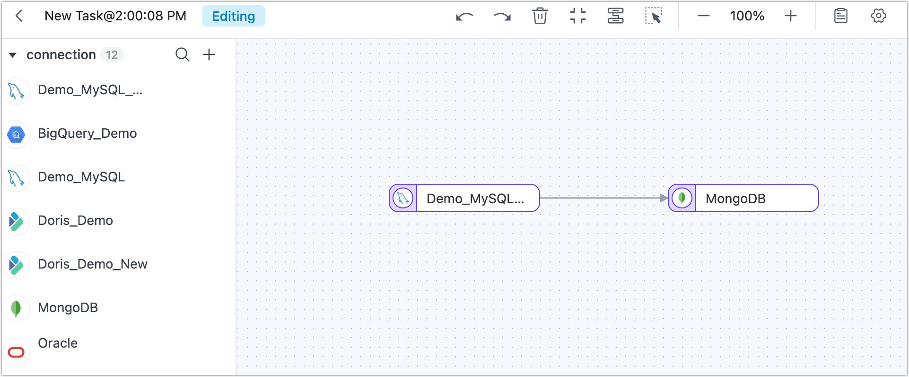
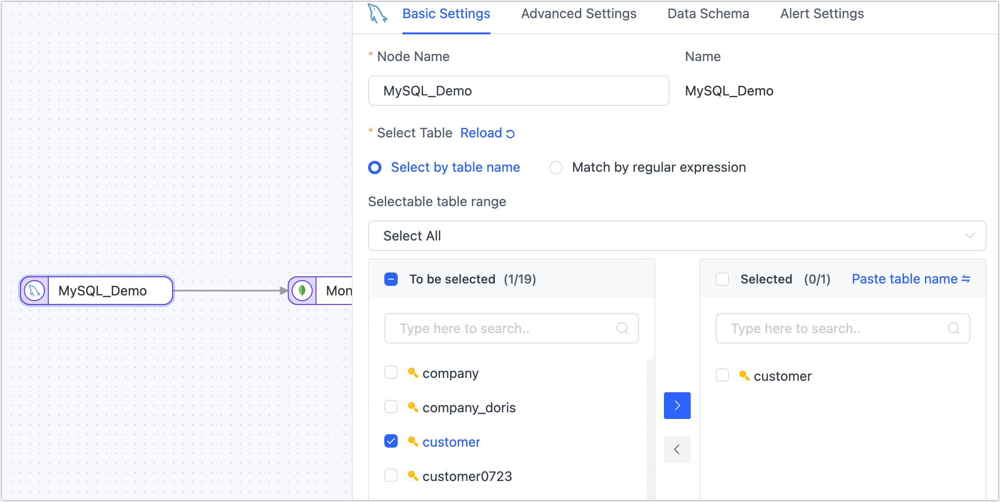

# Create a Data Replication Task

The data replication function can help you to achieve real-time synchronization between the same/heterogeneous data sources, which is suitable for data migration/synchronization, data disaster recovery, reading performance expansion, and other [business scenarios](../introduction/use-cases.md).

This article explains the specific data replication process to help you quickly become familiar with creating, monitoring, and managing data replication tasks.

:::tip

TapData supports both one-way and bidirectional synchronization. For bidirectional synchronization, the following data source combinations are supported: MySQL ↔ MySQL, PostgreSQL ↔ PostgreSQL, MongoDB ↔ MongoDB, PostgreSQL ↔ MySQL, and SQL Server ↔ SQL Server. For detailed configuration steps, see [Bidirectional Synchronization Case](../case-practices/pipeline-tutorial/mysql-bi-directional-sync.md).

:::

## Prerequisites

Before you create a data replication task, you need to perform the following preparations:

* [Install TapData](../getting-started/install-and-setup/README.md)
* [Connect to a Data Source](../getting-started/connect-data-source.md)

## Procedure

As an example of creating a data replication task, the article demonstrates the real-time replication of data from MySQL to MongoDB. However, it's important to note that TapData supports replication tasks between various data sources, so you can configure replication between different combinations of databases based on your specific requirements.

  
Best Practices

  To build efficient and reliable data replication tasks, it is recommended to read the <a href="../case-practices/best-practice/data-sync">Data Synchronization Best Practices</a> before starting to configure tasks.

1. Log in to TapData Platform.

2. In the left navigation panel, click **Data Replication**.

3. On the right side of the page, click **Create** to configure the task.

   :::tip

   You can also switch to the Data Console view by clicking the **Board** button. In this view, you simply need to drag the source table to the target database, and a data replication task will be generated automatically. This greatly simplifies the task configuration process and achieves real-time synchronization of source and target data.

   :::

4. On the left side of the page, you can drag and drop the source and destination data icons onto the right canvas. After placing them, you can connect them by drawing a line between them to establish the data flow for the replication task.

   

   :::tip

   In addition to adding data nodes, you can also add processing nodes to complete more complex tasks, such as filtering data, adding or subtracting fields, etc. For more information, see [processing nodes](../data-transformation/process-node.md).

   :::

5. Click the source node (MySQL in this example) to complete the parameter configuration of the right panel according to the following instructions.

   

   * **Basic Settings**      

      * **Node Name**: By default, it's the connection name, but you can also set a meaningful business name.
      * **Select Table**: Select the source table to operate. The table structure, including column names and types, will be displayed below.      
        * **Select by table name**: Select the table on the left, and then click the right arrow to complete the setup.
        * **Match regular expressions**: Enter the regular expression for the table name. Additionally, when a table is added to the source database and it matches the specified expression, TapData will automatically synchronize the table to the target database.
        * **Selectable table range**: By default, all tables are displayed, but you can choose to filter only tables with primary keys or only tables without primary keys. Since tables without primary keys use the full primary key method to implement data updates, they might encounter errors due to exceeding the index length limit, and their performance might be limited. Therefore, it is recommended that you create separate data replication tasks for tables without primary keys to avoid task errors and enhance the performance of data updates.

   * **Advanced Settings**      

      * **DDL Synchronization**      
        Choose whether to enable **Sync DDL Events**. When this switch is on, TapData will automatically collect the DDL events (like adding fields) from the selected source. If the target side supports DDL writing, the DDL statements can be synchronized.      

      * **Incremental Method**      
        Choose **Log CDC** or **Polling**. If you select **Polling**, you'll also need to specify the polling field, interval, and number of rows read each time.

        **Log CDC** will use the data source's transaction log to parse and sync incremental events. **Polling** will sync incremental events by polling a field, but it often can't sync delete events.      

      * **Data Filter**      

        * **Fully Customizable Query**: Turn this on to input a custom SQL query for full data sync (doesn't affect the incremental stage). For example, `SELECT id,name,address FROM customer;`.
          :::tip
          To use this feature, the target node must be a weak Scheme type of data source (like MongoDB/Kafka) etc.
          ::: 
        * **Filter Settings**: Off by default. Turn it on to specify data filtering conditions.      

      * **Batch Read Number**: For full data sync, the number of records read per batch. Default is **100**.     

6. Click on the target node, which in this example is MongoDB, to configure the parameters in the right panel based on the following instructions.

   

   * **Basic Settings**
     * **Node Name**: Defaults to the connection name; you can also set a name that has business significance.
     * **Deduction Results**: Displays table structure information that TapData will write into the target, deduced from the source node setting. The update condition will be automatically set as the table's primary key, or if there isn’t one, a unique index field will be used.
     * **Duplication Handling Strategy**: Choose according to business needs; defaults to **To maintain the original table structure on the target side, please clear the data**.
     * **Full Multi-thread Writing**: The number of concurrent threads for writing full data; default is **8**.
     * **Incremental Multi-thread Writing**: The number of concurrent threads for writing incremental data.
     * **Batch Write Item Quantity**: The number of items written per batch during full synchronization.
     * **Max Wait Time per Batch Write**: Set the maximum waiting time per batch write, evaluated based on the target database’s performance and network latency, in milliseconds.
   * **Advanced Settings**
     * **Data Writing Mode**: Select according to business needs.
       * **Process by Event Type**: If you choose this, you also need to select data writing strategies for insert, update, and delete events.
       * **Statistical Append Write**: Only processes insert events, discarding update and delete events.
     * **Data Source Exclusive Configuration**: Choose whether to save deleted data.
     * **Synchronize Partition Properties**: When this feature is enabled, TapData will automatically create a sharded collection in the target database. This function is only effective when both the source and target databases are MongoDB clusters.
   * **Data Model**
     Displays table structure information of the target table, including field names and field types.
   * **Alert Settings**
     Defaults as per source node alert settings.

7. (Optional) Click the  icon above to configure the task properties.

   * **Task name**: Fill in a name that has business significance.
   * **Sync type**: You have the option to select **Full + incremental synchronization**, or you can choose to perform **Initial sync** and **CDC** (Change Data Capture) separately. In real-time data synchronization scenarios, using the combination of full and incremental data copying allows you to copy existing data from the source database to the target database.
   * **Task description**: Provide a description for the task by filling in the relevant information.
   * **Advanced settings**: Set the start time of the task, select the incremental data processing mode, scheduled tasks, dynamic adjustment memory usage, specify the number of processor threads, and choose the appropriate agent.

8. Click **Start**, and you will be able to view the performance of the task on the current page, including metrics such as RPS (Records Per Second), delay, and task event statistics.

   

## See also

[Monitor or Manage Tasks](../data-transformation/manage-task.md)

