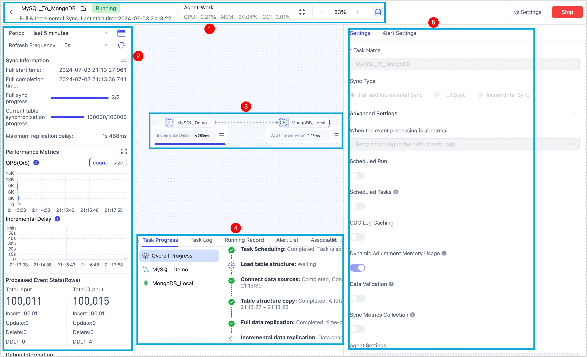

# Monitor Data Replication Task

Once the data replication task is started, the page will automatically redirect to the task monitoring page. From there, you can monitor the task's operation details, such as the status of the Agent, data synchronization progress, task progress, alert settings, and other relevant information.

:::tip

By clicking the **monitor** button on the task list page, you can access the monitoring page as well.

:::

## ① Top Control Bar

You can rename the task, view its start time, and check the Agent status, which includes the following information:

* **CPU Usage**: The CPU usage of the engine process as a proportion of the total CPU usage of the system.
* **Memory Usage**: Used / Memory Max
* **GC Throughput**: (Engine Cumulative Run Time - GC Time)/Engine Cumulative Run Time * 100%

## ② Task Indicators Display Bar

Displaying basic information and key monitoring indicators of the task, including synchronization information, task verification information, performance indicators, and task time statistics.

* **Task Checksumming**: Will only be displayed if the task has checksum enabled. You can click to view checksum details if any anomalies are found.
* **RPS**: The average number of input and output records processed by the task per second. It supports viewing based on the dimensions of event count or size.
* **Incremental Delay**: The delay is calculated as the time it takes for an event generated in the source database to be processed and written to the target by the task. When there are multiple targets, only the maximum incremental delay time is considered, measured in milliseconds.
* **Task Event Statistics**: Statistics of all cumulative events after the operation of the task should be analyzed with the following precautions in mind.
   * **Update**: If the target database already exists when performing an insertion event, it will be treated as an update event. This behavior is determined by the write policy, which is configured to update when the target already exists.
   * **DDL**
      * TapData directly creates a table on the target based on deduction results, so DDL (Data Definition Language) events of the table cannot be tracked or counted at the source.
      * If the target is a database type that does not require explicit table creation, such as MongoDB, the table-building events on the target side are not counted or considered as part of the synchronization process.
      * DDL events for **drop table** and **create table** are counted if the target duplicate processing policy is set to **clear target structure and data**.

## ③ Node Information Display Area

Hover your mouse pointer over a node to display key metrics for that node, and click the  icon in the bottom right corner of the node to see more details.

- **Full Sync Progress**: The progress report on the full data synchronization.
- **Incremental Data Synchronization**: The incremental log collection time point is represented as the relative time of (engine time - incremental time point of the node) in the floating window when hovering the mouse.
- **Writing time**: The time it takes for data to be written to the target.
- **RPS**: RPS (Records Per Second) measures the speed and performance of data transfer by indicating the number of records processed each second.
- **Cumulative Input Events**: The number of events received by the node from the previous node or source database.
- **Cumulative Output Events**: The number of events sent by the node to the next node or target database.
- **Processing time**: The processing time for the node to process data.

## ④ Task Log Display Area

Click the  icon at the top of the page, then you can view the progress, logs, alert list, and associated task information for a task run. You can filter the logs using keywords, periods, and levels, or download them for local analysis on the **Log** tab.

## ⑤ Task/Alert Setting Area

Click the  icon at the top of the page, which displays the task settings (not modifiable) and alert settings, you can set the alert rules:

* Task running error alert
* Notice of full completion of tasks
* Task increment start notification
* Task stop alert
* Task increment delay alert

