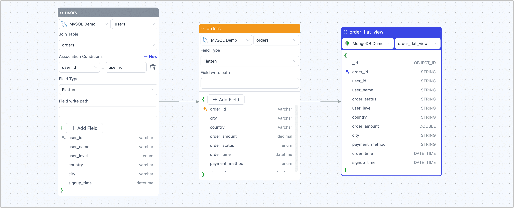

# Create Views with Guide

import Content from '../../reuse-content/_all-features.md';

<Content />

The Guide helps you quickly create an **Incremental Materialized View (IMV)** by walking you through each step. It’s the easiest way to join source tables into one analysis-friendly view without writing complex SQL.

:::tip

Need more background on why IMVs help with real-time analytics and avoiding heavy database joins? Check out **Create Views Overview**.

:::

## Prerequisites

Make sure you have already connected your **source MySQL database** and **target MongoDB database** in TapData.  

If you haven't set up these connections yet, see [Connect Data Sources](../../getting-started/connect-data-source.md) for detailed instructions.

## Procedure

1. [Log in to the TapData Platform](../../log-in.md).

2. In the left navigation panel, go to **Data Transformation**.

3. Click **Build Materialized View** to open the configuration workspace.

   1. Select your main source table.

      For this example, choose the **orders** table as your primary data source.

      

   2. To bring in related user details, click **+ Add Field** and choose **Flatten**.

   3. In the field editor, pick the database and table you want to join. Set the join condition by selecting the key column. In this example, link the **users** table using **user_id**.

      Once configured, the **orders** table will include user information as part of each record.

      

4. Click **+ Write Target** in the top-right corner. Choose your MongoDB connection and enter a collection name where the view data will be stored.

   On the right, you can preview field mappings and data types for the target collection (for example, **order_view**).

   

5. When you’re ready, click **Start** in the top-right to launch your real-time materialized view.

   After starting, you’ll be redirected to the task monitoring page, where you can track metrics such as records per second (RPS), latency, and event counts.

   


## Verify Results

Once your view is running, you can verify that the data looks as expected.

**Example: MySQL Source Query**

Here’s how you might query your source MySQL database to join orders and users:

```sql
SELECT
  o.order_id,
  o.user_id,
  o.order_amount,
  o.order_time,
  u.user_name,
  u.user_level,
  u.country,
  u.city
FROM
  orders o
JOIN
  users u ON o.user_id = u.user_id
WHERE
  o.order_time BETWEEN '2025-01-01' AND '2025-03-31'
  AND o.order_amount >= 300;
```

**Example: Querying the MongoDB View**

After building the Incremental Materialized View, the same data is flattened and always up-to-date in MongoDB. You can verify it with a simple query:

```javascript
db.order_flat_view.find({
  order_time: { $gte: ISODate("2025-01-01"), $lte: ISODate("2025-03-31") },
  order_amount: { $gte: 300 }
})
```

The MongoDB collection includes all selected fields—like order details and user information—in a single, analysis-friendly document. This makes it easy to use in BI dashboards, APIs, or data pipelines without writing complex joins.