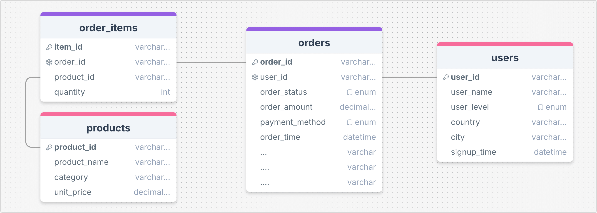

# Overview

This section will help you design real-time Incremental Materialized Views (IMVs) in TapData—tailored to your downstream use cases. You'll learn how to choose the right data structure for your needs, whether that's a flat table, embedded documents, or nested arrays, ensuring your data is clean, consistent, and ready to drive modern analytics and APIs.

## Background

In the **Getting Started** section, you learned how to quickly join your orders and users tables to build a simple, real-time view that helps analysts identify high-value customers and power marketing activities like coupons and loyalty programs.

However, in real-world e-commerce environments, data requirements are rarely so simple. Different teams often need richer, more flexible insights from the same dataset:

- **Analysts and marketing teams** want to segment customers by value, region, or product preferences without relying on complex SQL.
- **BI and reporting teams** need detailed transaction-level data to analyze order quantities, categories, and product bundles.
- **Developers and data engineers** are looking for ways to simplify ETL pipelines and API integrations, while keeping production systems performant.

To support these diverse use cases, we’ll extend our earlier example and design a more advanced, business-ready view that combines multiple data sources:

- Embedded user profiles to preserve full customer details in each record.
- Nested arrays of order items to capture all products in a single purchase.
- Flattened product attributes so each order line includes product names, categories, and pricing.

Ways to Add Related Fields

When designing your Incremental Materialized View, you can choose how data from related tables is included in your main record. TapData lets you customize this structure to match your analysis needs and downstream use cases:

- **Flatten**: Pull selected columns directly into the top level of the main table. Ideal for simple attributes you want to filter or group by (e.g., user_level, country).
- **Embedded Document**: Include all or selected fields as a nested object. Useful for preserving detailed context, such as a user profile with signup date, tier history, or calculated metrics.
- **Embedded Array**: Aggregate multiple related records as an array of objects. Perfect for one-to-many relationships like order items, each enriched with product details.

By combining these methods, you can design a single view that is analysis-ready, API-friendly, and tailored to your business questions—all without complex joins or heavy ETL processes.

With TapData’s Incremental Materialized Views, you can automatically join and transform data across tables in real time—no manual pipelines required. This approach gives your teams a single, always-up-to-date view ready for analytics, dashboards, and APIs, without overloading operational databases.

In this section, we’ll also share tips for optimizing performance and designing views that scale with your business needs.

## How to Create Your View

TapData offers multiple ways to design and build your IMVs, so you can choose the approach that best suits your needs and technical comfort level:

- [Using IMV Guide](create-views/using-imv-guide.md): A step-by-step wizard for quickly creating even complex joins, with a streamlined setup that doesn't require extra processing nodes.
- [Using Data Pipeline](create-views/using-data-pipeline.md): A visual, flow-based interface that lets you define joins, choose fields, and insert transformation nodes for cleaning or enriching your data.
- [Using TapFlow](create-views/using-tapflow.md): A code-friendly approach designed for developers and advanced users who want full control and automation via API or CLI.

Choose the approach that works best for you and start building real-time, analysis-ready data views tailored to your business.