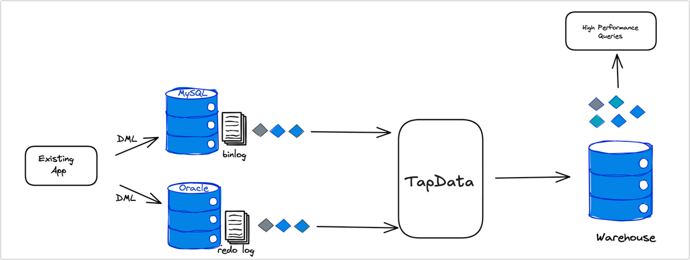

# What is TapData Shell

**TapData Shell** is a command-line toolkit provided by the TapData real-time data platform, built on [Change Data Capture](../introduction/change-data-capture-mechanism.md) (CDC) technology. It enables users to efficiently execute streaming data processing tasks. In addition to using TapData through a [graphical interface](../user-guide/data-development/create-task.md), you can also leverage an interactive command-line or Python-based approach to process real-time data across homogeneous and heterogeneous databases. This supports flexible and automated data integration and streaming processing scenarios, such as building real-time wide tables and materialized views.

## How It Works

Typical application scenarios for TapData Shell involve the following main data processing steps:

- **Data Collection**: Using TapData [Change Data Capture](../introduction/change-data-capture-mechanism.md) (CDC), it connects to and monitors update events (such as insert, update, and delete operations) in data sources, transforming them into data streams.
- **Data Stream Processing**: Allows users to perform real-time data processing through the command line, programming, or a graphical interface, including complex operations such as data merging, cleansing, and transformation.
- **Data Storage or Output**: The processed data streams can be saved to materialized views to support fast queries and application services or sent directly to downstream databases or message queues (such as Kafka) for rapid data transmission.
