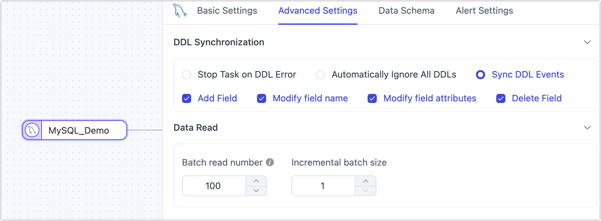
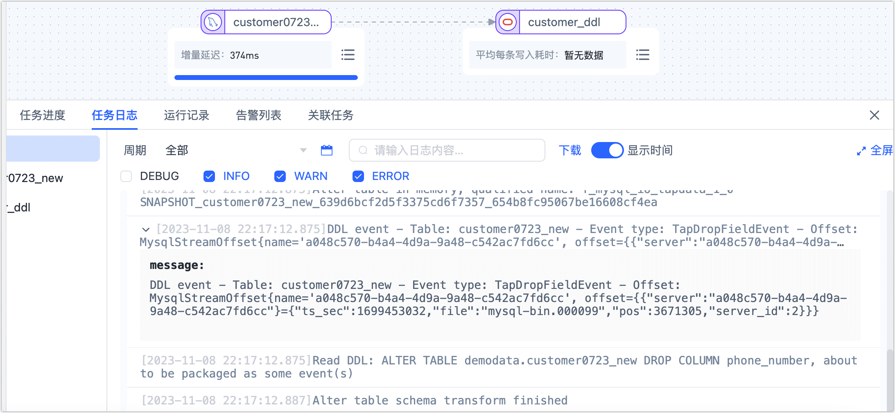

# 处理 DDL 变更

在使用 Tapdata 进行数据迁移和同步的过程中，了解数据源的表结构变更操作（如 DDL 操作）对数据流转的影响至关重要。Tapdata 致力于无缝处理大多数 DDL 变更，您需要了解表结构变更（如增减列）对数据同步流程的潜在影响，避免影响业务正常运行。

## 开启 DDL 自动同步

为保障数据复制/转换任务的高可用性和容错性，默认情况下，Tapdata 不会将源库的 DDL 语句同步到目标库，如果需要开启此功能，请按照以下步骤操作：

1. 在创建或编辑[数据复制](../user-guide/data-pipeline/copy-data/create-task.md)或[数据转换](../user-guide/data-pipeline/data-development/create-task.md)任务时，转到源数据库节点的配置页面。

2. 找到高级设置标签页，检查 **DDL 事件采集**选项是否可用。

3. 根据您的具体数据源类型，打开该功能并选择要采集的 DDL 事件。

   此页面会展示该数据源支持采集的 DDL 事件，通常包含**新增字段**、**修改字段名**、**修改字段属性**、**删除字段**。

   

   :::tip

   除开启该开关外，还需要目标库支持 **DDL** **应用**，您可以通过[支持的数据源](../introduction/supported-databases.md)文档，查询各类数据源对 DDL 事件采集和 DDL 应用的支持情况，也可以在在目标节点的**高级设置**中查看 **DDL 事件应用**的提示信息。

   :::

## DDL 采集与应用说明

| DDL 采集     | DDL 应用                                                     |
| ------------ | ------------------------------------------------------------ |
| 新增字段     | Tapdata 在目标库新增字段时，会自动适配字段类型，例如从 MySQL 的 **INT** 转换至 Oracle 的 **NUMBER(38,0)**，如遇[不支持的列类型](../user-guide/no-supported-data-type.md)可能导致新增字段失败。 |
| 修改字段名   | Tapdata 会自动在目标库完成该操作，需注意避免目标库的字段命名限制。 |
| 修改字段属性 | 在不同类型的数据库间同步时（例如从 MySQL 到 Oracle），需确保目标数据库支持更改后的数据类型和属性。否则，这可能导致同步任务的错误或中断。 |
| 删除字段     | 从源表中删除列可能会对数据管道产生严重影响，尤其是当该列是数据处理逻辑的关键部分，例如主键或作为同步链路的更新条件字段。在进行此类变更之前，需确保数据管道中的其他组件不再依赖该列。 |

:::tip

对于弱 Schema 约束类数据源不会变更历史数据的 Schema 信息，例如 Kafka 会在其消息中写入本次的 DDL 变更，后续在进行消费时可感知发生的 DDL 详情。

:::

如果因 DDL 同步错误而导致数据同步任务中断，您可以在选择源数据库中撤销相关 DDL 操作，或者选择重新加载数据源的 Schema，然后重置并重启任务来修复。

此外，您还可以通过查看[任务日志](../user-guide/data-pipeline/copy-data/monitor-task)和错误码，可以帮助您诊断和解决任务失败的问题，正常的 DDL 采集与应用日志示例如下：

## DDL 变更的最佳实践

为安全地管理 DDL 变更，降低对数据同步任务的潜在风险，推荐遵循以下最佳实践：

1. **变更前验证**：在生产环境应用 DDL 变更之前，在测试环境进行完整的验证，识别可能中断同步的潜在问题。
2. **计划与通知**： 安排在业务低峰时段进行 DDL 变更，并提前通知相关团队。
3. **管道配置更新：**定期回顾并更新您的数据管道配置，以符合最新的表结构。
4. **监控和预警：**为您的数据管道设置[监控](../user-guide/data-pipeline/copy-data/monitor-task)和[告警](alert-via-qqmail.md)，以便在遇到不支持的DDL操作时快速响应。

