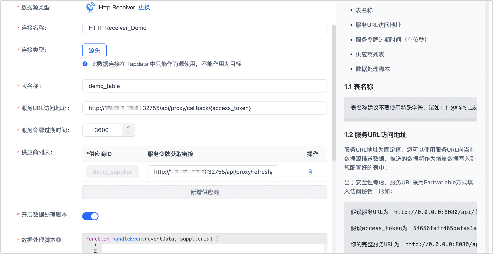

# Http Receiver

借助 Tapdata 的 HTTP Receiver 数据源，您可以接收来自 SaaS 等平台数据源推送的数据，方便您快速打通数据孤岛，构建统一的数据平台。本文介绍如何在 Tapdata 中添加 HTTP Receiver 数据源。


## 连接 HTTP Receiver

1. 登录 Tapdata 平台。

2. 在左侧导航栏，单击**连接管理**。

3. 单击页面右侧的**创建**。

4. 在弹出的对话框中，搜索并选择 **HTTP Receiver**。

5. 根据下述说明完成数据源<span id="320-http-receiver">配置</span>。

   

    * **连接名称**：填写具有业务意义的独有名称。
    * **连接类型**：支持将 HTTP Receiver 作为源头。
    * **表名称**：填写用作接收数据的表名称，不推荐使用特殊字符。
    * **服务 URL 访问地址**：为固定值，您可以使用服务 URL 向当前数据源推送数据，推送的数据将作为增量数据写入到您配置好的表中。
    * **服务令牌过期时间**：默认为 **3600** 秒，首次推送或服务令牌过期时，您需要调用下方的**服务令牌获取链接**来获取新的服务令牌。
    * **供应商列表**：可用于区分不同的供应商，单击**新增供应商**，可为每个供应商配置独立的服务令牌获取链接以提升安全性。
    * **开启数据处理脚本**：打开该开关，然后根据第三方平台的消息数据格式设计相关处理脚本来提取所需数据，完成设置后可单击下方的**试运行**确认脚本运作正常。
      假设某平台推送过来的数据示例如下：
      ```js
      {
        "eventType": "ADD_MESSAGE",
        "time": 1256467862232000,
        "message": {
          "title": "This is sample message",
          "context": "Sample message for everyone.",
          "sender": "Jack",
          "to": "Sam",
          "time": 1256467862232000
        },
        "sender": {
          "name": "Jack",
          "id": "12354-5664-2130-45-460",
          "dept": "OpenDept"
        }
      }
      ```
      如果我们仅需其中 **message** 中的数据，那么数据处理脚本示例如下：
      ```js
      function handleEvent(eventData, supplierId) {
          let eventType = eventData.eventType;
          //判断事件类型，转换为统一事件类型标识（i：新增，u：修改，d：删除）
          let type = "i";
          switch(eventType){
              case "ADD_MESSAGE" : type = "i";break;
              case "UPDATE_MESSAGE": type = "u";break;
              case "DELETE_MESSAGE": type = "d";break;
          }
          return {
              "before": eventData.message, //事件发生前的数据，删除类型的事件此值是必填
              "after": eventData.message,  //事件发生后的结果，新增、修改类型的事件此值为必填
              "opType": type,              //事件的类型，i：新增，u：修改，d：删除
              "time": eventData.time       //事件发生的时间点，值类型为事件戳
          }
      }
      ```
      经过数据处理脚本，您将得到如下数据并写入我们的表中：
      ```js{
        "title": "This is sample message",
        "context": "Sample message for everyone.",
        "sender": "Jack",
        "to": "Sam",
        "time": 1256467862232000
      }
      ```
    * **agent 设置**：默认为**平台自动分配**，您也可以手动指定。
    * **模型加载时间**：当数据源中模型数量小于 10,000 时，每小时刷新一次模型信息；如果模型数据超过 10,000，则每天按照您指定的时间刷新模型信息。

6. 单击**连接测试**，测试通过后单击**保存**。

   :::tip

   如提示连接测试失败，请根据页面提示进行修复。

   :::


## 试运行说明

完成上述操作后，后续尝试试运行该链接时，您需要注意：

* 确保第三方平台已使用此处配置的服务 URL，且已配置好了一个有效的消息推送服务。

* 如果第三方平台初次配置好消息推送服务，那么可能存在没有历史消息数据的情况，此时，您可以前往第三方平台通过在平台操作相应的数据来触发第三方平台的消息推送，此时在消息服务配置有效的情况下您可以在历史数据中获取相应的数据用于试运行。

  此外，您也可以手动构建相应的消息数据来试运行您的数据处理脚本，以此来验证您的数据处理脚本是否符合您的预期。