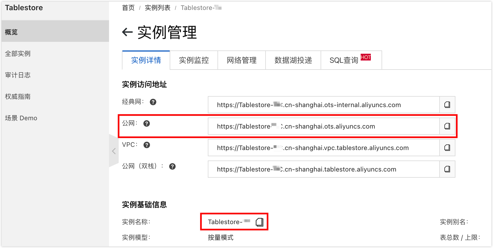
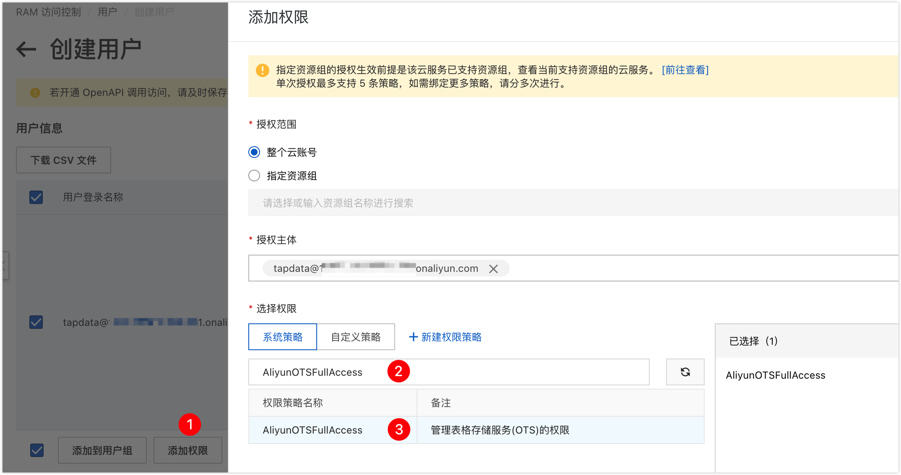
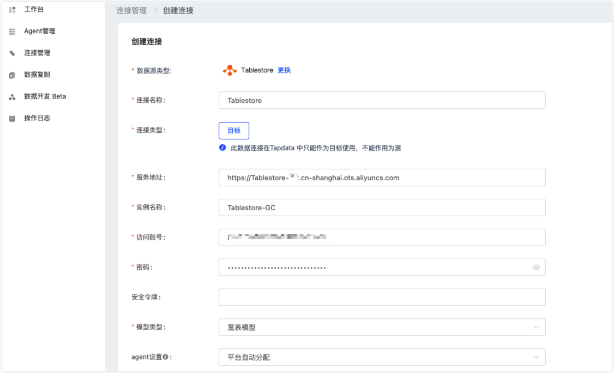

# Tablestore

阿里云[表格存储](https://help.aliyun.com/document_detail/27280.html)（Tablestore）是面向海量结构化数据提供 Serverless 表存储服务，同时针对物联网场景深度优化提供一站式的IoTstore解决方案。

完成 Agent 部署后，您可以跟随本文教程在 Tapdata 中添加 CSV 数据源，后续可将其作为目标库来构建数据管道。

##  准备工作 

1. [创建阿里云 Tablestore 实例](https://help.aliyun.com/document_detail/342853.html)，获取该实例的公网连接地址和实例名称。

   

2. 在阿里云平台创建 RAM 用户并获取访问密钥 AccessKey（AK） 信息，该信息将在连接时使用。

   1. [创建RAM用户](https://help.aliyun.com/document_detail/93720.htm#task-187540)，需选中 **OpenAPI 调用访问**。
   2. 在跳转到的页面，单击**下载 CSV 文件**，该文件包含了 AccessKey 信息。

3. 为该 RAM 用户并授予 **AliyunOTSFullAccess** 权限（管理 Tablestore 服务的权限）。

   1. 选中刚创建的 RAM 用户，单击**添加权限**。

   2. 在对话框的文本框中输入 **AliyunOTSFullAccess**，然后单击选择搜索结果中的权限策略名称。

      

   3. 单击**确定**，然后单击**完成**。

## 添加数据源

1. 登录 Tapdata 平台。

2. 在左侧导航栏，单击**连接管理**。

3. 单击页面右侧的**创建**。

4. 在弹出的对话框中，单击 **Alpha 数据源**，然后选择 **Tablestore**。

5. 在跳转到的页面，根据下述说明填写 Tablestore 的连接信息。

   

   * **连接名称**：填写具有业务意义的独有名称。
   * **连接类型**：固定为**目标**。
   * **服务地址**、**实例名称**：填写在[准备工作](#prerequisite)中获取的 Tablestore 公网连接地址和实例名称。
   * **访问账号**、**密码**：填写在[准备工作](#prerequisite)中获取的 RAM 用户的 AccessKey 信息。
   * **安全令牌**：默认为空。
   * **模型类型**：固定为**宽表**。
   * **agent 设置**：选择**平台自动分配**。

6. 单击**连接测试**，测试通过后单击**保存**。

   :::tip

   如提示连接测试失败，请根据页面提示进行修复。

   :::