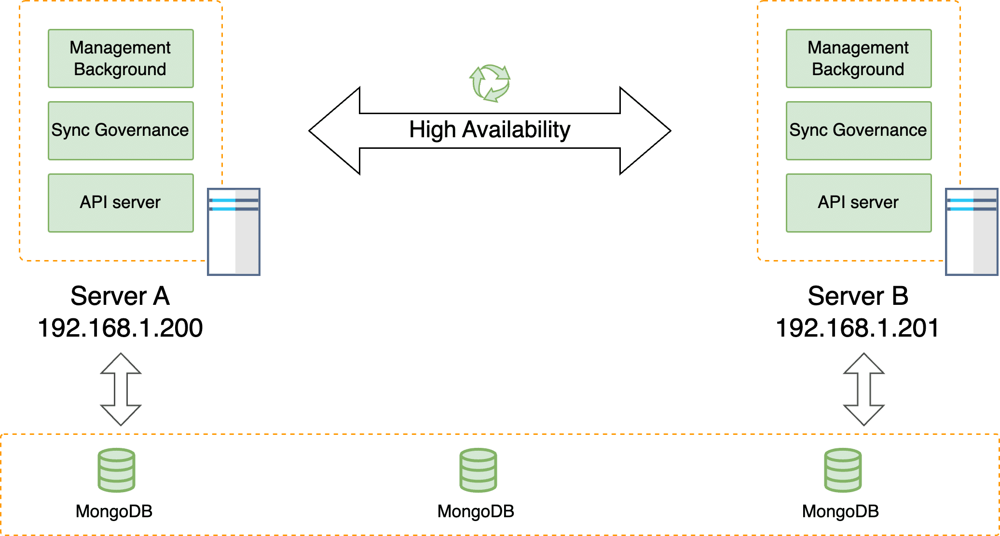

# 部署高可用 Tapdata

为保障生产环境的业务可靠性，推荐采用高可用部署的方式，本文介绍如何快速在本地的 Linux 平台部署高可用的 Tapdata 服务。

## 软硬件环境要求

* CPU：8 核
* 内存：16 GB
* 存储空间：100 GB
* 操作系统：CentOS 7 + 或 Ubuntu 16.04 +

import AsciinemaPlayer from '@site/src/components/AsciinemaPlayer/AsciinemaPlayer.tsx';


## 部署架构

本案例中，假设我们有两个服务器（A 和 B），分别为它们配置了 IP，现在我们希望分别在这两个服务器上部署完整的 Tapdata 服务，即管理服务、同步治理服务和 API 服务，从而实现整体服务的高可用。

:::tip

此环境中，我们已完成了  [MongoDB 副本集](install-replica-mongodb.md)的部署，可为 Tapdata 服务提供运行数据的存储服务。

:::




本文以 CentOS 7 为例，演示服务器 A 和 服务器 B 的部署流程。

## 准备工作

在部署前，我们需要为这两台服务器执行分别下述操作。

1. 登录至服务器，依次执行下述命令完成文件访问数、防火墙等系统参数设置。

   ```bash
   ulimit -n 1024000 
   echo "* soft nofile 1024000" >> /etc/security/limits.conf 
   echo "* hard nofile 1024000" >> /etc/security/limits.conf 
   systemctl disable firewalld.service 
   systemctl stop firewalld.service 
   setenforce 0 
   sed -i "s/enforcing/disabled/g" /etc/selinux/config 
   ```

2. 安装环境依赖。

   1. 执行下述命令安装 Java 1.8 版本。

      ```bash
      yum -y install java-1.8.0-openjdk
      ```

   2. 安装 MongoDB（4.0 及以上版本），该库将作为中间库存储任务等数据，具体操作，见[官方文档](https://www.mongodb.com/docs/v4.4/administration/install-on-linux/)。

3. 下载 Tapdata 安装包（可[联系我们](mailto:team@tapdata.io)获取），将其上传至待部署的设备中。

4. 在待部署的设备上，执行下述格式的命令，解压安装包并进入解压后的路径。

   ```bash
   tar -zxvf 安装包名&&cd tapdata
   ```

   例如：`tar -zxvf tapdata-release-v2.14.tar.gz&&cd tapdata `


## 服务器 A 部署流程

1. 获取 License 文件。

   1. 执行下述命令获取申请所需的 SID 信息。

      ```bash
      java -cp components/tm.jar -Dloader.main=com.tapdata.tm.license.util.SidGenerator org.springframework.boot.loader.PropertiesLauncher
      ```

   2. 将打印出的 SID 信息提供给 Tapdata 支持团队，完成 License 申请流程。

   3. 将申请到的 License 文件上传至解压后的目录（**tapdata**）中。

2. 在 tapdata 目录中，执行 `./tapdata start`，跟随命令行提示，依次设置 Tapdata 的登录地址、API 服务端口、MongoDB 连接信息等，示例及说明如下：

   ```bash
    ./tapdata start
    _______       _____  _____       _______
   |__   __|/\   |  __ \|  __ \   /\|__   __|/\    
      | |  /  \  | |__) | |  | | /  \  | |  /  \   
      | | / /\ \ |  ___/| |  | |/ /\ \ | | / /\ \  
      | |/ ____ \| |    | |__| / ____ \| |/ ____ \ 
      |_/_/    \_\_|    |_____/_/    \_\_/_/    \_\ 
   
   WORK DIR:/root/tapdata
   Init tapdata...
   ✔ Please enter backend url, comma separated list. e.g.:http://127.0.0.1:3030/ (Default: http://127.0.0.1:3030/):  …
   ✔ Please enter tapdata port. (Default: 3030):  …
   ✔ Please enter api server port. (Default: 3080):  …
   ✔ Does MongoDB require username/password?(y/n):  … no
   ✔ Does MongoDB require TLS/SSL?(y/n):  … no
   ✔ Please enter MongoDB host, port, database name(Default: 127.0.0.1:27017/tapdata):  …
   ✔ Does API Server response error code?(y/n):  … yes
   MongoDB uri:  mongodb://127.0.0.1:27017/tapdata
   MongoDB connection command: mongo  mongodb://127.0.0.1:27017/tapdata
   System initialized. To start Tapdata, run: tapdata start
   WORK DIR:/root/tapdata
   Testing JDK...
   java version:1.8
   Java environment OK.
   Unpack the files...
   Restart TapdataAgent ...:
   TapdataAgent starting ...:
   ```

   * **Please enter backend url**：设置 Tapdata 平台的登录地址，默认为 `http://127.0.0.1:3030/`
   * **Please enter tapdata port**：设置 Tapdata 平台的登录端口，默认为 `3030`。
   * **Please enter api server port**：设置 API Server 的服务端口，默认为 `3080`。
   * **Does MongoDB require username/password?**：MongoDB 数据库是否启用了安全认证，未启用则输入 **n**，如果启用则输入 **y**，然后根据提示分别输入用户名、密码和鉴权数据库（默认为 `admin`）。
   * **Does MongoDB require TLS/SSL?(y/n)**：MongoDB 数据库是否启用 TSL/SSL 加密，未启用则输入 **n**，如果启用则输入 **y**，然后根据提示分别输入 CA 证书和 Certificate Key 文件的绝对地址路径，以及 Certificate Key 的文件密码。
   * **Please enter MongoDB host, port, database name**：设置 MongoDB 数据库的 URI 连接信息，默认为 `127.0.0.1:27017/tapdata`。
   * **Does API Server response error code?**：是否启用 API Server 响应错误码功能。

   部署成功后，命令行返回示例如下：

   ```bash
   deployed connector.
   Waiting for the flow engine to start \
   FlowEngine is startup at : 2023-04-01 23:00
   API service started
   ```

   服务器 A 部署流程示例如下：
   <AsciinemaPlayer
    src="/asciinema_playbook/install_tapdata.cast"
    poster="npt:0:20"
    rows={25}
    speed={1.8}
    preload={true}
    terminalFontSize="14px"
    fit={false}
   />

3. 通过浏览器登录 Tapdata 平台，本机的登录地址为  [http://127.0.0.1:3030](http://127.0.0.1:3030)，首次登录请及时修改密码以保障安全性。

   :::tip
   如需在同一内网的其他设备上访问 Tapdata 服务，请确保网络可互通。
   :::

4. 为 Tapdata 服务设置开机启动。

   1. 进入 `/usr/lib/systemd/system` 目录， 使用文本编辑器（如 `vim`）创建一个新的服务文件并命名为 `tapdata.service`，将下述文件内容粘贴到文件中。

      ```bash
      # 将 ExecStart、ExecStop 的路径替换为 tapdata 安装路径
      [Unit]
      Description=Tapdata Service
      After=network.target
      
      [Service]
      Type=simple
      User=root
      ExecStart=/root/tapdata/tapdata start
      ExecStop=/root/tapdata/tapdata stop
      Restart=on-failure
      
      [Install]
      WantedBy=multi-user.target
      ```

   2. 加载新的服务文件，并启用以实现开机启动：

      ```bash
      sudo systemctl daemon-reload
      sudo systemctl enable tapdata.service
      ```

   3. （可选）在业务低峰期，重启机器并通过 `systemctl status tapdata.service` 命令查看 Tapdata 服务是否正常启动。


## 服务器 B 部署流程

1. 获取 License 文件。

   1. 执行下述命令获取申请所需的 SID 信息。

      ```bash
      java -cp components/tm.jar -Dloader.main=com.tapdata.tm.license.util.SidGenerator org.springframework.boot.loader.PropertiesLauncher
      ```

   2. 将打印出的 SID 信息提供给 Tapdata 支持团队，完成 License 申请流程。

   3. 将申请到的 License 文件上传至解压后的目录（**tapdata**）中。

2. 在 tapdata 目录中，执行 `./tapdata start`，跟随命令行提示，依次设置 Tapdata 的登录地址、API 服务端口、MongoDB 连接信息等，示例及说明如下：

   ```bash
   ./tapdata start
    _______       _____  _____       _______
   |__   __|/\   |  __ \|  __ \   /\|__   __|/\    
      | |  /  \  | |__) | |  | | /  \  | |  /  \   
      | | / /\ \ |  ___/| |  | |/ /\ \ | | / /\ \  
      | |/ ____ \| |    | |__| / ____ \| |/ ____ \ 
      |_/_/    \_\_|    |_____/_/    \_\_/_/    \_\ 
   
   WORK DIR:/root/tapdata
   Init tapdata...
   ✔ Please enter backend url, comma separated list. e.g.:http://127.0.0.1:3030/ (Default: http://127.0.0.1:3030/):  … http://192.168.1.200:3030,http://192.168.1.201:3030
   ✔ Please enter tapdata port. (Default: 3030):  … 
   ✔ Please enter api server port. (Default: 3080):  … 
   ✔ Does MongoDB require username/password?(y/n):  … no
   ✔ Does MongoDB require TLS/SSL?(y/n):  … no
   ✔ Please enter MongoDB host, port, database name(Default: 127.0.0.1:27017/tapdata):  … 192.168.1.200:27017/tapdata
   ✔ Does API Server response error code?(y/n):  … yes
   MongoDB uri:  mongodb://192.168.1.200:27017/tapdata
   MongoDB connection command: mongo  mongodb://192.168.1.200:27017/tapdata
   System initialized. To start Tapdata, run: tapdata start
   WORK DIR:/root/tapdata
   Testing JDK...
   java version:1.8
   Java environment OK.
   Unpack the files...
   frontend server started.begin deploy init
   Try to connect to TM for deploy connector...
   deploy connector...
   ```

   * **Please enter backend url**：设置 Tapdata 平台的登录地址，此处我们需要设置服务器 A 和 B 的登录地址，以英文逗号（,）分隔，即填入：`http://192.168.1.200:3030,http://192.168.1.201:3030`
   * **Please enter tapdata port**：设置 Tapdata 平台的登录端口，默认为 `3030`。
   * **Please enter api server port**：设置 API Server 的服务端口，默认为 `3080`。
   * **Does MongoDB require username/password?**：MongoDB 数据库是否启用了安全认证，未启用则输入 **n**，如果启用则输入 **y**，然后根据提示分别输入用户名、密码和鉴权数据库（默认为 `admin`）。
   * **Does MongoDB require TLS/SSL?(y/n)**：MongoDB 数据库是否启用 TSL/SSL 加密，未启用则输入 **n**，如果启用则输入 **y**，然后根据提示分别输入 CA 证书和 Certificate Key 文件的绝对地址路径，以及 Certificate Key 的文件密码。
   * **Please enter MongoDB host, port, database name**：设置 MongoDB 数据库的 URI 连接信息，本案例中，我们填写为 `mongodb://192.168.1.200:27017/tapdata`。
   * **Does API Server response error code?**：是否启用 API Server 响应错误码功能。

   部署成功后，命令行返回示例如下：

   ```bash
   deployed connector.
   Waiting for the flow engine to start \
   FlowEngine is startup at : 2023-04-01 23:10
   API service started
   ```

   服务器 B 部署流程示例如下：
   <AsciinemaPlayer
    src="/asciinema_playbook/install-tapdata-ha.cast"
    poster="npt:0:10"
    rows={25}
    speed={1.8}
    preload={true}
    terminalFontSize="13px"
    fit={false}
   />

3. 两个服务器上的 Tapdata 服务均已完成部署，在同一内网的设备，即可通过 http://192.168.1.200:3030 或 http://192.168.1.201:3030 来登录管理页面。

   :::tip
   首次登录请及时修改密码以保障安全性。
   :::

   登录成功后，在系统管理 > 集群管理中，即可查看到两个服务器上 Tapdata 服务的状态。

   

4. 为 Tapdata 服务设置开机启动。

   1. 进入 `/usr/lib/systemd/system` 目录， 使用文本编辑器（如 `vim`）创建一个新的服务文件并命名为 `tapdata.service`，将下述文件内容粘贴到文件中。

      ```bash
      # 确保 ExecStart、ExecStop 指向正确的 tapdata 安装路径
      [Unit]
      Description=Tapdata Service
      After=network.target
      
      [Service]
      Type=simple
      User=root
      ExecStart=/root/tapdata/tapdata start
      ExecStop=/root/tapdata/tapdata stop
      Restart=on-failure
      
      [Install]
      WantedBy=multi-user.target
      ```

   2. 加载新的服务文件，并启用以实现开机启动：

      ```bash
      sudo systemctl daemon-reload
      sudo systemctl enable tapdata.service
      ```

   3. （可选）在业务低峰期，重启机器并通过 `systemctl status tapdata.service` 命令查看 Tapdata 服务是否正常启动。


## 下一步

[连接数据库](../quick-start/connect-database.md)