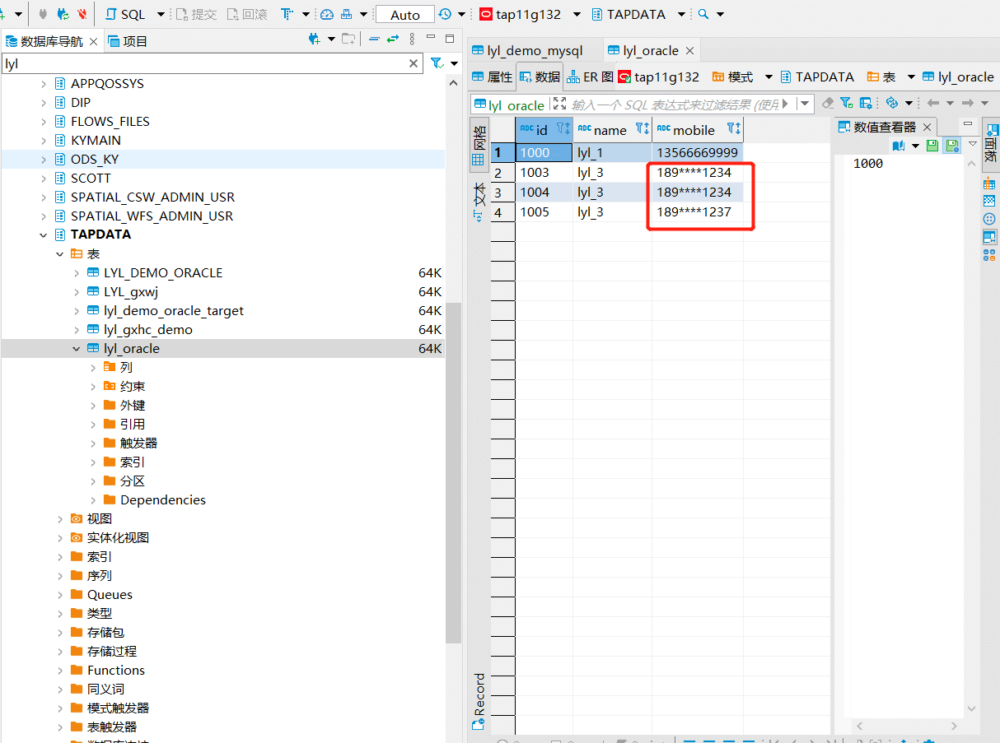

# 自定义节点

通过自定义节点功能，您可以将通用的 JS 脚本整理成可复用的处理节点，创建完成后可在数据转换任务重直接引用该节点，无需为重复编写脚本，极大地降低了开发工作量。本文介绍自定义节点的用法并提供相关案例供您参考。


## 创建自定义节点

1. 登录 Tapdata 平台。

2. 在左侧导航栏，选择**数据管道** > **自定义节点**。

3. 在页面右侧，单击**新增**。

4. 在跳转到的页面，根据下述说明完成设置。

   1. 处理节点设置所需的表单组件。

      

      * 左侧为组件区域，可拖拽各种需要的组件至操作区并进行配置
      * 中间为操作区域，可调整各组件的位置或选中后进行配置
      * 右侧为配置区域，可设置该组件的各项配置（如标题、描述、默认值等）

   2. 单击页面上方的图标，显示该处理节点表单项的JSON模型，您可直接在该界面编辑表单信息。

      

   3. 单击页面上方的图标，可编辑该处理节点的数据处理逻辑，可将表单中的字段标识进行引用。

      

   4. 单击页面上方的图标，可预览该节点的展示效果。

5. 单击页面右上角的**保存**，完成设置。


## 使用处理节点

在开发任务中可使用已经创建好的自定义处理节点，将需要节点拖拽至DAG画布中即可正常使用.


## 案例一：自定义脱密规则

出于信息安全考虑，希望对 MySQL 表中的一部分手机号进行脱敏，我们可以创建一个自定义节点，填写相应配置和逻辑后，再创建开发任务并应用该节点。

**具体流程：**

1. 登录 Tapdata 平台。

2. 在左侧导航栏，选择**数据管道** > **自定义节点**。

3. 在页面右侧，单击**新增**。

4. 在跳转到的页面，根据下述说明完成设置。

   * 节点名称：在页面左上角，填写节点名称，例如手机号脱敏。

   * 操作：从左侧输入控件区域拖拽一个单行输入框到中间的操作区域。

   * 字段标识：填写字段标识，例如 masking_field_name。

   * 标题：可任意填写，例如手机号字段名。

     其他为非必填项

5. 单击页面上方的图标，打开代码编辑界面编写节点逻辑。

   ```java
   // 代码逻辑：将手机号中的“1234”进行脱敏
   function process(record, form){
   var str="18912341234"
   var pat=/(\d{3})\d*(\d{4})/*
   *var b=str.replace(pat,'$1****$2');
   console.log(b)
    record[form.masking_field_name] = record[form.masking_field_name].replace("1234","****"); 
   ```

6. 点击右上角**保存**按钮。

7. [创建数据转换任务](../data-pipeline/data-development/create-task.md)，在源头和目标节点间，增加我们刚刚创建的手机号脱敏节点，并填写手机号对应的字段，本案例为 mobile。

   

8. 启动数据转换任务，即可将源表中的手机号进行脱敏，结果如下：

   * 源端的表数据：

     

   * 经过脱敏后，目标端的表数据：
   
     


## <span id="csv-demo">案例二：自定义 CSV 字段处理器</span>

通过 Tapdata 将数据同步至 Redis 时，希望能够按照 CSV 文件的格式进行标准化处理，例如对特殊字符进行转移，方便后续的数据处理。

**具体流程：**

1. 登录 Tapdata 平台。

2. 在左侧导航栏，选择**数据管道** > **自定义节点**。

3. 在页面右侧，单击**新增**。

4. 在跳转到的页面，根据下述说明完成设置。

   1. 在页面左上角，填写节点名称，例如 CSV  转义。

   2. 从左侧输入控件区域拖拽一个**字段选择框**到中间的操作区域。

   3. 在页面右侧的组件属性面板中，填写自动标识（例如 fields），然后选中**多选**。

   4. 单击页面上方的图标，打开代码编辑界面并填入下述代码，该函数将每个字段的值两端加上双引号，并将其中的双引号替换为两个双引号，以便在 CSV 文件中正确表示包含特殊字符的数据。

      ```javascript
      function process(record, form) {
        var tmp;
        var fields = form["fields"];
        if(fields) {
          for(var i in fields) {
            tmp = record[fields[i]];
            if(!tmp) continue;
            
            tmp = tmp.toString();
            record[fields[i]] = '"' + tmp.replaceAll("\"", "\"\"") + '"';
          }
        }
        return record;
      }
      ```

   5. 点击右上角**保存**按钮。

   6. [创建数据转换任务](../data-pipeline/data-development/create-task.md)，在源头和目标节点间，增加我们刚刚创建的 CSV 转义节点，然后选择相关字段。

      