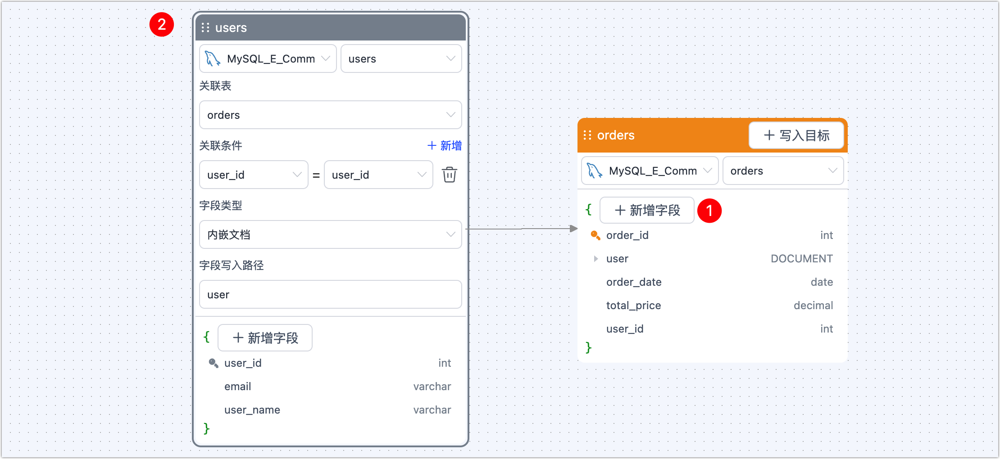
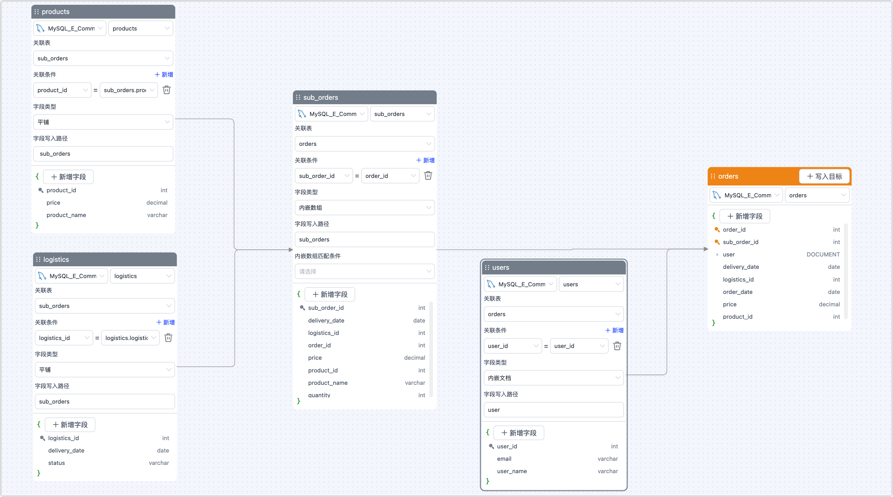

# Building Real-Time Materialized Views (Beta)

Materialized views, a special kind of database view, pre-store the results of complex queries, significantly speeding up data retrieval. In scenarios integrating multiple data sources or requiring real-time data updates, you can create real-time materialized views with Tapdata, simplifying data management and application development while ensuring data accuracy and timeliness.

## Background

As data grows exponentially, enterprises and developers face increasingly complex data management challenges. Traditional data handling methods, such as manually managing and synchronizing multiple related data tables, are not only inefficient but may also lead to data consistency issues. Efficient and real-time data integration tools become crucial in this context.

Tapdata's real-time materialized view feature is designed to address these challenges, allowing easy integration of different data sources and ensuring automatic updates of materialized views when source table data changes. This automation and real-time capability significantly simplify data management complexity and improve query efficiency.

To bring this feature closer to practical application, we chose data from the e-commerce domain as an example. In e-commerce platforms, order management is a core component, with common data tables like orders, sub-orders, products, user information, and logistics playing crucial roles. Suppose the development team decides to use MongoDB and plans to integrate data from these tables into a new order table. With Tapdata, this task becomes straightforward.

Next, we'll demonstrate how to apply Tapdata's real-time materialized view feature in an e-commerce scenario, helping you understand its powerful capabilities.

## Operational Steps

1. Log into the Tapdata platform.

2. In the left navigation bar, select **Data Pipeline** > **Data Transformation**.

3. Click **Build Materialized View** on the right side of the page, then complete the main table configuration on the redirected task configuration page.

   1. Select the database and table to serve as the source for the materialized view. In this example, we choose the **order** table as the main table.

      

   2. As mentioned, we aim to build a materialized view containing complete data, including user information and product tables. First, click **+ Add Field**, select embedded document, and enter the field name as **user**.

   3. In the field edit box that appears, sequentially complete the associated library, table, and joining condition. In this example, we associate it with the **user_id** from the **users** table.

      After setting, you'll see a new embedded document field named **user** in the **orders** table.

      

   4. Add a **sub_orders** field to store sub-order information by clicking **+ Add Field** on the **orders** table, selecting **embedded array**, and entering the path **sub_orders**. Then, follow the previous step to complete the table and joining condition settings.

   5. Add product and logistics information to the **sub_orders** field. This time, click **+ Add Field** on the **sub_orders** table, choose to flatten, and complete the table and joining condition settings.

      After all configurations, the specific relationship looks like the following image, and thus, the **orders** table includes all table information.

      

4. Click the **+ Write Target** in the top right corner of the **orders** table edit box, then select the MongoDB data source and collection name to write to.

   As shown below, you can see the field types and details in the target collection **order_view** on the right.

   

5. Click the **X** icon in the top left to return to the task configuration page, then click **Start** at the top right to complete the construction of the real-time materialized view.

   After successful startup, it will automatically redirect to the task monitoring page where you can view the task's QPS, latency, task events, etc.

   