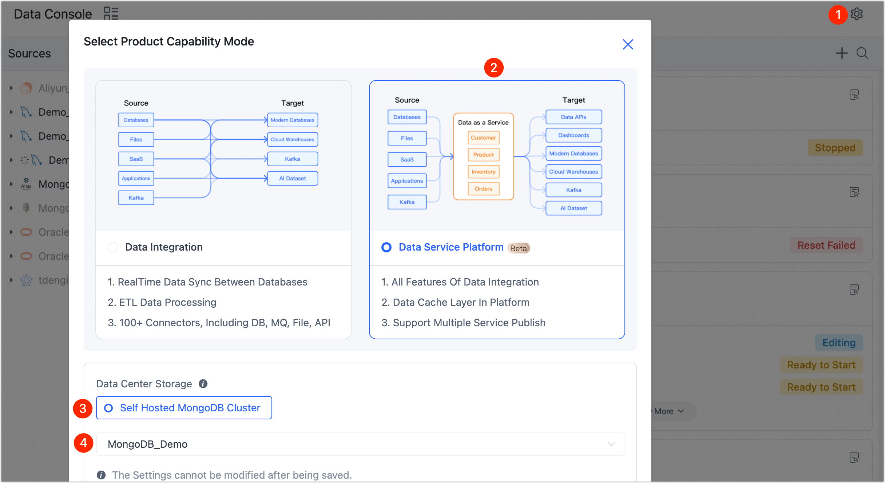

# Enable DaasS Mode

Due to digital transformation, the presence of isolated data, data fragmentation, or data silos has emerged as a significant challenge. Moreover, there is a growing demand for data in business operations. However, traditional data delivery methods pose limitations, such as lengthy processes and substantial resource requirements. This situation calls for a solution that enables organizations to swiftly establish data flow pipelines and unlock the value of their data.

Tapdata Cloud's Real-Time Data Hub offers a powerful solution. By synchronizing data from diverse business systems to a unified platform cache layer, it enables the consolidation of data sources and facilitates seamless data processing and analysis. This unified and real-time data platform helps enterprises overcome data silos and promotes data-driven decision-making, ultimately enhancing their competitiveness in the market.

## Real-Time Data Hub Introduction

With the increase in the tasks carried by the source database, in order to minimize the impact of data extraction on the source database and adhere to the organization's concept of data hierarchical governance, Tapdata Cloud organizes the data service platform in a layered manner based on the data flow order. This hierarchical arrangement ensures efficient and structured data processing, allowing for better data management and seamless integration across different systems.

| Hierarchy | Description                                                                                                                                                                                                                                                                                                                                                                                                                                                                              |
| -------------------- |------------------------------------------------------------------------------------------------------------------------------------------------------------------------------------------------------------------------------------------------------------------------------------------------------------------------------------------------------------------------------------------------------------------------------------------------------------------------------------------|
| **Sources** | Tapdata Cloud consolidates data sources from various business systems into a centralized data source layer, which serves as the initial step in bridging data silos. This abstraction of data sources enables a unified and streamlined approach to accessing and utilizing data. For more detailed instructions, please refer to the [Connect Data Sources](../../../prerequisites/README.md) section for comprehensive information on establishing connections with your data sources. |
| **FDM (Foundation Data Model)** | By synchronizing the table from the source database to the **FDM** beforehand, the data can be readily accessed by the business through the FDM, thus eliminating the need to directly read or manipulate the data in the source database, such as performing union operations, during data processing. This approach significantly minimizes the impact on the business operations of the source database.                                         |
| **MDM (Master Data Model)** | If there is a need for extensive customization of data processing or operations, such as generating a wide table, it is possible to extract the data table from the FDM and perform the required operations within the **MDM**. This allows for the generation of model data that can be used in the final business processes.                                                                                                                      |
| **Targets & Service** | Tapdata Cloud provides a centralized platform that aggregates and presents various data sources, allowing them to be utilized as targets for data processing. This enables the provision of processed data to the business, facilitating the creation of a unified data service platform for enterprises.                                                                                                                                                                                |

## Preparations

In the Data Service Platform Mode, we need to prepare a self-hosted MongoDB database as a data repository for the Data Cache Layer and Data Processing Layer:

1. Prepare a MongoDB database (4.0 and above), and see the [MongoDB official website](https://www.mongodb.com/docs/manual/administration/install-on-linux/) for information on deployment.

   :::tip

   In order to ensure high service availability, MongoDB is recommended to use replica/cluster architecture, and to reserve enough storage space based on the data size of the Source Data Layer.

   :::

2. [Connect to MongoDB Database](../../../prerequisites/README.md)

## Procedure

Tapdata is in [Data Integration Mode](../etl-mode/README.md) by default, and next we'll introduce how to enable Data Service Platform Mode.

1. Log in to Tapdata.

2. In the left navigation panel, click **Data Console**.

3. On the right side of the page, click the  icon.

4. Once you have selected the **Data Service Platform**, you can proceed with configuring the storage engine for the **Data Cache Layer** and **Data Processing Layer**, specifically utilizing the MongoDB data source that was established during the preparatory phase.

   

   :::tip

   The storage engine currently supports only self-hosted MongoDB databases, and once selected and saved, it cannot be modified later.

   :::

5. Clicking **Save** will categorize the page according to the [hierarchy](#intro) we previously defined.
