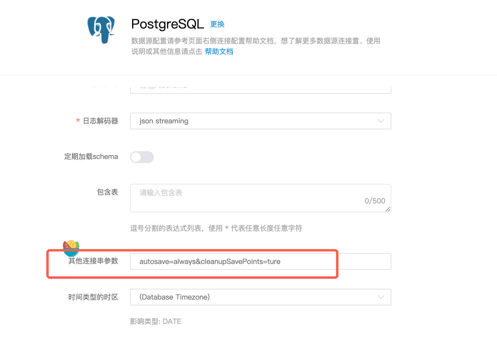
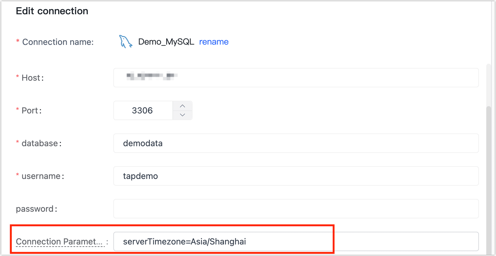
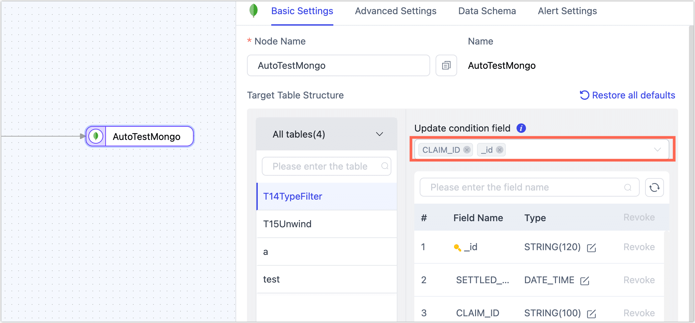
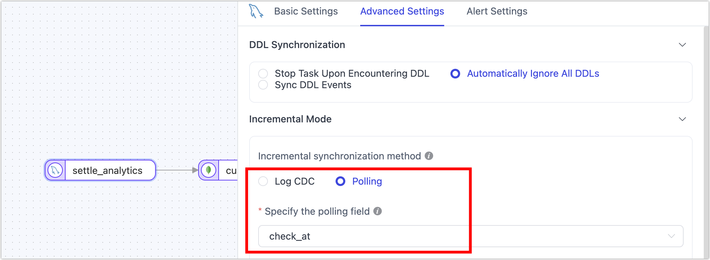
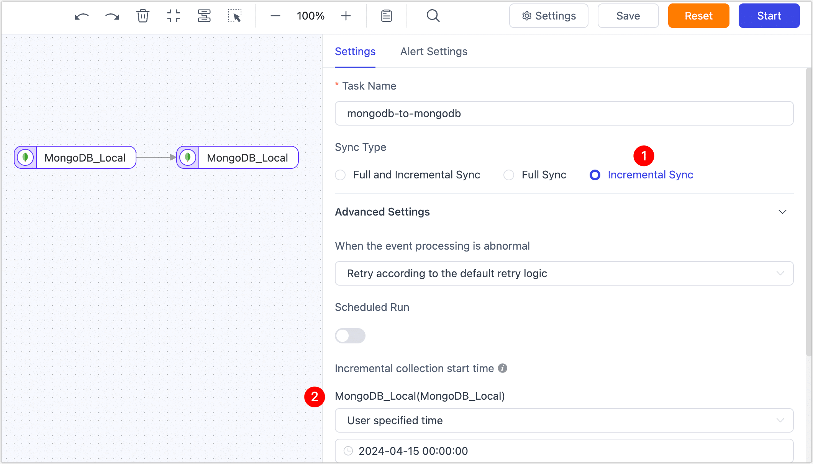

# Data Pipelines


This article lists potential issues and solutions encountered when constructing data pipelines, including data replication tasks, data transformation tasks, and data validation modules.

## Common Questions
### What is the difference between data replication and data transformation?

Data replication is primarily used for whole database or multi-table data synchronization, catering to business needs such as database migration to the cloud, database upgrades, and database backups.

Data transformation is primarily used for data modeling, ETL processes, data cleaning, data merging (including merging multiple tables into a single table), and building wide tables. The main difference is that the target of data development is usually a single table.

### Will Data Replication/Transformation Tasks Automatically Resume After Network Interruptions?

Yes, in most cases, tasks will resume automatically under the following conditions:

- **Network interruption between the Manager and Engine**:
  - In the TapData Cloud, tasks continue running without impact. They will automatically resume after the network is restored.
  - In the TapData Enterprise, short interruptions have no effect. If the disconnection lasts longer than 10 minutes, tasks will automatically switch to another available engine. Full sync tasks will restart from the beginning, while incremental sync tasks will resume from the last checkpoint.
- **Network interruption between the Engine and Data Source**:
  - The system will attempt to reconnect within the configured [retry interval](../system-admin/other-settings/system-settings.md#task-setting). Once the connection is restored, the task will continue.
  - If the network is not restored within the timeout period, the task will stop. After recovery, full sync tasks will restart from the beginning, and incremental tasks will resume from the last checkpoint.

### Does it support cross-region, cross-network data synchronization?

Yes. TapData connects sources and targets through Agents by opening limited network services to meet synchronization needs.

### Does it support data synchronization where the source and target are the same entity?

Yes. It just requires that the data objects involved in synchronization open the corresponding data permissions.

### Does it support cross-time zone/character set data synchronization?

Yes.

### Does it support data synchronization for sharded databases?

Yes. TapData can synchronize data from multiple sources to the same target table.

### Does it support changing the name of the data synchronization object in the target database?

Yes.

### Does it support filtering certain fields or data?

Yes.

### Does it support adding or removing synchronization objects?

Yes.

## Task Management

### What are the principles for categorizing data tables?

Recommended classification principles are as follows:

* Tables that only have primary keys or unique indexes: TapData supports these tables well, and they usually do not encounter issues.
* Tables with both primary keys and unique indexes: These tables may encounter unique index violation errors under extreme conditions.
* Tables without primary keys and unique indexes: Replication tasks will perform full-field matching for these tables, which can be slow in high-concurrency incremental synchronization scenarios.
* Extremely large tables: For tables with millions of rows, it is recommended to configure tasks individually for each table to avoid affecting the synchronization performance of other tables.

### What if the task status remains "starting"? How to resolve it?

You can [contact us for technical support](../appendix/support.md).

### Task reset failed?

You need to check the health status of the corresponding Agent on the TapData Cloud's Agent page.

### What logs can be checked besides the task logs when a task shows an error?

You can also check the logs of the analysis Agent, located in the **logs/tapdata-agent.log** within the Agent's installation directory.

### Will data be lost if a task is stopped and then restarted?

No, TapData uses a checkpoint mechanism to ensure data integrity.

### What if the connection test and error logs show garbled characters?

This is usually due to incorrect time zone settings. You can try changing the time zone and retrying.

### What if the list of tables to be replicated is empty when creating a task?

Loading Schema and creating connections are asynchronous processes. If loading is not timely or fails, you can manually update it through "Connection Management -> Specific Connection -> Load Schema."

### If some tables have already synchronized data, will the previous data be cleared if a full re-synchronization is performed?

No.

### How to handle adding DDL?

1. Stop services during off-peak hours.
2. Verify that the source and target table data are completely consistent; if consistent, stop CDC, otherwise data loss will occur.
3. Stop source CDC.
4. Perform source table DDL and restart CDC.
5. Perform target table DDL.
6. Re-fetch the connection Schema.
7. Restart the synchronization Agent service.

### What if a task cannot be deleted?

A task cannot be deleted when it is in an intermediate state such as scheduling, running, stopping, or being forcibly stopped. A task can only be deleted once it has stopped.

### What if the table cannot be found when setting up a scheduled task?

You need to load the model from the source database before creating the task.

Edit task -> Select tables -> Load model.

### What is the logic associated with the task's Agent?

Currently, it is based on task count for load scheduling; in the future, it will support scheduling based on tags.

### What if the data from the source address is not loaded correctly when creating a task?

First, check whether the instance machine can access the database. If the issue persists, you can contact online customer service support for assistance.

### What if there is garbled Chinese characters when synchronizing Oracle to MySQL?

When creating a connection, you can use jdbc conversion:

`?useUnicode=true&characterEncoding=utf8` or `?useUnicode=true&characterEncoding=gbk`

### What if the PostgreSQL transaction fails to retry after an ERROR: current transaction is aborted, commands ignored until the end of the transaction block?

You need to add the following parameters to the PostgreSQL connection string during configuration to solve this:

```
autosave=always&cleanupSavePoints=true
```



### What if testing the MySQL connection indicates: The server time zone value ' 'is unrecognized?

In this case, you can add the parameter **serverTimezone=Asia/Shanghai** to your MySQL connection string.



### What if the connection test fails?

The prerequisite for a connection test is to start the agent. First, check the agent's status.

When creating a data connection, refer to the connection configuration help on the right side of the page and complete the relevant parameter settings according to the guide.

### What does the topic expression in Kafka mean?

The topic expression is a regular expression used to match the name of the message queue. Users can define a regular expression to subscribe to one or more message queues for message consumption.

### If Oracle synchronizes to SQL Server, is the Select permission sufficient?

Oracle needs some additional permissions for CDC. For specific configuration and authorization, see [Oracle Preparation Work](../connectors/on-prem-databases/oracle.md).

### Can changes be made during task execution, such as adding tables to be synchronized?

You can re-edit the task. However, adding tables might affect the original synchronization task and require resetting the original task progress. If adding tables without affecting the original, it's recommended to create a new task.

### If the main table data is real-time replicated, and the secondary table data is also increasing, will there be a conflict?

TapData performs upsert operations. If there is already data in the target, it will be identified and updated according to the source. If the data from the secondary table is entirely new, it will not affect it.

## Error Occurred During Sync data Between MongoDB Sharded Clusters

When creating a sync task between MongoDB sharded clusters and selecting `_id` as the update condition, the following error may occur during task execution:

> **“An upsert on a sharded collection must contain the shard key and have the simple collation.”**

**Issue Analysis**

In a sharded cluster, the shard key is used to determine where documents are stored. During an `upsert` operation, if the query does not match any existing document, it switches to an `insert`. In this case:

1. The inserted data must include the shard key; otherwise, MongoDB cannot route the data to the correct shard.
2. If the sync task uses only `_id` as the update condition while the target collection’s shard key is not `_id`, the routing will fail, resulting in the error.

**Solution**

1. Manually create the target collection in the MongoDB cluster and set the correct shard key. For example:

   ```javascript
   use my_database;
   db.createCollection("my_collection");
   sh.shardCollection("my_database.my_collection", { claim_id: 1 });
   ```

2. Adjust the TapData replication task configuration by selecting both the **shard key** and `_id` as the **update condition fields** in the target node.

   

3. Start the data sync task.

### Why does enabling concurrent increment conflict with synchronization without a primary key?

Incremental concurrency processes data in groups based on primary keys. Without primary keys, this capability fails, so they are mutually exclusive.

### The table was successfully created, so why does the task report that the target table does not exist during runtime?

For some databases used as targets, if the target database is set to be case-insensitive for table names. When the source table is uppercase, it will be forcibly converted to lowercase in the target database. When the task matches the target table using the uppercase source table name, it will report an error that the target table is not found.

In this case, you can force the table name conversion to match the case of the target database table name during the task settings process, allowing normal synchronization.


## Data Replication Task

### Do I need to check the source database before configuring a replication task?

It is recommended to understand the following about the source database before configuring a task, to estimate the scale of data replication:

- How many tables are in the source database
- How many rows are in the largest table and how much space it occupies, to roughly estimate the size per record
- The primary key (primary key) or unique key situation of these tables
- The daily incremental events of these tables, such as approximately how many insert, delete, and update events occur each day

### Is it recommended to execute all tables in one task during data replication?

Not recommended. We suggest categorizing data tables and processing similar data tables with separate tasks to avoid issues with one type of table causing the entire task to interrupt.

### How to synchronize newly added tables in the source database?

By default, during data synchronization task configuration, you can select tables that are already present in the source database. To automatically recognize and synchronize tables added to the source database during task execution, you can use a regular expression to select tables during the data synchronization task configuration phase. Tables matching the expression will be automatically recognized and synchronized.


### What if the source table does not have a primary key? How should it be handled?

It's recommended to filter out primary key tables and non-primary key tables during task configuration and configure synchronization tasks for them separately to avoid affecting the synchronization performance of primary key tables. Additionally, when configuring synchronization tasks for non-primary key tables, to ensure data consistency and synchronization performance, you can manually select specific columns to combine as the data update column, thus achieving data uniqueness and avoiding using full-field matching which could lead to low synchronization efficiency.

### Can index information be automatically synchronized?

Data replication tasks do not automatically synchronize existing indexes of the source table by default. You can manually create indexes in the target database after the table structure synchronization is completed. Additionally, to improve data synchronization efficiency, TapData will create indexes in the target based on the source table's related keys/primary keys during operation.

### Which Data Sources Support Bidirectional Synchronization?

TapData supports bidirectional synchronization between the following data sources:

- **MySQL ↔ MySQL**
- **PostgreSQL ↔ PostgreSQL**
- **MongoDB ↔ MongoDB**
- **PostgreSQL ↔ MySQL**
- **SQL Server ↔ SQL Server**

Support for more database types is planned for future releases.

### How Does Bidirectional Synchronization Handle Write Conflicts?

Currently, bidirectional synchronization does not include an automatic mechanism for handling concurrent write conflicts. Since synchronization occurs outside of transaction contexts, the system cannot detect or resolve data conflicts that may arise between source and target databases.

Therefore, it is not recommended to modify the same data on both sides simultaneously. Conflicts should be avoided through proper business logic or operational guidelines.

### Will resetting the task configuration clear the synchronized tables and data?

No, resetting the task configuration will only clear the task's runtime status information (such as incremental checkpoints) but will not clear the tables and data already synchronized to the target database.

### During task configuration, is it possible to adjust field types and lengths?

Yes, for example, when synchronizing between heterogeneous databases, TapData automatically

infers the field types and lengths of the target database based on general compatibility considerations. If the model inference is inaccurate or needs manual adjustment based on business needs, you can click the field type in the target node and adjust it in the pop-up dialog box.


### Does it support synchronizing DDL changes?

Yes, you need to turn on the corresponding switch during task configuration. Additionally, you need to understand the potential impacts of table structure changes (such as adding or removing columns) on the data synchronization process to avoid affecting normal business operations. For more details, see [DDL Synchronization Explanation](../case-practices/best-practice/handle-schema-changes.md).

### How long is it recommended to keep the source database's incremental logs for incremental synchronization?

To ensure the parsing of incremental data, it is recommended to retain the source database's incremental logs (such as Binlog) for at least 7 days.

## Data Transformation Task

### Can a single data transformation task write data to multiple target tables?

The output is a single table. Data transformation tasks are mainly used for data modeling, ETL, data cleaning, data merging (including merging multiple tables into a single table), and building wide tables. The characteristic of these tasks is that the target is usually a single table.

### If the source table does not support real-time log parsing, how can incremental synchronization be performed?

Incremental data can be obtained through field polling. This field is usually an auto-increment value or timestamp. For example, data insertion/change is accompanied by a timestamp, and TapData can use regular queries of this field's value to assist in determining incremental data changes, typically capturing INSERT/UPDATE operations but not DELETE operations.



### Does it support synchronizing DDL changes?

Yes, you need to turn on the corresponding switch during task configuration. Additionally, you need to understand the potential impacts of table structure changes (such as adding or removing columns) on the data synchronization process to avoid affecting normal business operations. For more details, see [DDL Synchronization Explanation](../case-practices/best-practice/handle-schema-changes.md).

### If manual deletion of a field in the target table causes an error during incremental synchronization, how can it be fixed?

You can edit the task, add an [add/remove field node](../data-transformation/process-node.md#add-and-del-cols) before the target node, filter out the deleted field, and then restart the task.

:::tip

During the task operation phase, do not manually adjust the structure of the target table to avoid task interruptions due to table structure changes. If you need to adjust the table structure, you should enable task DDL operations and adjust the table structure in the source database. For more details, see [Handling DDL Changes](../case-practices/best-practice/handle-schema-changes.md).

:::

### How can data be filtered during the full synchronization phase?

During task configuration, you can open the advanced settings in the source node, enable custom query for full synchronization, and then fill in the SQL query statement to be executed during the full synchronization phase (does not affect the incremental phase), allowing custom data extraction (such as data filtering, joins, etc.), for example, write `SELECT id,name,address FROM customer WHERE id>1000;`.

:::tip

This feature requires that the target node be a weak scheme-type data source (such as MongoDB/Kafka), etc. If you need to perform data filtering rules during both the full and incremental phases, you can add a [row filter](../data-transformation/process-node.md) to achieve this.

:::

## Real-time Data Center

### If a table join is required, at which layer is it recommended to perform?

It is recommended to perform complex operations like joins at the processing layer (MDM). This layer can perform customized processing computations based on the data in the platform cache layer to generate the final business model data. Even if run and debugged repeatedly, it will not affect the read/write performance of the source database.

## Data Validation

### Is it possible to schedule data validation to run periodically?

Yes, you can select **repetitive validation** as the **validation frequency** when configuring the validation task, then choose the execution time and interval according to your needs.

### Why might data validation show inconsistencies?

TapData uses a variety of proprietary technologies to ensure data consistency. If data inconsistency is indicated after performing validation, possible reasons include:

* **New business data has been entered into the database**: You can add filtering conditions to the validation task to exclude newly added data.
* **Full/incremental synchronization is in progress**: If it is a full data synchronization task, wait until the task is completed before validating. If it is an incremental data synchronization task, use filtering conditions to exclude data changes after a certain point.
* **Primary keys are inconsistent

**: Check whether the related tables' primary keys and their types are consistent.
* **Data filtering conditions caused it**: For example, the data pipeline itself has added filtering conditions, only synchronizing part of the data to the target table. Additionally, if validating the results of an incremental task, ensure the accuracy of the data range selected by the filtering conditions.

:::tip

For MongoDB databases, if row count validation is inconsistent, check for orphan documents, which can be [cleaned](https://www.mongodb.com/docs/manual/reference/command/cleanupOrphaned/) before re-running the data validation task. If full-field validation is inconsistent, compare whether the fields involved in synchronization are within the scope of the sync, for instance, in MongoDB bidirectional sync scenarios, `__tapdata.del` should be filtered out.

:::

### What to do when data validation shows inconsistencies?

* **All data is inconsistent**: If the field types in the source and target do not match reasonably (e.g., insufficient field width), adjust the synchronization task configuration, reset, and re-execute data synchronization.

* **Data is inconsistent due to incremental events**: If the data pipeline includes a JS processing node, check whether the JS node's processing logic is correct and whether the field types in the source and target are reasonable.

* **Events changed during a certain period were not synchronized**: Create a data synchronization task, click settings in the upper right corner of the page, synchronize only incremental data, and specify the time to get the incremental log, only synchronizing the unsynchronized period, thus completing the missing incremental data synchronization.



### How does data type affect validation results?

* **Date types**: When synchronizing between heterogeneous databases, different databases might handle date types differently, leading to discrepancies in data synchronization results:
    * **Timezones**: If the source and target databases' time zones are inconsistent, this scenario can be corrected by adjusting the relevant data sources' time zone settings in connection management. After adjustments, re-synchronize the data and attempt validation again.
    * **Data types**: For example, the DATE type has different meanings in different databases, representing both a date and time `1970-01-01 00:00:00` and just a date `1970-01-01`.
    * **Time precision**: For example, the source precision might be `.000` and the target precision `.000000`.
* **Numerical types**: Check whether the storage types' precision in the source and target is consistent. If inconsistent, it may lead to inconsistencies in validation results.
* **Boolean types**: In MySQL, `tinyint(1)` is normally read with values `0` or `1`; during validation, if another database stores the type as `boolean`, validation will fail because `1` and `true` are not equal. In this scenario, you can set the parameter on the MySQL data source: `tinyint1isBit=true`, so both synchronization and validation will recognize the values as `boolean` type.

### What to do if the validation task indicates failure?

Click **Details** corresponding to the validation task, review the related error messages, or [contact us for technical support](../appendix/support.md).