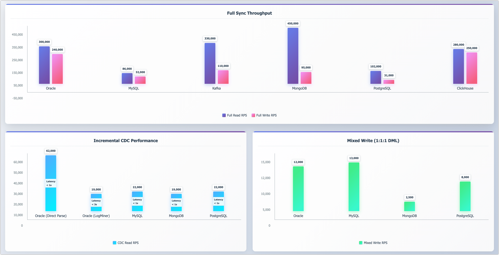

# Performance Benchmarks

This benchmark summarizes TapData's real-world performance across mainstream data sources. It reflects production-like workloads—including full sync, incremental CDC, and mixed writes—validating the platform’s ability to handle high-throughput, low-latency pipelines at scale.

## Overview

A high-level snapshot of TapData’s performance across full sync, incremental CDC, and mixed DML workloads.

:::tip

ClickHouse supports append-only operations and is excluded from CDC and DML tests.

:::

## Full Sync Throughput

TapData achieves strong full-sync performance across both structured and unstructured data systems. The following table shows read and write throughput measured in records per second (RPS), based on 1KB records with \~50 fields.

| Data Source    | Full Read RPS | Full Write RPS |
| -------------- | ------------- | -------------- |
| **Oracle**     | 300,000       | 240,000        |
| **MySQL**      | 86,000        | 32,000         |
| **Kafka**      | 330,000       | 110,000        |
| **MongoDB**    | 450,000       | 95,000         |
| **PostgreSQL** | 102,000       | 31,000         |
| **ClickHouse** | 280,000       | 250,000        |

## Incremental Sync (CDC)

TapData supports change data capture (CDC) with consistently high throughput and low latency across traditional and NoSQL systems.

| Data Source               | CDC Read RPS | P99 latency  |
|---------------------------| ------------ |--------------|
| **Oracle (Direct Parse)** | 62,000       | < 1s         |
| **Oracle (LogMiner)**     | 19,000       | < 3s         |
| **MySQL**                 | 22,000       | < 1s         |
| **MongoDB**               | 19,000       | < 1s         |
| **PostgreSQL**            | 22,000       | < 1s         |

:::tip
- **P99 latency** indicates the maximum delay experienced by 99% of change events.  
- TapData supports both Oracle LogMiner and native log parsing; the latter delivers higher throughput for high-frequency scenarios. [Learn more](../connectors/on-prem-databases/oracle.md#incremental-data-capture-methods).
:::

## Mixed Load Performance

To simulate transactional behavior, we issued INSERT, UPDATE, and DELETE operations in a **1:1:1 ratio**. TapData sustained stable throughput across major targets.

| Data Target    | Mixed Write RPS |
| -------------- | --------------- |
| **Oracle**     | 12,000          |
| **MySQL**      | 13,000          |
| **MongoDB**    | 2,500           |
| **PostgreSQL** | 8,000           |

## Engine-Level Capacity

Under synthetic loads with 1KB records, a single TapData engine instance sustained up to **450,000 RPS**—demonstrating strong performance and scalability in high-concurrency scenarios.

## Key Takeaways

- **Real-time CDC** with low-latency support across relational and NoSQL databases
- **High throughput**: Up to 450K RPS for full sync, 60K+ RPS for incremental reads
- **Mixed DML support**: Stable performance for real-world transactional workloads
- **Flexible CDC modes**: Choose Oracle parsing mode based on performance/ops needs

## About This Report

These results are based on **TapData v3.7.0**, tested under typical enterprise configurations.

This benchmark evaluates TapData’s performance across full sync, incremental CDC, and mixed DML workloads—validating its ability to handle high-throughput, low-latency pipelines at scale.

**Test Scope**
- Full sync throughput (initial batch replication)
- Incremental CDC read/write performance
- Mixed write throughput (DML: INSERT, UPDATE, DELETE in a 1:1:1 ratio)
- Engine scalability under concurrent workloads

**Test Environment**
- **TapData Version**: v3.7.0
- **Instance Type**: 16 vCPU, 32 GB RAM, 300 GB ESSD
- **Engine Memory Allocation**: 16 GB  
  *(Source and target systems had sufficient resources to avoid bottlenecks)*

Results may vary depending on hardware, deployment mode, and connector settings.
