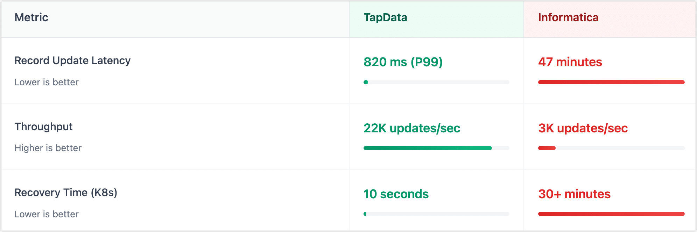

# TapData vs. Informatica MDM

Both TapData and Informatica help you manage master data—but with very different goals in mind. Informatica MDM is built for batch-oriented, governance-heavy environments. TapData offers a real-time, low-latency platform for delivering “always accurate” golden records—ideal for operational use and cloud-native teams.

This guide helps you compare both, and shows when TapData’s **Active MDM** offers the modern alternative.

## Why TapData Stands Out

| Capability              | **TapData Active MDM**                     | **Informatica MDM**                        |
| ----------------------- | ------------------------------------------ | ------------------------------------------ |
| **Data Freshness**      | Sub-second CDC updates                     | Hourly/daily batch jobs                    |
| **Golden Record Logic** | Real-time merge with conflict resolution   | Scheduled merges                           |
| **Source Connectivity** | 100+ CDC connectors, zero-code setup       | ETL tools and PowerExchange required       |
| **Change Propagation**  | <500ms latency to downstream systems       | Delayed by next batch cycle (hours)        |
| **API Access**          | Auto-generated REST & GraphQL APIs         | Requires separate CIAM setup               |
| **Cloud Architecture**  | Unified control plane across cloud/on-prem | Separate modules for each deployment model |

## What Makes TapData “Active” MDM

### Real-Time Golden Records

TapData merges incoming changes from 10+ systems via CDC, keeping master data always current.

*Example: A customer address update in SAP triggers a golden record refresh in <1s.*

### Built-In Data Quality

Validate values like email formats before merging. Resolve conflicts using rules, timestamps, or priority.

### Instant API Access

Expose golden records as secure REST/GraphQL endpoints—instantly consumable by downstream apps.

### Event-Driven by Default

Push Kafka/webhook notifications on golden record changes (e.g., customer tier upgrade).

## When TapData Makes Sense

Use TapData when:

- You need sub-second golden record refreshes
- You want APIs out of the box, no backend needed
- You’re building cloud-native apps with real-time needs
- You prefer low maintenance, no batch jobs or ETL

**Example:**
 “Unify customer records across SAP, Salesforce, and MongoDB, validate the data, resolve conflicts, and publish a GraphQL API—all in under 1 hour.” 

> With traditional tools, delivering the same result could take **weeks of work**—and a cross-functional team juggling ETL tools, job schedulers, and backend API code.

## When Informatica Excels

Informatica MDM fits when:

- You need strict governance and audit controls
- You manage complex enterprise hierarchies (e.g. global subsidiaries)
- You work in regulated industries like pharma or banking
- You’re comfortable with batch cycles and ETL-based ops

**Example:**
 “Manage global product hierarchy with scheduled weekly refreshes and audit logging.”

## Performance Benchmarks

TapData offers significantly better real-time performance than traditional MDM tools like Informatica. Below is a side-by-side comparison across three key dimensions.

*Tested with 50M records across 12 source systems. See detailed comparisons below.*

| Metric                | **TapData**     | **Informatica** | TapData Advantage |
| --- | --- | --- | --- |
| Record Update Latency | 820 ms (P99)    | 47 minutes      | **3,400x** faster |
| Throughput            | 22K updates/sec | 3K updates/sec  | **7.3x** higher |
| Recovery Time (K8s)   | 10 seconds      | 30+ minutes     | **180x** faster |

## Final Takeaways

1. **TapData = Real-Time MDM for Modern Teams**
    Live golden records, APIs, and CDC pipelines—all in one UI.
2. **Informatica = Governance-First, Batch-Oriented**
    Best suited for strict hierarchy management and legacy systems.
3. **TapData Reduces MDM Complexity**
    From onboarding to data delivery, everything is faster, lighter, and cloud-ready.