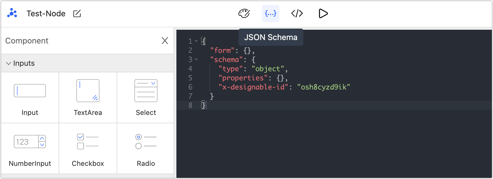
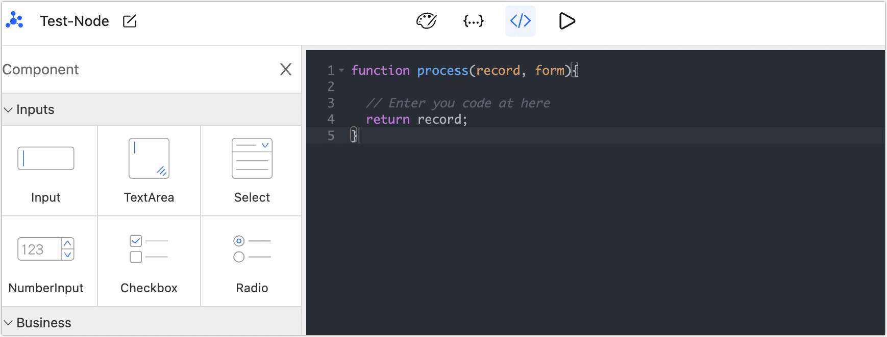

# User Defined Processors

By customizing the node function, you have the flexibility to organize your JavaScript script into reusable processing nodes. Once created, these custom nodes can be easily referenced in your data transformation tasks without the need for rewriting the script. This significantly reduces the development workload. 

In this article, we will guide you on how to use custom nodes effectively and provide use cases as examples for your reference.


## Create Custom Processors

1. [Log in to TapData Platform](../../user-guide/log-in.md).

2. In the left navigation bar, select **Advanced** >  **User Defined Processors**.

3. On the right side of the page, click **New**.

4. On the page that you are redirected to, follow the instructions below to complete the setup.

   1. Add form component to process node.

      

      * On the left side of the page, you will find the **component** area. You can drag components from this area to the operation area and configure them accordingly.
      * The middle section of the page is the operation area. Once a component is selected and placed in this area, you can adjust its position and configure its settings as needed.
      * On the right side of the page is the property settings area. Here, you can configure various settings for the selected component, such as its title, description, default values, and other properties based on your requirements.

   2. Clicking  the  icon located at the top of the page will display the JSON model for the processing node's form item. This allows you to directly edit and modify the form information in JSON format. 

      

   3. Clicking  the  icon at the top of the page allows you to edit the data processing logic of the processing node. You can reference the field identification in the form while customizing the logic.

      

   4. Click the  icon at the top of the page to preview the performance of the node.

5. Click **Save** in the top-right corner of the page.


## Use Custom Processors

In the development task, you can use the custom processor that has been created. You can use it by dragging the node into the DAG canvas.


## Example: Custom Decryption Rule

To ensure information security, if you need to desensitize certain mobile phone numbers in a MySQL table, you can create a custom processor in TapData. Once the custom node is created, you can create a development task and apply the node to perform the desired data desensitization.

**Procedure:**

1. [Log in to TapData Platform](../../user-guide/log-in.md).

2. In the left navigation bar, select **Advanced** >  **User Defined Processors**.

3. On the right side of the page, click **New**.

4. On the page that you are redirected to, follow the instructions below to complete the setup.

   * Node name: In the upper left corner of the page, fill in the node name, such as phone number desensitization.

   * Action: Drag and drop a Input form from the left component area to the middle action area.

   * Name: Fill in the field name, such as masking_field_name.

   * Title: Optional, such as phone number field name.

      Other is not required

5. Click the  icon at the top of the page to open the code editing interface.

   ```java
   // Code logic: Mask the "1234" in the phone number
   function process(record, form){
   var str="18912341234"
   var pat=/(\d{3})\d*(\d{4})/*
   *var b=str.replace(pat,'$1****$2');
   console.log(b)
    record[form.masking_field_name] = record[form.masking_field_name].replace("1234","****");
   ```

6. Click the **Save** in the top right corner.

7. [Create a data transformation task](../../user-guide/data-development/create-task.md). Add the phone number desensitization node between the source and target nodes in the data development task, and specify the field **mobile** as the input for the desensitization process.

   

8. Start the task. The phone number will be masked on the target node, and the result is as follows:

   

