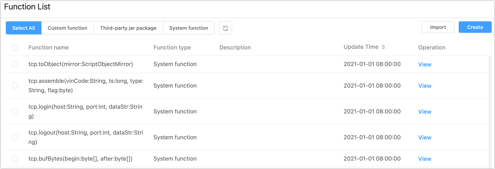
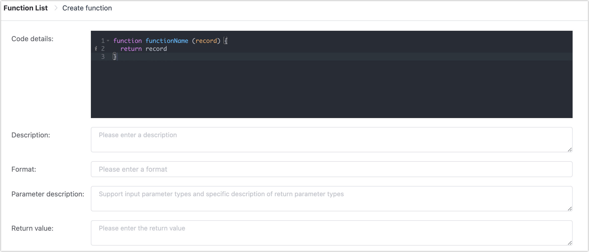

# Manage Functions

TapData supports a wide range of functions to facilitate the definition of processing steps, allowing for their use in [JavaScript (JS) nodes](../../data-transformation/process-node.md#js-process). Additionally, you can freely define custom functions or import third-party JAR packages to introduce new functions as needed.

## Procedure

1. Log in to TapData platform.

2. In the left navigation bar, select **Advanced** > **Function List**.

3. On this page, you can see the functions currently available. For example, click **View** next to a system function to learn more about it.

   

4. If the existing functions do not meet your needs, you can click **Create** in the upper right corner to define a new function. Click **Save** once setup is complete.

   :::tip

   Alternatively, you can click **Import** and then import functions from the package (which must comply with TapData standards). Subsequently, functions from that JAR package can be used in JS nodes using the general format: function name.method name (specific parameters).

   :::

   

   - **Code Details**: You can write your own function logic here.
   - **Description**: A description of what the custom function does.
   - **Format**: The command format for the custom function, useful for prompting when calling the function.
   - **Parameter Description**: Specific explanations for the supported input parameter types and the return parameter types.
   - **Return Value**: The return value of the custom function.

5. For custom functions, you can select them to export for backup or share with other team members. You can also import custom functions.

   