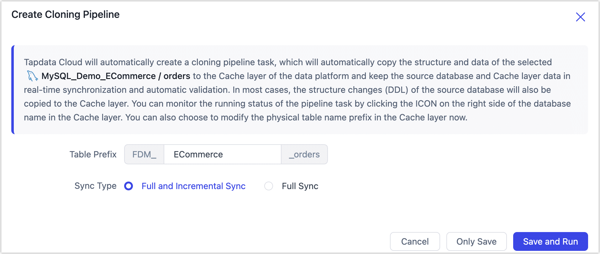

# Replicate Data from Sources

Learn how to set up real-time data replication from your source systems into the FDM (Platform Cache) layer using Tapdata’s flexible, CDC-powered engine. This ensures your business always works with fresh, reliable data—without burdening production databases.

## Why Use the FDM Layer?

The FDM (Federated Data Management) layer acts as a high-performance, real-time cache for your most critical business data.

- Decouples analytics and downstream processes from production databases
- Boosts security and performance by limiting access to sensitive source systems
- Enables scalable, flexible data delivery for multiple teams and use cases

Tapdata’s replication is powered by **Change Data Capture (CDC)** technology, allowing you to sync data with low latency and minimal impact on source systems. Tapdata supports a wide range of popular databases and cloud data sources—so you can unify your data, no matter where it lives.

## Prerequisites

Before you start, make sure you’re set up for a smooth experience:

- [ODH mode is enabled](../set-up-odh.md) on your Tapdata workspace.
- Your source database connections are configured and tested, for details, see [Connect Data Sources](../../connectors/README.md).
- Your source tables must have a primary key or unique index.

## Procedure

1. Log in to TapData Platform.

2. In the left sidebar, select **Real-time Data Center**.

3. On this page, you’ll see all connected data sources, displayed across four platform layers for clear governance and data flow management.

    For details on each layer, see [ODH Architecture Overview](https://docs.tapdata.net/user-guide/real-time-data-hub/daas-mode/enable-daas-mode).

4. In the **Source Data Layer**, find the database and tables you want to replicate.
    Or use the </img> icon to search, then drag the desired table(s) to the **Platform Cache Layer**.

    
    
5. In the configuration dialog, set a **table prefix** and choose the replication mode (**Full and Incremental Sync** or **Full Sync**).
   
    
    
    Tapdata automatically generates the FDM-layer naming pattern for you, which typically includes the `FDM_` prefix plus your table name.
    Here you can add your **source system identifier** to make it easier for business teams to recognize the origin of the data.
    
    For more naming best practices, see [Plan Your Operational Data Hub](../plan-data-platform.md).
    
6. Click **Save & Run** to immediately start the replication.
   
    Tapdata will automatically create and launch a real-time replication task, continuously syncing your selected tables into the **FDM (Platform Cache) Layer** with built-in validation.
    
    To monitor the task, click the </img> icon next to the table name—this opens the job monitoring page with live status and performance metrics.
    
    
    
    :::tip
    
    When multiple tables are selected from the same database source, Tapdata will group them into a single replication task by default. This makes it easier to manage schema changes and monitor task status consistently.
    
    :::
    
    Tapdata also helps keep things organized by automatically creating a **folder** in the Platform Cache named after your source connection. Your new replication task will appear inside this folder, making it easier to manage and find related tables from the same source.
    
    If you want to rename the folder, simply **hover over it**, click the vertical three-dot (**⋮**) icon, and select **Edit** to change its name.
    
    
    

:::tip

**Need more control?**
If you want to adjust advanced options—like read concurrency, batch size, hash-based sharding (for splitting large tables during full sync), or index replication—click **Only Save** instead of **Save & Run**.
After saving, locate your new task in the list, click its name, and configure these settings before running it.

:::

## Next Step

- [Explore FDM Table Details](explore-fdm-tables.md)
- [Data Validation](validate-data-quality.md)