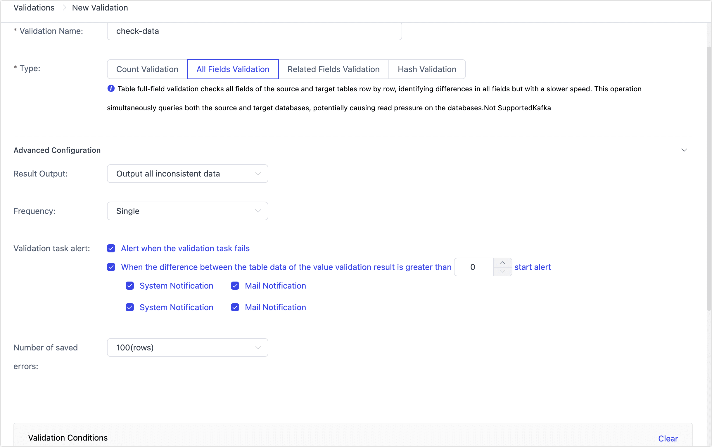

# Validate View Results


Leveraging various proprietary technologies, TapData ensures maximum data consistency. In addition, TapData supports data table validation to further verify and ensure the correctness of data flow, meeting the stringent requirements of production environments. This document introduces the configuration process for data validation tasks.

```mdx-code-block
import Tabs from '@theme/Tabs';
import TabItem from '@theme/TabItem';
```

## Procedure

1. Log in to TapData Platform.

2. In the left navigation bar, click **Data Validation**.

3. In the upper right corner of the page, click **Task Consistency Validation** or **Any Table Data Validation** based on your validation target, then fill in the parameters as described below:


```mdx-code-block
<Tabs className="unique-tabs">
<TabItem value="Task Consistency Validation">
```


- **Choose Job**: Choose the data replication/data transformation task to verify.
- **Verify Task Name**: Enter a meaningful name for the task.
- **Type**: Currently, the following three validation methods are supported. If the field names in the table have been modified during synchronization, executing **All Fields Validation** or **Associated FieldsValidation** may fail due to field name mismatches.
    - **Count Validation**: Verifies the row count of the source and target tables without displaying specific difference content, very fast.
    - **Full Fields Validation**: Verifies the values of all fields in the source and target tables row by row, displaying the difference content of all fields, slower.
    - **Associated Fields Validation**: Only validates the values of associated fields in the source and target tables. The associated fields must have a sortable index, resulting in moderate performance.
    - **Hash Validation**: Currently does not support Verify data between heterogeneous databases.
- **Advanced Configuration**: Click on advanced configuration to unfold more configuration options:
    - **Result Output**: Choose **Output all inconsistent data** or **Only output inconsistent data from the source table**.
    - **Validation Task Alert**: Choose the rule configuration and notification method for alarms when the task runs into errors or the validation results are inconsistent.
    - **Validation Frequency**: Default is **Single**. If **Repeated** is chosen, you also need to set the start and end time of the validation and the interval between tasks.
    - **Error**: The maximum number of inconsistent data records to save, default is 100, maximum is 10000. It's recommended to set a larger value to ensure completeness of records.
    - **Validation Conditions**: By default, TapData automatically loads the source/target data tables from the data replication/development tasks. Additionally, you can turn on the **Data Filter** switch to only verify specific condition data to reduce the validation scale (custom query and aggregate query filtering can be implemented via SQL). Moreover, you can add JS validation logic through advanced validation.

</TabItem>

<TabItem value="Any Table Data validation">




- **Validation Name**: Enter a meaningful name for the task.
- **Type**: Currently, the following three validation methods are supported.
    - **Count Validation**: Verifies the row count of the source and target tables without displaying specific difference content, very fast.
    - **All Fields Validation**: Verifies the values of all fields in the source and target tables row by row, displaying the difference content of all fields, slower.
    - **Associated Fields Validation**: Only validates the values of associated fields in the source and target tables. The associated fields must have a sortable index, resulting in moderate performance.
    - **Hash Validation**: Currently does not support Verify data between heterogeneous databases.
- **Advanced Configuration**: Click on advanced configuration to unfold more configuration options:
    - **Result Output**: Choose **Output all inconsistent data** or **Only output inconsistent data from the source table**.
    - **validation Task Alarm**: Choose the rule configuration and notification method for alarms when the task runs into errors or the validation results are inconsistent.
- **validation Frequency**: Default is **Single**. If **Repeated** is chosen, you also need to set the start and end time of the validation and the interval between tasks.
- **Error**: The maximum number of inconsistent data records to save, default is 100, maximum is 10000. It's recommended to set a larger value to ensure completeness of records.
- **Validation Conditions**: Click **Add Table** to manually specify the validation source/target data connections, tables to be verified, index fields, and validation model. Additionally, you can turn on the **Data Filter** switch to only verify specific condition data to reduce the validation scale (custom query and aggregate query filtering can be implemented via SQL). Moreover, you can add JS validation logic through advanced validation.
  If you need to verify multiple tables, click **Add Table** to continue adding validation conditions.

</TabItem>
</Tabs>


4. Click **Save**. After returning to the task list, click **Execute** for the target validation task.

5. (Optional) Click on **Result** for the verification task to view detailed verification results. For discrepancies, you can click **Data Correction** to align the data or **Download** for in-depth analysis.

   

   :::tip

   When the validation type is **Full Fields Validation** or **Associated Fields Validation**, you can also click **Diff verification** in the upper right corner to re-verify the difference data results of this full validation to confirm whether the data has become consistent.

   :::
   
6. *(Optional)* On the data verification task list page, you can import and export task configurations—useful for migrating or reusing configurations between test and production environments.


## Common Issues

For troubleshooting methods regarding failed validation tasks or inconsistent validation data, see [Common Questions on Data validation](../../faq/data-pipeline.md#check-data).

## See also

[Incremental Data Validation](../../data-replication/incremental-check.md)