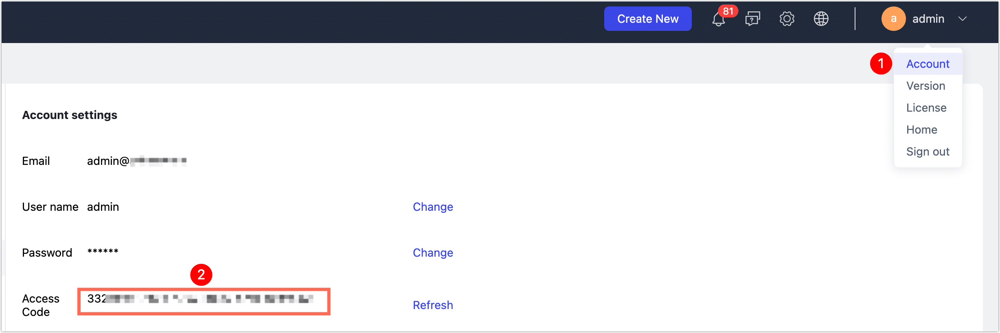

# Quick Start

import Content from '../../reuse-content/_enterprise-and-community-features.md';

<Content />

This guide walks you through enabling the [MCP (Model Context Protocol) service](introduction.md) in Tapdata and integrating it with AI agent tools that support the SSE protocol (e.g., Cursor). It enables real-time delivery of structured contextual data, helping large language models better understand business context.

## Prerequisites

- Requires Tapdata Enterprise or Community Edition to be [deployed](../../backup-files/install.md).
- You have an AI model service or tool that supports MCP with SSE protocol (e.g., Cursor or Trae).

## Step 1: Set Up User and Get Access Code

To ensure platform security, you need to create and authorize a user account with permission to access data via the MCP protocol.

1. [Log in to the Tapdata Platform](../../user-guide/log-in.md).

2. Go to **System Settings** > **Role Management** and create a role named `mcp` (case-insensitive). See [Manage Roles](../../user-guide/manage-system/manage-role.md).

3. Navigate to **System Settings** > **User Management**, and assign the `mcp` role to a user account. See [Manage Users](../../user-guide/manage-system/manage-user.md).

4. Log in to Tapdata using the authorized account, click your username in the top-right corner, and select **Account**. Copy the **Access Code**; you’ll need it in the next steps.

   

## Step 2: Configure MCP Server in Agent Tool

Next, we’ll use **Cursor** as an example to show how to configure and connect to the Tapdata MCP Server:

1. Open and log in to the Cursor app. Click the top-right  icon.

2. Click **MCP** on the left menu, then click **Add new global MCP Server**.

   

3. In the `mcp.json` config file that opens, add the Tapdata MCP service config using the structure below:

   ```json
   {
     "mcpServers": {
       "mcp-tcp-server": {
         "url": "http://{server}:{port}/mcp/sse?accessCode={accessCode}"
       }
     }
   }
   ```

   You only need to modify the `url` field. Description of the parameters:

   - **server**: Replace with the domain or IP of your Tapdata platform.
   - **port**: Replace with the Tapdata service port (default is **3030**).
   - **accessCode**: Replace with the access code obtained in Step 1.

   Example:

   ```json
   {
     "mcpServers": {
       "mcp-tcp-server": {
         "url": "http://192.168.1.18:3000/mcp/sse?accessCode=3324cf************"
       }
     }
   }
   ```

4. Save and close the configuration file. Return to the MCP settings section. When the status light on the left turns green, the connection to Tapdata MCP Server is successful.

   

5. When you interact with the AI model in Cursor, it will automatically fetch context data from Tapdata MCP Server. You can also guide the model via prompts to help it access data efficiently.

   ```bash
   # Role
   You are a data analysis assistant. Your job is to generate data queries based on user intent and present the results.
   
   # Task Preparation
   First, retrieve the available database connections (e.g., "E-commerce Materialized View"), then query the schema to understand the data model.
   
   # Working Directory
   /Users/lg/tmp/worker
   ```

   Cursor will recognize the task and execute the following:

   1. Retrieve database connections and data model schemas
   2. Run data queries and aggregation based on the context
   3. Return the final analysis results


```mdx-code-block
import Tabs from '@theme/Tabs';
import TabItem from '@theme/TabItem';
```

<details>
<summary><b>Understand Tapdata MCP Server Primitives</b></summary>

Tapdata MCP Server is built on three core primitives: **Prompts**, **Resources**, and **Tools**. These form the foundation for AI models to interact with data systems—allowing them to discover available resources, select appropriate operations, and use prompt templates to retrieve structured context for accurate and efficient reasoning.

```mdx-code-block
<Tabs className="unique-tabs">
<TabItem value="Prompts" default>
```

**Prompts** are task-specific natural language templates that guide AI models to understand intent, plan execution steps, and generate high-quality responses. Well-crafted prompts significantly improve accuracy and task completion.

</TabItem>
<TabItem value="Resources">

**Resources** define the data the AI model can access, including database connections and models, helping the model understand data structure and context.

| Primitive           | Description                                                  |
| ------------------- | ------------------------------------------------------------ |
| **Data Connection** | Represents database connections in MCP Server. Business tags can be added to describe purpose. |
| **Data Model**      | Represents schema definitions under a connection, including collection names, fields, and types, helping the model understand data organization. |

</TabItem>

<TabItem value="Tools">

Tools are callable functions or commands the model can use to interact with structured data—such as queries, aggregations, and sampling.
These tools are automatically discovered and made available through MCP without additional configuration.

| Tool Name        | Function Description                                  |
| ---------------- | ----------------------------------------------------- |
| `listConnection` | Lists all database connections and their tags         |
| `listDataModel`  | Retrieves all data models under a connection          |
| `sampleData`     | Samples up to 100 records from a model                |
| `query`          | Executes a MongoDB query                              |
| `aggregate`      | Performs MongoDB aggregation                          |
| `count`          | Returns the total number of documents in a collection |
| `listCollection` | Lists all collections in a MongoDB database           |

</TabItem>

</Tabs>

</details>

:::tip
The current MCP service supports read-based primitives for contextual data, including structured queries, aggregations, and data sampling.
Tapdata will gradually introduce enhanced capabilities such as **write support, data publishing APIs, and AI Agent–driven modeling**, continuously improving the end-to-end context loop and enabling secure, efficient AI-driven analytics.
:::

## FAQ

- **Q: MCP Server connection failed—what could be the reason?**

  Possible causes include:

  - Incorrect service URL or endpoint
  - Network firewall or security group blocking Tapdata port
  - The access code user lacks the `mcp` or admin role

- **Q: AI inference is delayed or missing data—how to troubleshoot?**

  Check for performance bottlenecks in the model backend, slow queries in the data source, or network latency between Tapdata and the model.

- **Q: How can I test SSE data connectivity quickly?**

  You can use `curl` or Postman to test Tapdata MCP's SSE endpoint, or use the official [MCP Inspector tool](https://modelcontextprotocol.io/docs/tools/inspector) to verify real-time payloads.

- **Q: My AI Agent only supports STDIO protocol. Can it still use Tapdata MCP?**

  Yes. Use the [mcp-proxy](https://github.com/sparfenyuk/mcp-proxy) tool to convert STDIO to SSE and bridge Tapdata MCP Server.
