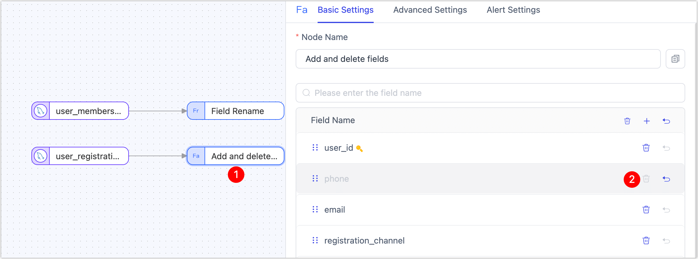

# Prepare and Transform Data

Transform scattered data into a clean, standardized, and privacy-safe foundation for master data modeling. TapData lets you visually enrich and align records across multiple tables—ready for analytics, personalization, and operational use.

## Why Transform Data

In most organizations, business data is scattered across many systems—CRMs, e-commerce platforms, loyalty programs, marketing tools, and more. These systems use different naming conventions, formats, and standards, making the raw data inconsistent, redundant, or even privacy-sensitive. It’s not immediately usable for downstream analytics, applications, or AI.

To turn this fragmented data into trusted, analysis-ready information, you need to standardize, clean, and organize it into unified structures. That’s where the **MDM (Master Data Management) Layer** in TapData comes into play.

Once your raw data is replicated into the FDM (Platform Cache) Layer, you can design transformation pipelines in the MDM layer to shape it for downstream use. Typical tasks include removing or renaming fields, masking sensitive values, merging records from multiple sources, or applying custom rules and calculations. You have full flexibility to define logic that matches your business requirements—whether simple or complex.

The MDM layer supports two key roles:

- Building **reusable, clean data models**—like standardized user profiles or product views—that serve as shared building blocks across projects.
- Creating **real-time materialized views** that are optimized for direct consumption by BI dashboards, API integrations, or other applications.

These two roles often work together: a reusable user model can be further enriched or joined with transaction data to produce a wide table materialized view for reporting or personalization. In this example, we’ll walk through the first step—building a reusable user view.

## Example: Build a Unified User View

Let’s walk through a practical case: creating a privacy-compliant, reusable user view by cleaning and merging two FDM tables:


In this scenario, we’ll:

- Clean the `user_registration` table by removing phone numbers, masking email addresses, and extracting email domains for future segmentation.
- Standardize the field names by renaming `userId` to `user_id`, aligning it with the membership table.
- Use a **Master-Detail Merge** node to combine both tables by `user_id` into a unified profile.

The result is a well-structured user view that can be reused in later transformation tasks—for example, joining with order data to build a real-time wide table view for marketing, dashboards, or machine learning models.

If the output view is likely to be reused across teams or workflows, we recommend creating it as a standalone MDM transformation task. If it’s a one-off integration, you can embed the logic directly into a downstream pipeline for better performance and simpler management.

## Procedure

1. Start a New Data Transformation Task.

   1. Log in to TapData platform.

   2. In the left navigation menu, go to **Real-Time Data Hub**.

   3. Under the **MDM** section, click the  icon.

      

   4. In the pop-up dialog, name your view (e.g., `users_main_view`). TapData will automatically add the `MDM_` prefix.

   5. Click **OK** to create the task. You’ll be taken to the pipeline configuration page.

      Here, you’ll see that TapData has pre-built the basic structure for you—a visual pipeline with a **Master-Detail Merge** node and a **Target Node** already in place.
      
      

2. Add Source Tables from FDM.

   1. In the **Connections** panel on the left, find your source connection (e.g., an FDM storage engine).

      

   2. Drag the following two tables onto the canvas:

      - `FDM_ECommerce_user_registration`
      - `FDM_ECommerce_user_membership`

   3. Connect both tables to the **Master-Detail Merge** node by dragging from the **+** handle on each table node to the merge node.

3. Standardize Fields in the Membership Table.

   1. Hover over the line between `FDM_ECommerce_user_membership` and the merge node, and click the **+** icon.

      

   2. Select the **Field Rename** node.

   3. Click the new node to configure it. Rename the `userId` field to `user_id` to match the schema used in the registration table.

4. Clean and Transform the Registration Table.

   We’ll now remove the phone number and mask the email address to meet privacy and compliance standards.

   1. Hover over the line from `FDM_ECommerce_user_registration` to the merge node and click the **+** icon.

   2. Add an **Add and Delete Fields** node.

   3. In the configuration panel, delete the `phone` field.

      

   4. Hover over the line from this node to the merge node again, click **+**, and add a **Standard JS** node.

   5. In the **Script** box, paste the following JavaScript to mask the email address:

      ```js
      var parts = record.email.split("@");
      record.email = parts[0].substring(0,1) + "****@" + parts[1];
      return record;
      ```

      

      :::tip

      TapData offers many prebuilt nodes, but you can also use JS nodes for advanced customization. See [Appendix: JS Examples](../../appendix/standard-js.md) for more.

      :::

5. Configure the Merge Logic.

   Click on the **Master-Detail Merge** node and set the join key to `user_id` for both tables.

   

6. Run the Task.

   Click **Start** in the upper-right corner. TapData will launch the real-time transformation task and take you to the monitoring page, where you can track data volume, processing status, and latency in real time.

## What’s Next?

This new Unified User View is a powerful, reusable asset. You can now:

- Join it with transaction or behavior tables to enrich order-level analytics
- Use it as input for marketing segmentation or churn prediction
- Power AI-driven recommendation systems with high-quality, unified profiles

If you don’t plan to reuse this view across multiple flows, consider performing all processing steps within a single task to reduce transformation latency.

## See also

[Supported Processing Node](../../data-transformation/process-node.md)
