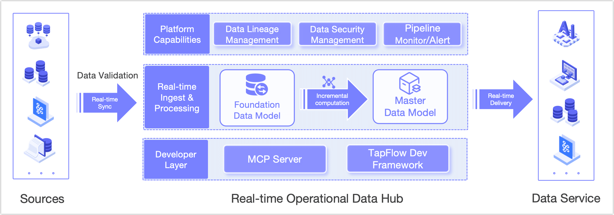

# Plan Your Data Platform

Build a unified, real-time data foundation that connects all your systems, breaks down silos, and delivers consistent, high-quality data to power your business. This guide explains why you need an Operational Data Hub (ODH) and how to plan and implement one step by step.

## Why Plan Your Data Platform

As businesses grow and expand, their data landscape often becomes fragmented. Different teams and systems develop in silos, each optimized for local needs at the time, but creating long-term barriers to data sharing, consistency, and agility.

Think of an ecommerce company processing customer orders: payment risk assessment, inventory checks, user segmentation, and promotion management all need timely, reliable data. Yet these systems often live in separate databases and services, making real-time decisions difficult.

Similarly in payments and fintech, real-time fraud prevention depends on instantly recognizing risky transactions. But fragmented systems with delayed data integration make real-time risk scoring and blocking hard to achieve.

Traditional solutions often focus on large data warehouses or lakes that batch-load data for analysis. While valuable for historical insights, they have clear limitations:

- **Slow to update:** Often T+1 latency, unsuitable for real-time use cases.
- **Complex and costly:** High implementation and maintenance overhead.
- **Inflexible:** Hard to adapt quickly as business needs evolve.

Some companies try building real-time pipelines with stream processing technologies, but these often come with steep learning curves, complex event ordering issues, and operational challenges that limit business self-service.

To meet these challenges, organizations need a **more agile, real-time, and lightweight approach** to unify data, reduce operational burden, and deliver reliable, consistent, real-time data to the people and systems that need it. This is where an **Operational Data Hub (ODH)** comes in.

## What is an Operational Data Hub (ODH)?

An Operational Data Hub is a real-time data integration and delivery layer that sits between your source systems and consuming applications. It's designed to solve fragmented data landscapes, reduce integration complexity, and deliver consistent, standardized data in real time.

At its core, an ODH is about connecting, transforming, and delivering data:

- **Connect:** Seamlessly integrate diverse data sources—databases, APIs, event streams—without requiring major system changes.
- **Transform:** Clean, standardize, and model data into consistent formats and business entities that everyone can understand.
- **Deliver:** Make high-quality, up-to-date data available to consuming systems and teams via APIs or downstream databases.

With an ODH, you move from siloed, hard-to-manage data flows to a single, unified, reusable data service that powers real-time operations and decision-making.

Tapdata's ODH design breaks this journey into clear, manageable layers:

| Layer                                               | Purpose                                                      |
| --------------------------------------------------- | ------------------------------------------------------------ |
| **[Source Data Layer](../connectors/README.md)**    | Connect to and abstract data from all business systems and sources, without disrupting existing operations. |
| **[Platform Cache (FDM)](fdm-layer/README.md)**     | Use real-time change data capture (CDC) to [mirror source tables](fdm-layer/replicate-data.md) safely, reducing load on critical systems. |
| [**Processing Layer (MDM)**](mdm-layer/README.md)   | [Transform, clean, and model data](mdm-layer/prepare-and-transform.md) into standardized business entities and wide tables for consistent consumption. |
| [**Delivery & Service (ADM)**](adm-layer/README.md) | Expose processed data to consuming systems and teams via [APIs](../publish-apis/README.md), real-time [pipelines](adm-layer/sync-downstream.md), or event-driven delivery. |

This approach aligns with best practices for **Master Data Management (MDM)** as defined by Gartner: enabling IT and business teams to work together to ensure consistency, accuracy, governance, and shared understanding of core business data.

## How to Plan Your Data Platform

Once you understand the why and what of an ODH, the next question is: **How do you actually build it?**

Below is a practical roadmap, based on proven best practices and real-world implementations, to help you plan and implement your own operational data platform.

### 1. Define Goals and Priorities

Start with business needs, not just technical architecture.

- Identify critical use cases (e.g., real-time fraud scoring, customer segmentation).
- List the core data assets required to enable these scenarios.

### 2. Audit Existing Data Assets

- Map out data sources, formats, and update frequencies.
- Document owners and integration points.
- Build an asset inventory or data catalog to clarify what's available.

### 3. Establish Standards and Governance

- Define unified data models and clear, agreed-upon metrics.

- Standardize naming conventions and security classifications.

  *Examples:*

  - `FDM_SourceSystem_TableName` for raw mirrors
  - `MDM_Domain_BusinessLogic` for processed wide tables
  - `ADM_Domain_Metric_Frequency` for business-facing aggregates

- Document data definitions, lineage, and ownership so everyone understands what's being delivered.

### 4. Design and Build Data Pipelines

Follow a layered approach:

- **FDM:** Mirror source data in real time without overloading production systems.
- **MDM:** Clean, enrich, and model data into consistent, business-friendly forms.
- **ADM:** Create ready-to-use data services or tables tailored to specific use cases.

*Example:*

> For fraud risk, replicate transactions and user profiles into FDM. Merge and enrich them in MDM to create a real-time user risk profile table for the scoring engine.

### 5. Deploy Monitoring and Quality Checks

- Set up automated monitoring and alerts for data pipelines.
- Conduct regular quality reviews to ensure data freshness, accuracy, and availability.

### 6. Iterate and Improve

- Start with a pilot project for one high-impact use case.
- Gather feedback, improve models and processes.
- Gradually scale to additional teams and data domains.

By following this approach, you can turn fragmented, hard-to-use data into a **single, standardized, reusable data service** that fuels real-time decision-making and enables your entire organization to move faster and smarter.
