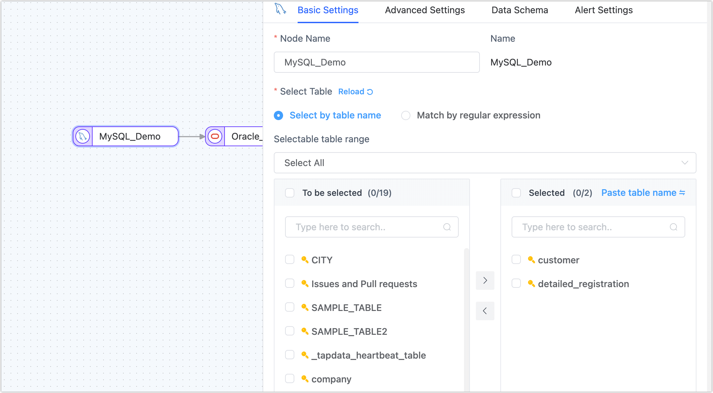
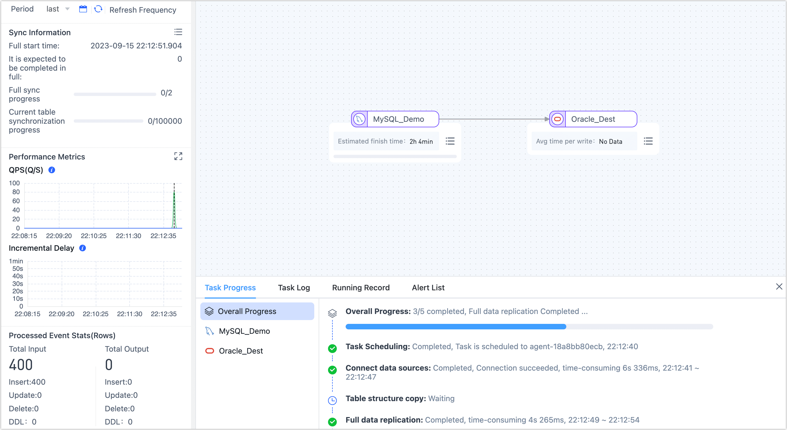

# Real-time Heterogeneous Sync from MySQL to Oracle

With the rapid development of modern enterprises, data has become one of the most important assets. In many organizations, to meet a variety of business and technical requirements, various types of databases might be in use. Through a real case of migration from Oracle to MySQL, this article introduces how to achieve real-time synchronization of heterogeneous databases through Tapdata Cloud. This helps to quickly complete data flow between databases of different types, structures, and technologies, building a unified data service platform and preventing data silos.

## Background

With the swift evolution of database technology and the diversification of data application scenarios, we find that traditional databases are increasingly struggling to meet changing business needs. This has not only led to an urgent demand for data migration and database upgrades but has also accentuated the long-standing problem of enterprise "data islands", presenting significant challenges for real-time data aggregation. In this context, traditional heterogeneous database synchronization methods, such as relying on migration tools provided by database vendors (like Oracle's OGG) or manually written SQL scripts, are evidently inadequate.

Tapdata Cloud, as an innovator, breaks free from traditional paradigms. Compared to complex execution logic and tedious code writing, Tapdata Cloud offers a low-code, highly visual solution for real-time heterogeneous database synchronization. Its advantages include:

- **Extensive Data Source Support**: It covers mainstream databases like MongoDB, MySQL, Oracle, and goes further by integrating with SaaS, data warehouses, cloud databases, and many other data sources, ensuring comprehensive data synchronization.
- **Ultra-high Real-time Capability**: Leveraging the CDC technology of databases, millisecond-level synchronization latency guarantees data timeliness, achieving real-time data synchronization without any intrusion.
- **Simplicity and Efficiency**: With simple drag-and-drop actions, users can achieve real-time data synchronization and processing without writing any code, simplifying the complexities of data migration.
- **Unmatched Flexibility and Reliability**: Tapdata Cloud is based on an advanced cloud-native architecture, ensuring exceptional elasticity and security, providing a solid safeguard for the data.

## Prerequisites

Having understood the differences between Tapdata Cloud and traditional solutions, we will now use data synchronization from **MySQL to Oracle** as an example to provide a hands-on demonstration of Tapdata Cloud's operation process.

Before building the data sync pipeline, we first need to establish a connection to the data source on Tapdata Cloud. The specific steps are as follows:

1. [Connect to MySQL](../prerequisites/on-prem-databases/mysql.md)
2. [Connect to Oracle](../prerequisites/on-prem-databases/oracle.md)

## Configure Task

1. Log in to [Tapdata Cloud](https://cloud.tapdata.io/).

2. In the left navigation panel, click **Data Replications**.

3. On the right side of the page, click **Create** to configure the task.

4. Drag and drop previously configured MySQL and Oracle sources to the canvas and connect them.

5. Click on the MySQL data source, select the tables for syncing.
   Adjust settings, view table structures, set batch sizes, and configure email alerts if needed.
   

6. Click on the Oracle data source, preview data structure and adjust advanced settings.
   

   * **Node name**: Defaults to connection name, you can also set a name that has business significance.
   * **Deduction Results**: This is derived from the source node settings. The update condition is automatically set to the table's primary key. If there's no primary key, a unique index field is used. In the absence of both a primary key and a unique index, you'll need to manually specify the update condition's field.
     :::tip
     Additionally, you can click on the field type, in the pop-up dialog, you can adjust the field type and precision. You can also modify the field's length based on a coefficient. For instance, if the original field is `STRING(200)` and the coefficient is set to **2**, then the field becomes `STRING(400)`. This feature is helpful to address data insertion failures due to varying storage length requirements caused by character encoding differences.
     :::
   * **Duplicate Processing Strategy**, **Data write mode**: Select the preferred method for handling duplicated data.
   * **Full Multi-threaded Write**: The default setting for the number of concurrent threads with full data written is **8**. However, it can be adjusted as needed, taking into consideration the write performance of the target database.
   * **Incremental Multi-threaded Write**: The number of concurrent threads with incremental data written is disabled by default. However, it can be adjusted as needed, considering the write performance of the target database.
   * **Number of Writes Per Batch**: This is the number of entries written per batch during full synchronization.
   * **Maximum Wait Time for Each Batch Write**: Evaluate based on the performance of the destination database and network latency. Set the maximum wait time, measured in milliseconds.

7. Click on the **Save** or **Start** to finalize the creation. To ensure the task runs smoothly, Tapdata Cloud conducts a pre-check based on the node configuration and characteristics of the data source, simultaneously logging relevant information.

   Upon successful start, you'll be automatically redirected to the **Task Monitoring** page. Here, you can view details like the task's QPS (Queries Per Second), latency, and various task-related events.

   

## See also

For more advanced features like table merging or building wide tables, you can [create data transformation task](../user-guide/data-pipeline/data-development/create-task.md) on Tapdata Cloud. Additionally, you can explore the [Real-Time Data Hub](../user-guide/real-time-data-hub/daas-mode/enable-daas-mode.md), simply drag the source table to generate a data pipeline, which will then automatically start the task. This greatly simplifies the task configuration process.