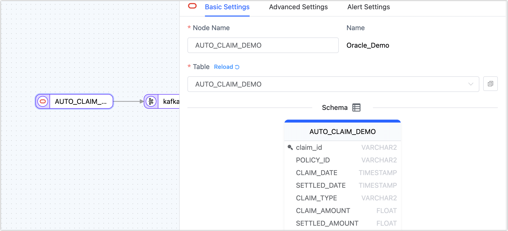
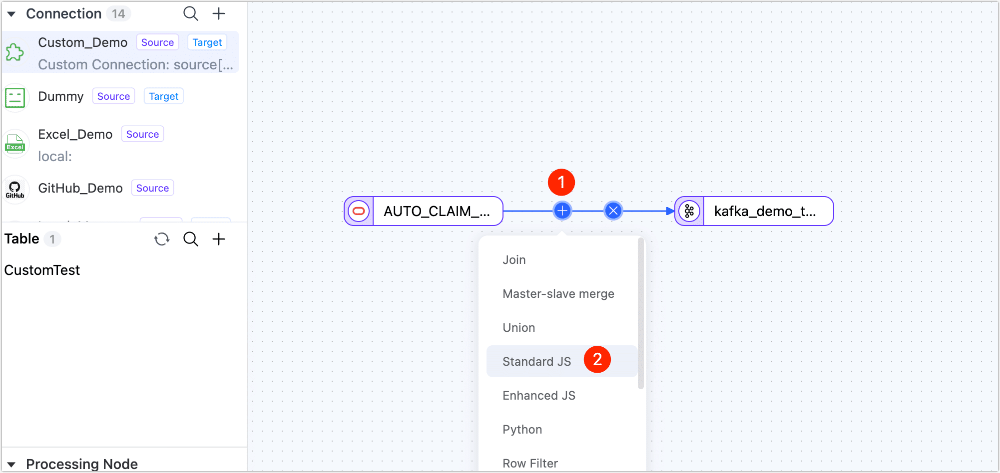
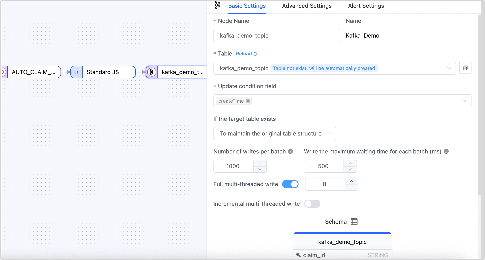

# Real-Time Oracle to Kafka Synchronization
import Content from '../reuse-content/_all-features.md';

<Content />

In the era of big data, more and more enterprises need to synchronize data from traditional relational databases to big data processing platforms to support real-time data processing, data lake construction, and alternative data warehousing scenarios. Oracle, widely used in enterprise applications, increasingly requires synchronization to big data platforms.

This article explains how to synchronize data from Oracle to Kafka in just a few simple drag-and-drop steps using TapData, meeting the needs of big data supply scenarios.

## Scenario Description

As enterprises continuously develop and data volumes increase, traditional relational databases face challenges in performance, scalability, and cost when handling big data. Big data platforms like Flink provide real-time data processing and complex data analysis tasks.

Thus, synchronizing data from Oracle databases to big data platforms has become a necessity for many enterprises in big data supply scenarios, typically offering the following benefits:

* **Real-Time Data Synchronization**: Enables quick access to the latest data for real-time processing and analysis, allowing timely decision-making, business opportunity identification, or real-time monitoring.
* **Reduce Load on Source Database**: Oracle, as the core data storage system for enterprises, may face high-concurrency data writing and reading requests. Synchronizing data to Kafka can enable asynchronous processing through message queues, reducing the database's read pressure and avoiding the impact on the source database that could arise from batch data extraction in T+1 synchronization methods.
* **Unified Data Distribution**: Publishing data to Kafka message queues can standardize data distribution, allowing downstream applications to consume the data as needed, fulfilling diverse data consumption and processing requirements.
* **Reduce Business Coupling**: The dependency between different systems is decoupled, allowing systems to evolve independently, reducing the interdependence and thus enhancing system flexibility and maintainability.


TapData, as an efficient, reliable, and secure real-time data platform, offers easy-to-use, feature-rich data transformation services that enhance your data development efficiency and allow you to focus on your core business. Additionally, in scenarios involving large-scale data processing, you can achieve horizontal scaling by adding nodes or adjusting configurations.

In this case, we aim to read real-time data from the car insurance claims table (**AUTO_CLAIM_Demo**) in the source Oracle database. We will process this data to help us capture incremental changes before and after, and then synchronize the data in real-time into a Kafka data source. Downstream business applications can freely subscribe to and consume Kafka data, building a real-time data synchronization pipeline.

## Considerations

* Ensure that the size of individual Oracle data entries does not exceed Kafka's single message limit (default 1 MB) to avoid write failures. If oversized data occurs, consider filtering large fields between Oracle and Kafka nodes during data transformation task configuration, or modify Kafka's maximum message size limit.
* TapData's Oracle log parsing speed is about 10,000 RPS. If the rate of incremental events exceeds this, it may lead to increased data processing delays.
* The raw log feature is currently not supported on RAC-ASM deployment architectures and does not support obtaining raw logs from non-primary nodes in DG architectures.

## Prerequisites

Before creating a data transformation task, ensure you have configured the necessary data sources:

1. [Configure Oracle Connection](../prerequisites/on-prem-databases/oracle.md)
2. [Configure Kafka Connection](../prerequisites/mq-and-middleware/kafka.md)

## Configure Task

1. [Log in to TapData Platform](../user-guide/log-in.md).

2. Based on the product type, select the operation entry:

   * **TapData Cloud**: In the left navigation panel, click **Data Transformation**.
   * **TapData Enterprise**: In the left navigation panel, choose **Data Pipelines** > **Transforms**.
   
3. Click **Create** on the right side of the page.

4. Drag and drop the Oracle and Kafka data sources to the right side of the canvas and connect them.

5. Click the Oracle data source and complete the configuration on the right panel as follows:

   

    * **Basic Settings**
        * **Node Name**: By default, it is the connection name, but you can set a name with business significance.
        * **Table**: Select the source table to operate on; below, the table's structure information will display, including column names and types. In this case, we are creating a data transformation task suitable for single-table processing. To handle multiple tables simultaneously, you could create a data replication task with a similar configuration process.
        
    * **Advanced Settings**
        * **DDL Synchronization**: Choose whether to enable **DDL Event Collection**. Turning on this switch allows TapData to automatically collect selected source DDL events (such as field additions) if the target supports DDL writing, enabling synchronization of DDL statements.
        
        * **Incremental Method**: Choose **Real-time Log Parsing** or **Field Polling**. When selecting **Polling**, you will need to specify the polling field, interval, and rows per read. 
        
        * **Real-time Log Parsing** uses transaction logs from the data source for parsing and synchronizing incremental events, whereas **Field Polling** uses polling on the field to synchronize incremental events, typically unable to synchronize delete events.
        
        * **Data Filter**: 
        
          * **Full Customizable Query**: Activate this switch to write a SQL query statement required during the full data sync phase (does not affect the incremental phase), allowing for custom data extraction (such as data filtering, joins, etc.), for example, `SELECT id,name,address FROM customer;`.
        
            :::tip
        
            This feature requires the target node to be a weak Schema class data source (such as MongoDB/Kafka).
        
            :::
        
          * **Filter Settings**: Off by default; when enabled, you need to specify data filtering conditions.
        
        * **Data Read:** Set the number of records read per batch during full synchronization, default is **100**.
        
        * **Data Source**
        
          * **Continuous Miner**: To reduce the latency of acquiring incremental data, it is recommended to turn on this switch when the Oracle version is below 19c. When the version is 19c or above, this switch should be turned off.
          * **Fetch Size**: Only effective for continuous mining. When the source's update frequency is low, you may choose a lower value to reduce latency; when the update frequency is high, selecting a higher value can enhance throughput. The general formula is `source database data change RPS divided by 10`, recommended values are 1 ~ 1000.
          * **Enable Sync of LOB Types(BLOB,CLOB,NCLOB)**: Turning off this switch can enhance performance, but LOB type parsing will be unreliable.
          * **Association key update**: Turning off this switch can enhance performance, but updates to association keys will be ignored.
          * **Large Transaction Time Boundary**: Transactions exceeding this value will enter the large transaction logic. Setting it too large could impact memory; large transactions will have local disk caching, and disk cleanup needs attention in case of task anomalies.
          * **Uncommitted Transaction Lifetime (minutes)**: Long uncommitted transactions can cause each task start and stop to mine from this transaction. To avoid impacting the source database and the performance of incremental synchronization, TapData will clean up uncommitted transactions exceeding this duration. Please set this duration in line with business needs to avoid data inconsistency.
        
    * **Alert Settings**
        By default, if the node's average processing time is continuously 1 minute or longer than 5 seconds, system notifications and email alerts are sent. You can adjust the rules or turn off alerts according to business needs.

6. To display detailed information about data changes before and after, facilitating downstream business integration, we add a standard JS node between the Oracle and Kafka nodes.

    1. Point the mouse at the line between Oracle and Kafka and click the **+** icon, then select **Standard JS**.

       

    2. Click the node, then fill in the following code in the right panel. We have implemented a custom message body including properties like `before`, `after`, `createTime`, and `tableName` to help us capture the data before and after incremental changes.

       ```js
       var ret = {}
       ret.before = context.event.before;
       ret.after = record;
       ret.createTime = new Date();
       ret.tableName = context.tableName;
       return ret;
       ```

       :::tip

       For more information on how to use the JS node and supported functions, see [Process Node](../user-guide/data-pipeline/data-development/process-node.md).

       :::

    3. After setting, click **Dry Run** in the lower right corner, click compare on the right to view input and output data samples, and exit full-screen mode by clicking the top right corner after confirming there are no issues.

       

7. Click the Kafka data source and complete the settings on the right panel as follows.

   

    * **Basic Settings**
        * **Node Name**: By default, it is the connection name, but you can set a name with business significance.
        * **Table**: Select the target Topic in Kafka for this scenario, choose **kafka_demo_topic**. If the written Topic does not exist, it will be automatically created.
        * **Update Condition Field**: Select the data update condition field; in this case, choose **createTime**.
        * **Existing Data Handling**: Choose based on business needs. If there is no data in the target table and the structure is not consistent with the source table, you can select **Clear the existing table structure and data in the target table**.
        * **Number of Writes per batch**: The number of entries written per batch during full synchronization.
        * **Write the Maximum Waiting Time for Each Batch**: Based on the performance and network latency of the target database, set the maximum wait time in milliseconds.
        * **Full Multi-threaded Write**: The number of concurrent threads for full data writing, default is **8**, which can be adjusted based on the target end's writing performance.
        * **Incremental Multi-threaded Write**: The number of concurrent threads for incremental data writing, not enabled by default, can be enabled and adjusted based on the target end's writing performance.
        * **Model**: Displays the source table's structure information, including field names and types.
    * **Advanced Settings**
        Choose the data writing mode based on business needs:
        * **Process by Event Type**: If selected, you will also need to choose the data writing strategies for insert, update, and delete events.
        * **Append Write**: Only processes insert events, discarding update and delete events.
        * Set data source specific settings:
             * **Number of Replications**: The number of replicas for the Topic automatically created by TapData, cannot be greater than the number of Kafka clusters and cannot be changed after creation.
             * **Number of Partitions**: If the Topic already exists, the number of partitions can only increase, not decrease.
    * **Alert Settings**
        By default, if the node's average processing time is continuously 1 minute or longer than 5 seconds, system notifications and email alerts are sent. You can adjust the rules or turn off alerts according to business needs.

8. (Optional) Click **Settings** in the upper right corner to configure task properties.

    - **Task Name**: Fill in a name with business significance.
    - **Synchronization Type**: You can choose **Full + Incremental** or select **Full** or **Incremental** separately. Full means copying the existing data from the source end to the target end, and Incremental means copying the new data or data changes generated in real time from the source end to the target end. Combining both can be used for real-time data synchronization scenarios.
    - **Task Description**: Fill in the task description information.
    - **Advanced Settings**: Set the task start time, incremental data processing mode, processor thread count, Agent, etc.

9. After confirming correctness, click **Start**.

   After completion, you can observe the task's execution on the current page, such as RPS (Records Per Second), latency, task time statistics, etc., as shown below:

   

## Result Verification

Based on the task settings described above, TapData will synchronize the data from the Oracle table **AUTO_CLAIM_DEMO** to Kafka. If data changes occur in the source table, through the JS node, TapData will write the data before and after the changes into the Kafka node.

After waiting for the task to enter the incremental data replication phase, we first count the number of messages in Kafka, knowing that the number of messages in the Topic is exactly consistent with the number of entries in the source table, both being **95,877**.

```bash
# Count the number of messages in the Topic
kafka-run-class.sh kafka.tools.GetOffsetShell --broker-list 192.168.1.18:9092 --topic kafka_demo_topic 

# Result, sum of results is 95,877
kafka_demo_topic:0:317747
kafka_demo_topic:1:320986
kafka_demo_topic:2:320044
```

We extract one of the earliest written data and display the message result in JSON format for readability, showing an example of data synchronized during the full phase below:

```json
// View the earliest data
kafka-console-consumer.sh --bootstrap-server localhost:9092 --topic kafka_demo_topic --max-messages 1 --from-beginning | jq .

// Sample result
{
  "createTime": "2023-04-16 04:05:26.587000",
  "after": {
    "SETTLED_DATE": "2023-03-06T12:31:02Z",
    "SETTLED_AMOUNT": 2800,
    "claim_id": "CID_02dyzrhu",
    "CLAIM_REASON": "WATER/HEATING/AC",
    "CLAIM_TYPE": "BUIDLING",
    "POLICY_ID": "PID_Dw6ypOhC",
    "CLAIM_DATE": "2023-03-06T12:31:02Z",
    "LAST_CHANGE": "2023-03-06T12:31:01.964589Z",
    "CLAIM_AMOUNT": 2800
  },
  "tableName": "AUTO_CLAIM_DEMO"
}
```

Then, we run the following command on the Kafka node to start listening to messages, and for readability, we use **JSON format** to display the message results.

```bash
kafka-console-consumer.sh --bootstrap-server localhost:9092 --topic kafka_demo_topic --max-messages 1 | jq .
```

We then performed a data change operation on the source table, adjusting the value of **SETTLED_AMOUNT** from **1000** to **1200**:


After waiting for a while, on the TapData task monitoring page, we could see that TapData had synchronized this data update to Kafka.

Returning to our Kafka command line monitor, we also saw the latest data change message. Here, you can see the detailed data before and after the change, making it easy to integrate into downstream applications (like Flink, etc.).

```json
{
  "before": {
    "SETTLED_DATE": {
      "tapType": {
        "fraction": 3,
        "type": 1
      },
      "value": "2023-03-31T21:47:40Z"
    },
    "SETTLED_AMOUNT": 1000,
    "claim_id": "CID_01scxEy7",
    "CLAIM_REASON": "WATER/HEATING/AC",
    "CLAIM_TYPE": "BUIDLING",
    "POLICY_ID": "PID_tXePZRIG",
    "CLAIM_DATE": {
      "tapType": {
        "fraction": 3,
        "type": 1
      },
      "value": "2023-03-31T21:47:40Z"
    },
    "LAST_CHANGE": {
      "tapType": {
        "fraction": 3,
        "type": 1
      },
      "value": "2023-03-31T21:47:40.019518Z"
    },
    "CLAIM_AMOUNT": 1399
  },
  "createTime": "2023-04-16 04:23:57.559000",
  "after": {
    "SETTLED_DATE": "2023-03-31T21:47:40Z",
    "SETTLED_AMOUNT": 1200,
    "claim_id": "CID_01scxEy7",
    "CLAIM_REASON": "WATER/HEATING/AC",
    "CLAIM_TYPE": "BUIDLING",
    "POLICY_ID": "PID_tXePZRIG",
    "CLAIM_DATE": "2023-03-31T21:47:40Z",
    "LAST_CHANGE": "2023-03-31T21:47:40.019518Z",
    "CLAIM_AMOUNT": 1399
  },
  "tableName": "AUTO_CLAIM_DEMO"
}
Processed a total of 1 messages
```

## Task Management

On the task list page, you can also start/stop, monitor, edit, copy, reset, delete, and perform other operations on the task.

For more information, see [Managing Tasks](../user-guide/data-pipeline/data-development/monitor-task.md).
