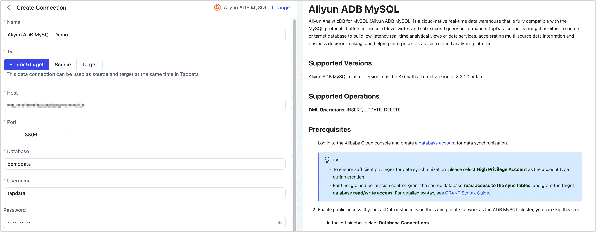

# Aliyun ADB MySQL

import Content from '../../reuse-content/_all-features.md';

<Content />

Aliyun AnalyticDB for MySQL (Aliyun ADB MySQL) is a cloud-native real-time data warehouse that is fully compatible with the MySQL protocol. It offers millisecond-level writes and sub-second query performance. TapData supports using it as either a source or target database to build low-latency real-time analytical views or data services, accelerating multi-source data integration and business decision-making, and helping enterprises establish a unified analytics platform.

## Supported Versions

Aliyun ADB MySQL cluster version must be 3.0, with a kernel version of 3.2.1.0 or later.

## Supported Operations

**DML Operations**: INSERT, UPDATE, DELETE

## Prerequisites

1. Log in to the Alibaba Cloud console and create a [database account](https://www.alibabacloud.com/help/en/analyticdb/analyticdb-for-mysql/user-guide/create-database-accounts) for data synchronization.

   :::tip

   - To ensure sufficient privileges for data synchronization, please select **High Privilege Account** as the account type during creation.
   - For fine-grained permission control, grant the source database **read access to the sync tables**, and grant the target database **read/write access**.
      For detailed syntax, see [GRANT Syntax Guide](https://www.alibabacloud.com/help/en/analyticdb/analyticdb-for-mysql/developer-reference/grant).

   :::

2. Enable public access. If your TapData instance is on the same private network as the ADB MySQL cluster, you can skip this step.

   1. In the left sidebar, select **Database Connections**.

   2. Click **Enable Public Address**.

   3. In the pop-up window, add the public IP address of your TapData service to the whitelist.

      For TapData Cloud, the fixed whitelist IPs are 47.93.190.224 and 47.242.251.110.

   4. Click **OK**.

3. If you need to connect via the public network, [apply for a public endpoint.](https://www.alibabacloud.com/help/en/analyticdb/analyticdb-for-mysql/user-guide/apply-for-or-release-a-public-endpoint)

4. (Optional) To enable incremental sync from Aliyun ADB MySQL, configure Binlog for each table to be synced:

   1. Enable Binlog:

      ```sql
      -- Replace table_name with your actual table name
      ALTER TABLE table_name BINLOG=true;
      ```

      :::tip

      [XUANWU_V2](https://www.alibabacloud.com/help/en/analyticdb/analyticdb-for-mysql/developer-reference/table-engine) tables do not support enabling Binlog.

      :::

   2. Adjust Binlog retention time to prevent premature cleanup and ensure incremental sync works properly.

      You can check the current setting with:

      ```sql
      SHOW CREATE TABLE source_table;
      ```

      Set the retention:

      ```sql
      ALTER TABLE table_name binlog_ttl='1d';
      ```

      `binlog_ttl` formats:

      - Milliseconds: digits only (e.g., `60` = 60 ms)
      - Seconds: digits + `s` (e.g., `30s`)
      - Hours: digits + `h` (e.g., `2h`)
      - Days: digits + `d` (e.g., `1d`)

## Connect to Aliyun ADB MySQL

1. [Log in to TapData](../../user-guide/log-in.md).

2. In the left sidebar, click **Connections**.

3. Click **Create** on the right side.

4. In the pop-up dialog, search and select **Aliyun ADB MySQL**.

5. On the connection page, fill in the cluster connection details as follows:

   

   - **Basic Settings**
     - **Name**: Enter a unique name with business significance.
     - **Type**: Support using Aliyun ADB MySQL as either a source or target database.
     - **Host**: The internal or public host address.
     - **Port**: Database port (default is **3306**).
     - **Database**: The name of the database. One connection maps to one database; use multiple connections for multiple databases.
     - **Username**: The database username.
     - **Password**: The database password.
     - **Connection Parameters**: Optional.
     - **Timezone**: Defaults to the database's timezone, can be adjusted as needed.
   - **Advanced Settings**
     - **Contain Table**: The default option is **All**, which includes all tables. Alternatively, you can select **Custom** and manually specify the desired tables by separating their names with commas (,).
     - **Exclude Tables**: Once the switch is enabled, you have the option to specify tables to be excluded. You can do this by listing the table names separated by commas (,) in case there are multiple tables to be excluded.
     - **Agent Settings**: Defaults to **Platform automatic allocation**, you can also manually specify an agent.
     - **Model Load Time**: If there are less than 10,000 models in the data source, their schema will be updated every hour. But if the number of models exceeds 10,000, the refresh will take place daily at the time you have specified.
     - **Enable Heartbeat Table**: For source/target connections, enables automatic creation of a `_tapdata_heartbeat_table` that updates every 10 seconds (requires permissions). Used to monitor connection and task health.

6. Click **Test**. Once successful, click **Save**.